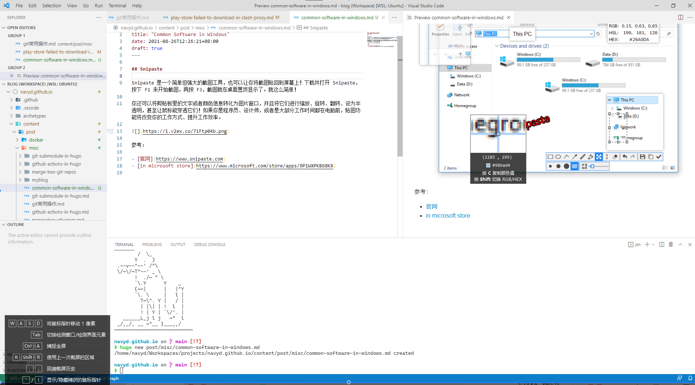

## [Snipaste](https://www.snipaste.com)

>Snipaste 是一个简单但强大的截图工具，也可以让你将截图贴回到屏幕上！下载并打开 Snipaste，按下 F1 来开始截图，再按 F3，截图就在桌面置顶显示了。就这么简单！
>
>你还可以将剪贴板里的文字或者颜色信息转化为图片窗口，并且将它们进行缩放、旋转、翻转、设为半透明，甚至让鼠标能穿透它们！如果你是程序员、设计师，或者是大部分工作时间都在电脑前，贴图功能将改变你的工作方式、提升工作效率。
>
>

可以查看颜色代码，不用qq的截图了

参考：

- [官网](https://zh.snipaste.com/)
- [in microsoft store](https://www.microsoft.com/store/apps/9P1WXPKB68KX)
