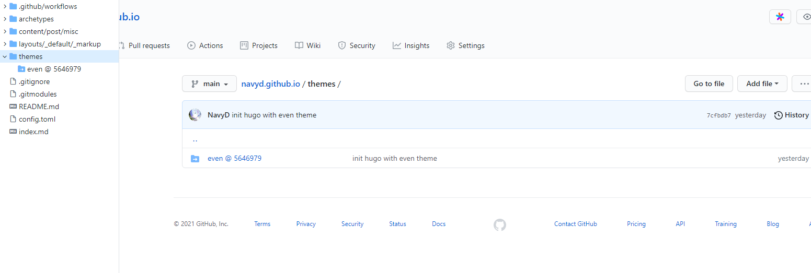
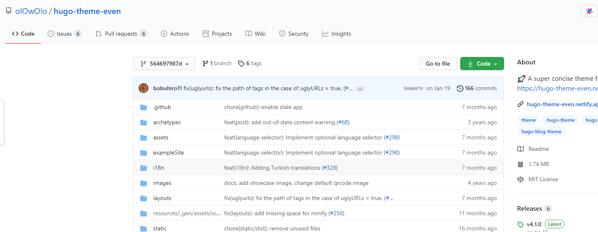

## 问题

在使用hugo添加主题时`git submodule add https://github.com/olOwOlo/hugo-theme-even themes/even`。在push到github后，过了一晚，不知道为啥启动hugo时出现错误：

```sh
❯ hugo server -D
Start building sites …
hugo v0.87.0 linux/amd64 BuildDate=unknown
WARN 2021/08/06 15:21:17 found no layout file for "HTML" for kind "page": You should create a template file which matches Hugo Layouts Lookup Rules for this combination.
WARN 2021/08/06 15:21:17 found no layout file for "HTML" for kind "home": You should create a template file which matches Hugo Layouts Lookup Rules for this combination.
WARN 2021/08/06 15:21:17 found no layout file for "HTML" for kind "taxonomy": You should create a template file which matches Hugo Layouts Lookup Rules for this combination.
WARN 2021/08/06 15:21:17 found no layout file for "HTML" for kind "section": You should create a template file which matches Hugo Layouts Lookup Rules for this combination.
WARN 2021/08/06 15:21:17 found no layout file for "HTML" for kind "taxonomy": You should create a template file which matches Hugo Layouts Lookup Rules for this combination.

                   | ZH-CN
-------------------+--------
  Pages            |     5
  Paginator pages  |     0
  Non-page files   |     6
  Static files     |     0
  Processed images |     0
  Aliases          |     0
  Sitemaps         |     1
  Cleaned          |     0

Built in 79 ms
Watching for changes in /home/navyd/Workspaces/projects/navyd.github.io/{archetypes,content,layouts}
Watching for config changes in /home/navyd/Workspaces/projects/navyd.github.io/config.toml
Environment: "development"
Serving pages from memory
Running in Fast Render Mode. For full rebuilds on change: hugo server --disableFastRender
Web Server is available at http://localhost:1313/ (bind address 127.0.0.1)
Press Ctrl+C to stop
WARN 2021/08/06 15:22:00 found no layout file for "HTML" for kind "home": You should create a template file which matches Hugo Layouts Lookup Rules for this combination.
^C%
```

## 分析

搜索后发现`themes/even`下没有任何文件，使用`trash-restore`一看，不会是我什么时候删除了？尝试重新添加失败

```sh
$ l themes/even
total 8.0K
drwxr-xr-x 2 navyd navyd 4.0K Aug  6 01:11 .
drwxr-xr-x 3 navyd navyd 4.0K Aug  6 15:31 ..

$ trash-restore
   0 2021-08-06 00:58:32 /home/navyd/Workspaces/projects/navyd.github.io/data
   1 2021-08-06 00:58:32 /home/navyd/Workspaces/projects/navyd.github.io/themes
   2 2021-08-06 00:58:32 /home/navyd/Workspaces/projects/navyd.github.io/themes/even
   3 2021-08-06 00:58:32 /home/navyd/Workspaces/projects/navyd.github.io/index.md
   4 2021-08-06 00:58:32 /home/navyd/Workspaces/projects/navyd.github.io/content
   5 2021-08-06 00:58:32 /home/navyd/Workspaces/projects/navyd.github.io/ .github
   6 2021-08-06 00:58:32 /home/navyd/Workspaces/projects/navyd.github.io/archetypes
   7 2021-08-06 00:58:32 /home/navyd/Workspaces/projects/navyd.github.io/config.toml
   8 2021-08-06 00:58:32 /home/navyd/Workspaces/projects/navyd.github.io/README.md
   9 2021-08-06 00:58:32 /home/navyd/Workspaces/projects/navyd.github.io/static
  10 2021-08-06 00:58:32 /home/navyd/Workspaces/projects/navyd.github.io/resources
What file to restore [0..10]:

$ git submodule add https://github.com/olOwOlo/hugo-theme-even themes/even
'themes/even' already exists in the index
```

尝试移除submodule时`git rm -f themes/even`出错：`fatal: pathspec 'themes/even' did not match any files`，幸好github上存在完整的仓库，看下`themes/even`是否存在




github上的`themes/even`链接到了原来的even仓库，并不是被删除了。

## 解决

如果直接`git clone <repo>`是不包括submodule的，有两种方式：

- clone时指定：`git clone --recurse-submodules -j8 git://github.com/foo/bar.git`
- clone后更新：`git submodule update --init --recursive`

由于之前因为even操作rm过git本地仓库，为了避免git出现问题，直接从github clone完整的仓库，有一份完整的备份是多么重要！！仓库中只有main分支是原始的hugo文档，另一个gh-pages分支不需要clone。

一行命令：

```sh
$ git clone -b main --recurse-submodules -j8 git@github.com:NavyD/navyd.github.io.git testgit
Cloning into 'testgit'...
remote: Enumerating objects: 174, done.
remote: Counting objects: 100% (174/174), done.
remote: Compressing objects: 100% (114/114), done.
remote: Total 174 (delta 34), reused 157 (delta 27), pack-reused 0
Receiving objects: 100% (174/174), 803.38 KiB | 863.00 KiB/s, done.
Resolving deltas: 100% (34/34), done.
Submodule 'themes/even' (https://github.com/olOwOlo/hugo-theme-even) registered for path 'themes/even'
Cloning into '/home/navyd/Workspaces/projects/testgit/themes/even'...
remote: Enumerating objects: 1689, done.
remote: Total 1689 (delta 0), reused 0 (delta 0), pack-reused 1689
Receiving objects: 100% (1689/1689), 1.74 MiB | 278.00 KiB/s, done.
Resolving deltas: 100% (984/984), done.
Submodule path 'themes/even': checked out '564697987de962672112b910422682eb6f9c26ba'
```

参考：

- [How to fix the error `found no layout file for “HTML” for “page”` in Hugo CMS?](https://stackoverflow.com/a/65745209/8566831)
- [How do I remove a submodule?](https://stackoverflow.com/a/1260982/8566831)
- [Pull git submodules after cloning project from GitHub](https://stackoverflow.com/a/16773779/8566831)
- [How to “git clone” including submodules?](https://stackoverflow.com/a/4438292/8566831)
- [How do I clone a specific Git branch? [duplicate]](https://stackoverflow.com/a/4568323/8566831)
