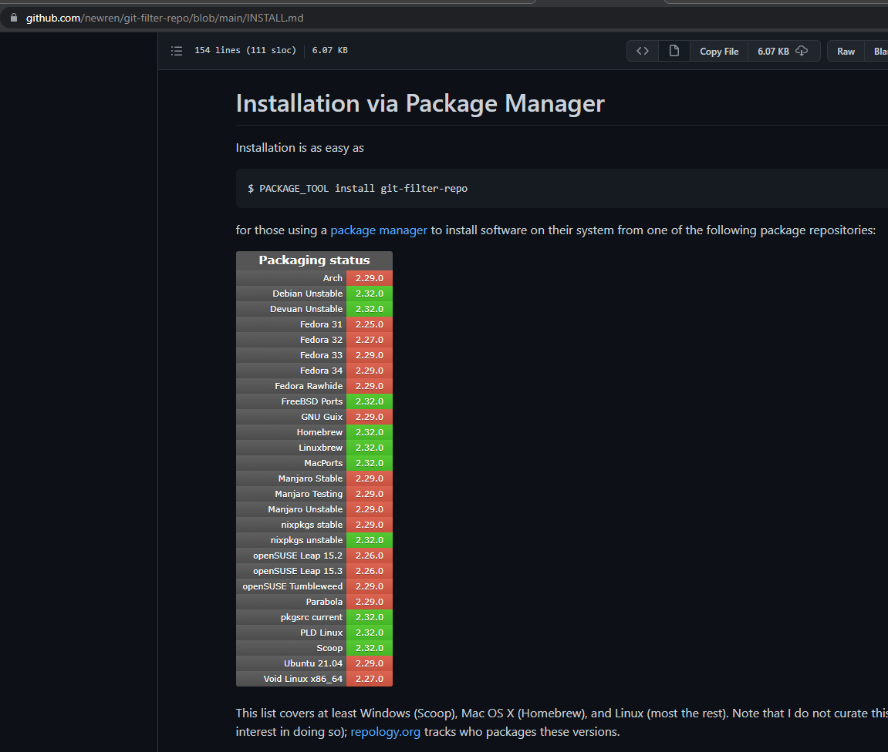

## 问题

从原始博客仓库`blog-resources`中迁移所有记录到新的hugo博客仓库`navyd.github.io`新文件夹下`content/res`中，以后慢慢修改为hugo博客形式。下面是两个仓库的目录结构

```
../
    - blog-resources/
        - .git/
        - blog.md
        - ...
    - navyd.github.io/
        - .git/
        - content/
            - post/
        - ...
```

## 分析

[git merge](https://stackoverflow.com/a/10548919/8566831)

```sh
cd navyd.github.io
git checkout -b blog
git remote add blog-res ../blog-resources
git fetch blog-res --tags
git merge --allow-unrelated-histories blog-res/master # or whichever branch you want to merge
git remote remove blog-res

mv test.md content/res # 移动之前仓库的文件到res中
git commit -m 'mv to res folder'
```

这个方法有个很大的缺点，在merge时会合并到根目录，可能出现冲突，无法自定义合并到子文件夹中，虽然可以提前使用[git-filter-repo](https://github.com/newren/git-filter-repo)命令：`git filter-repo --to-subdirectory-filter blog-res`，但是`ubuntu 20.04`无法安装，放弃使用merge的方法



### 注意

如果仓库中存在未被git管理的文件，一定要备份好，`git reset --hard`将会完全覆盖这样的文件，无法找回

使用`git reset --hard <commit_id>`回到合并前的状态。如果操作失误出现大量的`untracked files`，可以使用`git clean`删除

```sh
# 查看可被清除的文件
git clean -n
# 删除文件目录
git clean -f -d
```

如果在merge后想要撤消，但是使用`git log`找不能合并的记录日志对应的commit id，可以使用`git reflog`

```sh
$ git log
commit 0504c8037617b01b6c90183a7b8fcdaf71216411 (HEAD -> main, blog)
Merge: a30ea67 34cef1f
Author: navyd <dhjnavyd@gmail.com>
Date:   Sun Aug 8 01:39:45 2021 +0800

    Add 'content/res/' from commit '34cef1f6fe6477181818e55ff468e9a62c7fccbf'

    git-subtree-dir: content/res
    git-subtree-mainline: a30ea67efb72183d0d696dc74d9677a98b784035
    git-subtree-split: 34cef1f6fe6477181818e55ff468e9a62c7fccbf

commit a30ea67efb72183d0d696dc74d9677a98b784035 (origin/main, origin/HEAD)
Author: navyd <dhjnavyd@gmail.com>
Date:   Sat Aug 7 00:26:58 2021 +0800

    even主题问题

$ git reflog
0504c80 (HEAD -> main, blog) HEAD@{0}: merge blog: Fast-forward
a30ea67 (origin/main, origin/HEAD) HEAD@{1}: reset: moving to a30ea67
c9dc62b HEAD@{2}: reset: moving to HEAD~1
e341955 HEAD@{3}: checkout: moving from blog to main
0504c80 (HEAD -> main, blog) HEAD@{4}: reset: moving to 0504c80
94302ef HEAD@{5}: commit: test
0504c80 (HEAD -> main, blog) HEAD@{6}: reset: moving to 0504c8037617b01b6c90183a7b8fcdaf71216411
a30ea67 (origin/main, origin/HEAD) HEAD@{7}: reset: moving to a30ea67
00dc6b8 HEAD@{8}: commit: mv
1f736a4 HEAD@{9}: reset: moving to 1f736a4272dbd8306d8451bcb9fe5d35ce81878e
a30ea67 (origin/main, origin/HEAD) HEAD@{10}: checkout: moving from main to blog
e341955 HEAD@{11}: merge blog: Fast-forward
a30ea67 (origin/main, origin/HEAD) HEAD@{12}: checkout: moving from blog to main
e341955 HEAD@{13}: commit: remove index.md
c9dc62b HEAD@{14}: commit: mv to old folder
e965a30 HEAD@{15}: merge blog-res/master: Merge made by the 'recursive' strategy.
a30ea67 (origin/main, origin/HEAD) HEAD@{16}: reset: moving to a30ea67
a30ea67 (origin/main, origin/HEAD) HEAD@{17}: reset: moving to HEAD~
e440e06 HEAD@{18}: merge blog-res/master: Merge made by the 'recursive' strategy.
a30ea67 (origin/main, origin/HEAD) HEAD@{19}: checkout: moving from main to blog

$ git reset --hard id
```

## 解决

在这里提到[使用git subtree](https://stackoverflow.com/a/14992078/8566831)

```sh
cd navyd.github.io
git checkout -b blog
# 添加blog-resources@master
git subtree add --prefix=content/res ../blog-resources master
# 合并blog到main分支
git checkout main
git merge blog
```

完成合并log

```sh
$ git log
commit 0504c8037617b01b6c90183a7b8fcdaf71216411 (HEAD -> main, blog)
Merge: a30ea67 34cef1f
Author: navyd <dhjnavyd@gmail.com>
Date:   Sun Aug 8 01:39:45 2021 +0800

    Add 'content/res/' from commit '34cef1f6fe6477181818e55ff468e9a62c7fccbf'

    git-subtree-dir: content/res
    git-subtree-mainline: a30ea67efb72183d0d696dc74d9677a98b784035
    git-subtree-split: 34cef1f6fe6477181818e55ff468e9a62c7fccbf
```

参考：

- [How do you merge two Git repositories?](https://stackoverflow.com/questions/1425892/how-do-you-merge-two-git-repositories)
- [How to remove local (untracked) files from the current Git working tree](https://stackoverflow.com/a/64966/8566831)
- [Undo a Git merge that hasn't been pushed yet](https://stackoverflow.com/a/2389423/8566831)
- [newren/git-filter-repo](https://github.com/newren/git-filter-repo)
- [git subtree教程](https://segmentfault.com/a/1190000012002151)
