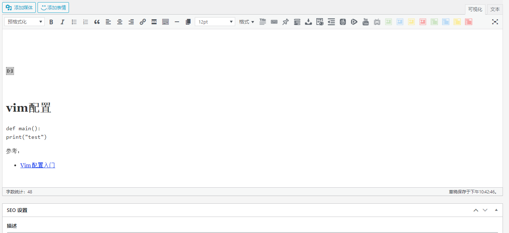
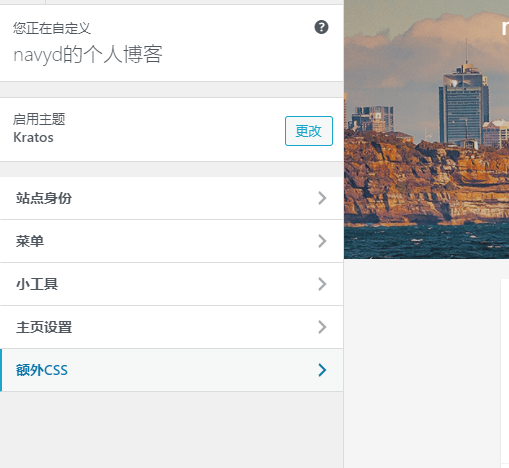
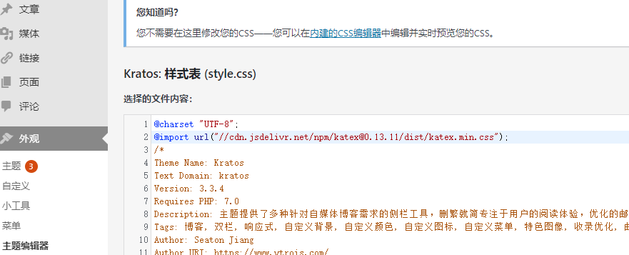

# hugo blog

开始使用hugo在github搭建静态博客。

## 选型

可选类型

### 动态博客

比较知名的动态博客工具有下面几种：

- [wordpress](https://wordpress.com/)
- [typecho](http://typecho.org/)

都是开源项目，wordpress(简称WP)是使用最广泛的，而typecho开发都不是告别活跃

对于博客项目，稳定是前提

开源项目参考：

- [WordPress/WordPress](https://github.com/WordPress/WordPress)
- [typecho/typecho](https://github.com/typecho/typecho)

#### 部署

在试用WP中，虽然现在可以使用docker方便的部署，我使用raspi4 2GB运行有点不够，运行WP与mysql后仅剩下200M左右，如果再vscode remote连接直接死机，需要开启swap才能正常。

#### markdown

由于之前都是使用markdown写作，存在100多篇md博文，不可能一一复制到WP中，所以想使用工具批量发布到WP中。在初步使用中没有发现在WP中有方法直接渲染markdown，基本都是md在线编辑器，不符合需求。

换个方式，使用已经渲染好的html文件发布到WP更好，避免了md的渲染不一致的问题，同时可以使用wp rest api批量更新。

尝试直接复制使用渲染markdown转换的html不可用，WP的html代码文本编辑器会转义部分代码

1. 原始markdown内容

    ```markdown
    # vim配置

    <!-- 去除空格`` ` -->
    `` `yaml
    vim: true
    `` `

    参考：

    * [Vim 配置入门](http://www.ruanyifeng.com/blog/2018/09/vimrc.html)
    ```

1. 使用markdown-preview-enhanced导出cdn hosted文件[vim_markdown_preview_enhanced.html](myblog/vim_markdown_preview_enhanced.html)，下面是部分代码：

    ```html
    <!DOCTYPE html><html><head>
    <title>vim&#x914D;&#x7F6E;</title>
    <meta charset="utf-8">
    <meta name="viewport" content="width=device-width, initial-scale=1.0">

    <link rel="stylesheet" href="https://cdn.jsdelivr.net/npm/katex@0.13.11/dist/katex.min.css">

    <style>
    /**
    * prism.js Github theme based on GitHub's theme.
    * @author Sam Clarke
    */
    code[class*="language-"],
    pre[class*="language-"] {
    color: #333;
    background: none;
    font-family: Consolas, "Liberation Mono", Menlo, Courier, monospace;
    text-align: left;
    white-space: pre;
    word-spacing: normal;
    word-break: normal;
    word-wrap: normal;
    line-height: 1.4;

    -moz-tab-size: 8;
    -o-tab-size: 8;
    tab-size: 8;

    -webkit-hyphens: none;
    -moz-hyphens: none;
    -ms-hyphens: none;
    hyphens: none;
    }
    ```

1. 经过WP转义后[vim_wordpress_esc](myblog/vim_wordpress_esc)

     下面是部分代码：

    ```html
    &nbsp;

    &nbsp;

    <style>
    /**<br />
    * prism.js Github theme based on GitHub's theme.<br />
    * @author Sam Clarke<br />
    */<br />
    code[class*="language-"],<br />
    pre[class*="language-"] {<br />
    color: #333;<br />
    background: none;<br />
    font-family: Consolas, "Liberation Mono", Menlo, Courier, monospace;<br />
    text-align: left;<br />
    white-space: pre;<br />
    word-spacing: normal;<br />
    word-break: normal;<br />
    word-wrap: normal;<br />
    line-height: 1.4;</p>
    <p>-moz-tab-size: 8;<br />
    -o-tab-size: 8;<br />
    tab-size: 8;</p>
    <p>-webkit-hyphens: none;<br />
    -moz-hyphens: none;<br />
    -ms-hyphens: none;<br />
    hyphens: none;<br />
    }</p>
    ```

可以看到`title, link`等tag被移除转义为`&nbsp;`，其中`<link rel="stylesheet" href="https://cdn.jsdelivr.net/npm/katex@0.13.11/dist/katex.min.css">`被移除导致无法正确显示代码高亮；`\n`被转义为`<br />`。下面有可以解决这两个问题：

- minifiy html移除所有`\n`避免转义：有各种插件可以生成一行的html文件
- 在WP中引用全局外部css。有两种方式

  1. 在额外css中插入`@import url("//cdn.jsdelivr.net/npm/katex@0.13.11/dist/katex.min.css");`
      

  2. 在主题style.css中插入`@import url("//cdn.jsdelivr.net/npm/katex@0.13.11/dist/katex.min.css");`
      

参考：

- [在WordPress中使用Markdown进行写作的正确姿势](https://cloud.tencent.com/developer/article/1150073)
- [WordPress+PublishMarkdown快速构建个人博客](https://www.paincker.com/publish-markdown)
- [命令行创建和发布 MarkDown 到 WordPress](https://zhuanlan.zhihu.com/p/65593971)
- [REST API Handbook](https://developer.wordpress.org/rest-api/reference/)
- [rest api: Posts](https://developer.wordpress.org/rest-api/reference/posts/)
- [How to link external css in wordpress? [closed]](https://stackoverflow.com/questions/27045670/how-to-link-external-css-in-wordpress)

#### 问题

到此，markdown渲染的问题解决了，新的问题出现了，如何批量渲染md文件。vscode markdown-preview-enhanced插件只提供了手动的方式渲染出html，front-matter配置自动导出需要打开预览界面才行，不利于自动化

```yaml
---
html:
  embed_local_images: false
  embed_svg: true
  offline: false
  toc: undefined

print_background: false
---
```

另外，对于不常用的图片，可以base64编码嵌入html文件中，缺点是文件过大，不利于缓存加载，链接形式的图片可以懒加载体验更好

于是转而寻找自动化工具，在[typora issues](https://github.com/typora/typora-issues/issues/824#issuecomment-418176112)中找到答案：Static Site Generator

参考：

- [Markdown Preview Enhanced docs](https://shd101wyy.github.io/markdown-preview-enhanced/#/zh-cn/)
- [Support export Multiple Documents #824](https://github.com/typora/typora-issues/issues/824)
- [[Summary] Advanced command line interface support #1999](https://github.com/typora/typora-issues/issues/1999)
- [typora issues](https://github.com/typora/typora-issues)

### 静态博客

知名的静态博客工具有：

- [hexo](https://github.com/hexojs/hexo)
- [hugo. A fast, simple & powerful blog framework, powered by Node.js.](https://github.com/gohugoio/hugo)
- [jekyll. Jekyll is a blog-aware static site generator in Ruby](https://github.com/jekyll/jekyll)

#### 选型

hexo使用nodejs开发，hugo使用golang开发，相对更熟悉golang。速度在这里不是重点，nodejs已经足够

部署方面，由于不是nodejs开发者，需要配置复杂的开发环境，虽然可借助docker在本地使用，但是没有找到可用的docker镜像，能满足需求。hugo部署非常简单，只有一个bin文件，结合git管理与github pages非常方便

在资源方面，hexo更多，但本着可以折腾golang、轻量博客功能不作过多要求的精神，hugo是理想的选择

## hugo博客

### markdown文件管理

使用markdown写作有一个痛点，如何链接本地文件。如图片、本地md文件链接、其它博文相关文件log等，一般在workspace目录中放置一个`assets/images`目录，md文件会链接到该路径。

```
workspaces/
  - assets/
    - images/
    - files/
  - posts/
    - myblog.md
    - test/a.md
```

但是这样存在一个问题，大量文件被放在一个不相关的地方，在需要时很难寻找。一旦md文件目录发生迁移，整个md文件中的链接都失效了。

在hugo中目录结构如果md存在多种本地文件链接，则用一个文件夹放入一个index.md与对应文件在同个目录

```
├── archetypes
├── config.toml
├── content
    - posts/
      - blog.md
      - multi-res/
        - index.md
        - a.png
        - b.log
        - c.file
├── data
├── layouts
├── static
└── themes
```

但是这里选择一个`filename.md`文件被build后会生成无后缀的`filename/`目录，里面存放相关的静态资源文件，如果md没有本地文件链接不需要文件夹。将一个md文件相关资源都放在这样的目录中非常方便：

```
workspaces/
  - content/posts/
    - alone.md
    - myblog.md
    - myblog/
      - a.log
      - b.html
      - c.png
  - public/
  - ...
```

在vscode中配合[Markdown Link Updater](https://github.com/mathiassoeholm/markdown-link-updater)重命名文件后对应链接也会被修改

使用[GitHub Action - Markdown link check](https://github.com/gaurav-nelson/github-action-markdown-link-check)可以在github repo中检查link的有效性

参考：

- [Hugo 的文件管理方案](https://www.isyin.cn/post/2018-05-03-hugo-%E7%9A%84%E6%96%87%E4%BB%B6%E7%AE%A1%E7%90%86%E6%96%B9%E6%A1%88/)
- [Directory Structure](https://gohugo.io/getting-started/directory-structure/)
- [CONTENT MANAGEMENT Content Sections](https://gohugo.io/content-management/sections/)
- [Hugo 从入门到会用](https://olowolo.com/post/hugo-quick-start/)

#### 预处理markdown link

由于当前目录结构与hugo官方不一致，导致本地相对链接无法正常使用如：

```markdown
<!-- 结构：

myblog.md
myblog/
  - vim_wordpress_esc
  - 2021-08-04-23-17-08.png

-->
[vim_wordpress_esc](myblog/vim_wordpress_esc)

```

对于上面的两个本地链接，hugo 构建后

```html
<a href="myblog/vim_wordpress_esc">vim_wordpress_esc</a>
<!-- 配置了 fancybox = true -->
<a class="fancybox" href="http://localhost:1313/post/myblog/myblog/2021-08-04-23-17-08.png" data-fancybox="gallery" data-caption=""></a>
```

很明显，blog.md被hugo后本地路径已经与`myblog/`文件夹一级，而其中的相对路径链接还是没有变化，应该移除对应的filename前缀如：`<a href="vim_wordpress_esc">vim_wordpress_esc</a>`

##### template in markdown

有一种简单的方式可以实现，在markdown文件中嵌入hugo template，可以使重写对应的链接如：

```markdown
<base href="{{ .Site.BaseURL }}">
<!-- 访问：https://host.url/img/foo.jpg -->

```

***注意：上面的代码仅用于演示，实际中存在改写`base url`后导致其它相对链接无法正常工作***

下面是简单的处理逻辑：对于`myblog.md`，在当前页面下，如果存在以页面url.path的最后一层即filename开始的href，如：`url=http://localhost:1313/post/myblog, url.path=/post/myblog, filename=myblog, href=myblog/vim_wordpress_esc`，则移除这一级的`href=vim_wordpress_esc`

参考：

- [Cannot link to static files with Hugo](https://stackoverflow.com/a/46180551/8566831)

##### js

开始的思路是使用js在页面加载时将对应href重写。但是看到`<a class="fancybox" href="http://localhost:1313/post/myblog/myblog/2021-08-04-23-17-08.png"`就发现使用js无法保证所有对应的href被处理，可能由于加载顺序导致异常。如果link过多可能会影响性能

```js
let list = window.location.pathname.split("/").filter(name => name.length > 0);
console.info("got path list: ", list);
if (list.length != 0) {
    let last = list[list.length - 1];
    console.log("check all ref tag");
    for (let item of document.getElementsByTagName("a")) {
        let href = item.getAttribute("href");
        console.log("href ", href)
        if (href.startsWith(window.location.href)) {
            // console.log("href ", href);
            href = href.substring(window.location.href.length + 1);
        }
        if (href.startsWith(last)) {
            let newRef = href.substring(last.length + 1);
            item.setAttribute("href", newRef);
            console.info("replaced ", href, " with ", newRef);
        }
    }
}
```

##### render hooks

在markdown渲染时预处理链接最合适，如果不行，就只能回到hugo标准目录结构了。

Markdown Render Hooks配合hugo template可以在渲染html时处理链接。定义下面的文件可以处理对应的链接类型

```
layouts
└── _default
    └── _markup
        ├── render-image.html
        ├── render-image.rss.xml
        └── render-link.html
```

下面是`render-link.html`代码

```html
<a test=""
{{$name := path.Base .Page.Permalink}}
{{if (hasPrefix .Destination $name) }}
    {{$size := len $name}}
    {{$size = add $size 1}}
    {{$destUrl := substr .Destination $size}}
    href="{{substr .Destination $size}}"
{{else}}
    href="{{.Destination | safeURL}}"
{{end}}
{{ with .Title}}
title="{{ . }}"{{ end }}>{{ .Text | safeHTML }}</a>
```

参考：

- [Configure Markup: Markdown Render Hooks](https://gohugo.io/getting-started/configuration-markup#markdown-render-hooks)
- [Markdown pre-processing?](https://discourse.gohugo.io/t/markdown-pre-processing/27299)
- [How to get the URL of the current page with the rel or relref function?](https://discourse.gohugo.io/t/how-to-get-the-url-of-the-current-page-with-the-rel-or-relref-function/29113/4)
- [Functions Quick Reference](https://gohugo.io/functions/)
