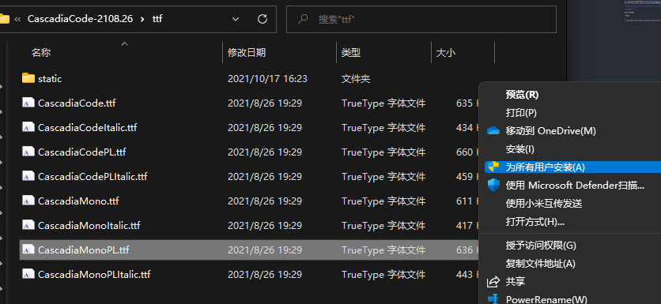

在wsl2中使用zsh主题出现乱码时需要安装powerline字体才能显示，windows terminal使用的Cascadia Code字体也支持powerline版本[Cascadia Code](https://github.com/microsoft/cascadia-code#installation)，常用的还有[powerline/fonts](https://github.com/powerline/fonts)

对于Cascadia Code字体下载[microsoft/cascadia-code/releases](https://github.com/microsoft/cascadia-code/releases)解压安装即可：



对于powerline字体文件可以使用`git clone https://github.com/powerline/fonts.git --depth=1`下载后在管理员权限下执行安装[install.ps1](https://github.com/powerline/fonts/blob/master/install.ps1)

## 配置使用

* vscode：在settings.json中添加

  ```json
  {
    "terminal.integrated.fontFamily": "Cascadia Mono PL"
  }
  ```

* windows terminal：在settings.json中添加

  ```json
  {
  	"profiles": {
          "defaults": {
              "fontFace": "Cascadia Code PL"
          },
      }
  }
  ```

参考：

* [Tutorial: Set up Powerline in Windows Terminal](https://docs.microsoft.com/en-us/windows/terminal/tutorials/powerline-setup)

* [Can I use Powerline fonts in the integrated terminal?](https://code.visualstudio.com/docs/editor/integrated-terminal#_can-i-use-powerline-fonts-in-the-integrated-terminal)
