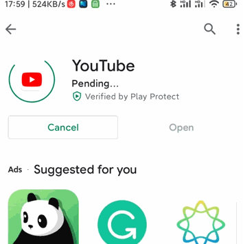
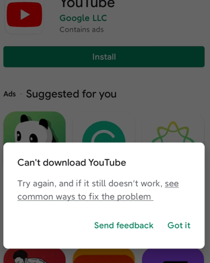
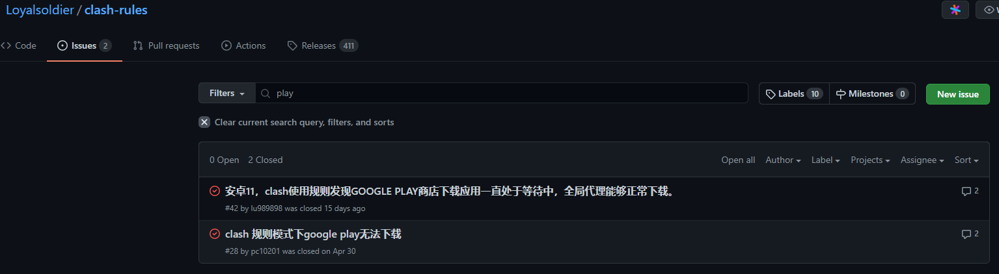
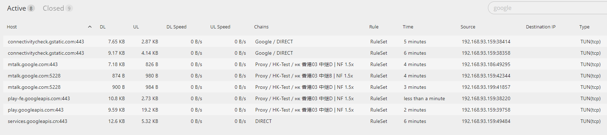

## 问题

clash透明代理使用规则发现GOOGLE PLAY商店下载应用一直处于等待中，全局代理能够正常下载。在我的oneplus3t上是可以正常使用play商店的，但是在redmi k40上只能浏览，无法下载，一直处于pending状态。





相关环境：

- redmi k40
- miui 12.5.4
- 从小米商店下载的 Play Store version: 258.21-19 [0] [PR] 379071060

## 分析

这个问题持续了2个月，开始遇到时使用oneplus3t上的其它的代理软件如老王、pandavpn测试没有clash环境下play商店是否可用，这两种免费的代理都无法使用，根本没法连接国外网站，测试失败

还有各种miui无法下载时的搜索问题`小米google play一直显示正在下载, miui12 google play 不能下载`，基本都是下面这种操作：包括清除下载管理器的缓存，清除googlePlay缓存和数据等

1. 打开系统自带的【下载管理】应用
2. 点击【设置】
3. 将【使用迅雷下载引擎】关闭
    
4. 重新打开Google Play应用商店进行下载或者更新应用

依然不可用。

有时候感觉就是这么突然，就在今天，可能是之前在什么地方看到过clash与play store的问题，而且是有关clash规则的，也就是我现在正在使用的[clash-rules](https://github.com/Loyalsoldier/clash-rules)。

打开issues中搜索`play`果然发现了问题：



根据[clash 规则模式下google play无法下载 #28](https://github.com/Loyalsoldier/clash-rules/issues/28#issuecomment-829886733)的方法是`services.googleapis.cn`没有使用代理，下面是在clash使用play下载时的google连接：



可以看到最后的`services.googleapis.cn`确实是直连。

## 解决

在clash配置文件中加上`DOMAIN,services.googleapis.cn,PROXY`如：

```yml
# ...
rules:
  - RULE-SET,private,DIRECT
  - RULE-SET,reject,REJECT

  # clash 规则模式下google play无法下载 https://github.com/Loyalsoldier/clash-rules/issues/28
  - DOMAIN,services.googleapis.cn,Proxy

  - RULE-SET,icloud,Icloud
  - RULE-SET,apple,Apple
  - RULE-SET,google,Google
  - DOMAIN-KEYWORD,epic,Epic
  - RULE-SET,proxy,Proxy
  - RULE-SET,direct,DIRECT
  - RULE-SET,telegramcidr,Telegram
  - GEOIP,,DIRECT
  - GEOIP,CN,DIRECT
  - MATCH,Final-Match
```

重启clash后可以正常下载应用，这里存在tcp与udp的`services.googleapis.cn`，tcp的使用了代理


参考：

- [Loyalsoldier/clash-rules](https://github.com/Loyalsoldier/clash-rules)
- [clash 规则模式下google play无法下载 #28](https://github.com/Loyalsoldier/clash-rules/issues/28)
- [解决Google Play Store一直「正在等待下载」的问题](https://yueyue200830.github.io/2020/02/29/%E8%A7%A3%E5%86%B3Google-Play-Store%E4%B8%80%E7%9B%B4%E3%80%8C%E6%AD%A3%E5%9C%A8%E7%AD%89%E5%BE%85%E4%B8%8B%E8%BD%BD%E3%80%8D%E7%9A%84%E9%97%AE%E9%A2%98/)
- [小米手机 Google Play 一直等待下载/安装不了软件解决办法](http://www.chinacion.cn/article/8209.html)
