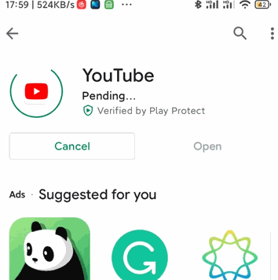
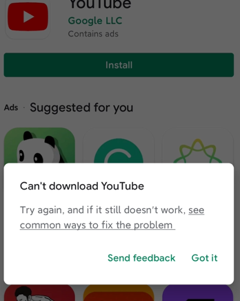
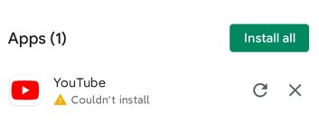
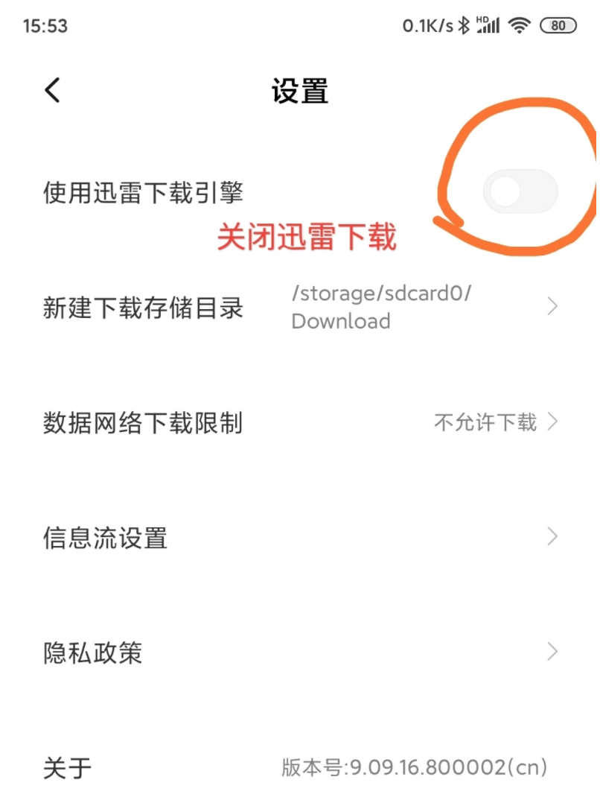
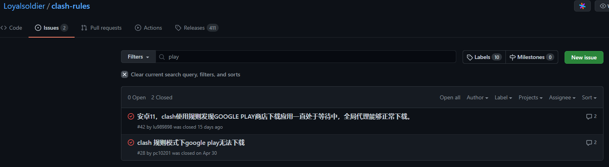
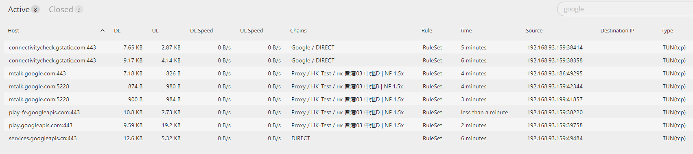
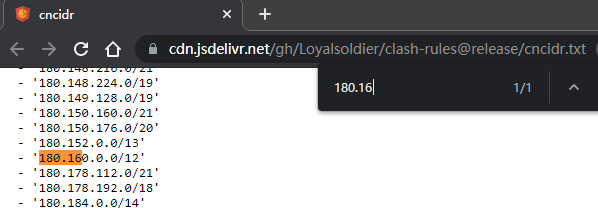
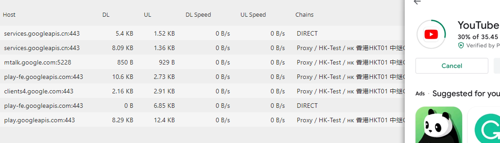

## 问题

clash透明代理使用规则发现GOOGLE PLAY商店下载应用一直处于等待中，全局代理能够正常下载。在我的oneplus3t上是可以正常使用play商店的，但是在redmi k40上只能浏览，无法下载，一直处于pending状态。





相关环境：

- redmi k40
- miui 12.5.4
- 从小米商店下载的 `Play Store version: 258.21-19 [0] [PR] 379071060`

## 分析

这个问题持续了2个月，开始遇到时使用oneplus3t上的其它的代理软件如老王、pandavpn测试没有clash环境下play商店是否可用，这两种免费的代理都无法使用，根本没法连接国外网站，测试失败

还有各种miui无法下载时的搜索问题`小米google play一直显示正在下载, miui12 google play 不能下载`，基本都是下面这种操作：包括清除下载管理器的缓存，清除googlePlay缓存和数据等

1. 打开系统自带的【下载管理】应用
2. 点击【设置】
3. 将【使用迅雷下载引擎】关闭
    
4. 重新打开Google Play应用商店进行下载或者更新应用

依然不可用。

有时候感觉就是这么突然，就在今天，可能是之前在什么地方看到过clash与play store的问题，而且是有关clash规则的，也就是我现在正在使用的[clash-rules](https://github.com/Loyalsoldier/clash-rules)。

打开issues中搜索`play`果然发现了问题：



根据[clash 规则模式下google play无法下载 #28](https://github.com/Loyalsoldier/clash-rules/issues/28#issuecomment-829886733)的方法是`services.googleapis.cn`没有使用代理，下面是在clash使用play下载时的google连接：



可以看到最后的`services.googleapis.cn`确实是直连TCP。

### 后记

在这之后，依然存在无法下载的问题，可能是由于下面的神奇操作使得之前的分析不可用：

1. 启用clash
2. 进入play store下载更新应用
3. 等待一段时间后一直显示正在下载
4. 断网等待几秒不要退出play store
5. 重连网络可以看到play store开始下载/更新应用

上面这个操作看运气，不具有稳定性，导致代理`services.googleapis.cn`分析不可用，就连使用全局代理都无法使用。

google搜索`miui12 clash 代理 play store`，在这篇文章[关于 Google Play 商店只能浏览不能下载的一点奇怪发现](https://www.v2ex.com/t/696735)和我的情况十分相似：

>ping 后发现这个网址的 IP 是 203.208 网段的，也就是 Google 部署在中国大陆的 IP 之一。更奇怪的是只有在我使用 HK 线路的时候，哪怕是全局，Play 商店都不能下载更新。一但使用别的地区（ SG/US...）的网络，Play 商店就正常了。
>
>Google Play 能不能下载及更新只跟机场有关。与手机是否国行，services.googl 去掉 eapis.cn 是否走代理都无关。 好的机场无需任何设置，在国行上也可以下载更新。（小米手机必须关闭迅雷功能）
>
>一般来说，这个问题发生在香港节点较多。原因的本质是 ip 被谷歌识别为中国 ip 。 （虽然你的 ip 的确是香港的）
>
>直接的结果是某些谷歌服务不可用。 已知的有 Google Play 无法更新下载。 地图时间轴打开 400，YoutubePremium 不可用。
>
>判断的方式上面已经有人提过，可以通过以下两个链接：
>
>`https://www.google.com/maps/timeline` 打开 400 错误表示 ip 被封
>`https://www.youtube.com/red` 网页打开提示“YouTube Premium 在您所在的国家 /地区尚未推出”。在手机上使用链接直接跳转到 YouTube app 里，它会明确地告诉你 YouTube Premium 在中国未推出。
>
>这种节点无论做什么努力都是无法改变无法使用 Google Play 的本质问题的。只有换节点一个办法。

在多次实验后，发现global+iepl专线节点有效，同时，除了HK节点，其它节点都可以在`services.googleapis.cn`代理下使得play store正常下载

### 代理UDP

另外，由于存在另一个`services.googleapis.cn`UDP连接，尝试了多种方式都无法代理UDP，解析`services.googleapis.cn`常见ip有：

```
120.253.253.98 中国 上海 上海 移动
180.163.150.162 中国 上海 上海 电信
203.208.39.226 中国 北京 北京 谷歌云
203.208.43.66 中国 北京 北京 谷歌云
180.163.150.34 中国 上海 上海 电信
#...
```

用`180.163.150.34`尝试在配置文件中添加`IP-CIDR,180.163.0.0/16,Proxy`但无法对UDP生效。在clash-rules中的[中国大陆 IPv4 地址列表 cncidr.txt](https://cdn.jsdelivr.net/gh/Loyalsoldier/clash-rules@release/cncidr.txt)规则中存在对该ip的配置

```yml
rules:
#...
  - GEOIP,,DIRECT
  - GEOIP,CN,DIRECT
  - MATCH,Final-Match
```



什么时候有时间好好研究下

<!-- todo -->

## 解决

在clash配置文件中加上`DOMAIN,services.googleapis.cn,Proxy`，注意`Proxy`尽量不要使用香港节点如：

```yml
# ...
proxy-groups:
  - name: Proxy
    type: select
    proxies:
      # - HK-Test
      - IEPL-Test
      - SGP-Test
      - US-Test
      - TW-Test
      - DIRECT
rules:
  - RULE-SET,private,DIRECT
  - RULE-SET,reject,REJECT

  # clash 规则模式下google play无法下载 https://github.com/Loyalsoldier/clash-rules/issues/28
  - DOMAIN,services.googleapis.cn,Proxy

  - RULE-SET,icloud,Icloud
  - RULE-SET,apple,Apple
  - RULE-SET,google,Google
  - DOMAIN-KEYWORD,epic,Epic
  - RULE-SET,proxy,Proxy
  - RULE-SET,direct,DIRECT
  - RULE-SET,telegramcidr,Telegram
  - GEOIP,,DIRECT
  - GEOIP,CN,DIRECT
  - MATCH,Final-Match
```

重启clash后可以正常下载应用，这里存在tcp与udp的`services.googleapis.cn`，tcp的使用了代理



参考：

- [Loyalsoldier/clash-rules](https://github.com/Loyalsoldier/clash-rules)
- [clash 规则模式下google play无法下载 #28](https://github.com/Loyalsoldier/clash-rules/issues/28)
- [解决Google Play Store一直「正在等待下载」的问题](https://yueyue200830.github.io/2020/02/29/%E8%A7%A3%E5%86%B3Google-Play-Store%E4%B8%80%E7%9B%B4%E3%80%8C%E6%AD%A3%E5%9C%A8%E7%AD%89%E5%BE%85%E4%B8%8B%E8%BD%BD%E3%80%8D%E7%9A%84%E9%97%AE%E9%A2%98/)
- [小米手机 Google Play 一直等待下载/安装不了软件解决办法](http://www.chinacion.cn/article/8209.html)
- [关于 Google Play 商店只能浏览不能下载的一点奇怪发现](https://www.v2ex.com/t/696735)
- [Play商店和youtube代理不了 #113](https://github.com/Kr328/ClashForAndroid/issues/113)
- [[BUG] Play Store应用无法下载 #478](https://github.com/Kr328/ClashForAndroid/issues/478)
- [clash IP-based Rule](https://lancellc.gitbook.io/clash/clash-config-file/rules/ip-based-rule)
