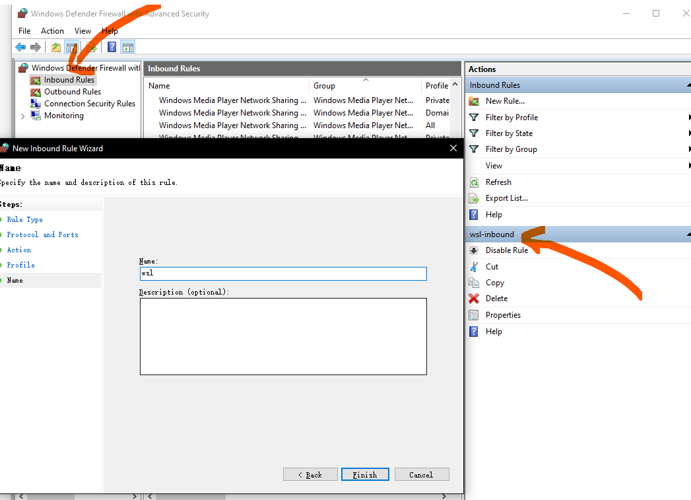

在wsl2中使用docker跑一个简单的ngnix时，发现只有宿主机使用`localhost:8080`可以用浏览器打开，而内网内其他电脑则没办法使用宿主机内网ip访问ngnix界面

再用idea启动一个web服务，还是不能被内网访问

## 分析

wsl2是一个hyper v虚拟机，使用 virtual network adapter进行网络通信，局域网机器访问windows宿主机，windows宿主机转发端口至wsl2

`netsh interface portproxy add v4tov4 listenport=8080 connectaddress=127.0.0.1 connectport=8080 listenaddress=* protocol=tcp`，但是这段指令还是有个问题我转发的ip是127.0.0.1 这里很明显转发到的是windows宿主机的ip而不是wsl2的ip。

但是有个疑问的点是 windows宿主机能够在浏览器直接访问127.0.0.1:8080来访问到wsl2中的http服务。于是事情就变成了 我转发到127.0.0.1是不行的，必须转发到wsl2内部ip也就是172.31.58.132，这里的话问题变成了 wsl2的内部ip是每次重启都会变的。

用wsl2虚拟机分配一个ip，使用windows自带的端口转发命令netsh可以实现在获取了虚拟机ip之后转发至wsl2进而进行访问。

### hyper-v保留端口

在win10 21H2的wsl2中，已支持端口转发。但使用`hugo server -D`启动时在windows端无法访问`http://localhost:1313`。在[Huge amount of ports are being reserved #5306](https://github.com/microsoft/WSL/issues/5306#issuecomment-636509302)中提到了hyper-v保留端口的问题：

```powershell
$ netsh int ipv4 show excludedportrange protocol=tcp

Protocol tcp Port Exclusion Ranges

Start Port    End Port
----------    --------
      1235        1334
      1435        1534
      2096        2195
      5357        5357
     12278       12377
     14512       14611
     19455       19455
     50000       50059     *

* - Administered port exclusions.
```

显然hugo监听的端口1313在hyper-v的保留端口范围中

## 解决方案

### 保留端口

参考[Unable to bind ports: Docker-for-Windows & Hyper-V excluding but not using important port ranges](https://github.com/docker/for-win/issues/3171#issuecomment-572571882)，但一般而言，不需要配置，如果发现无法访问，查看下是否在保留端口中

### script

每次重启来获取wsl2的内部ip并且写入到windows的hosts中

1. 获得虚拟机ip

    ```bash
    $ ip a | grep eth0 # 172.22.58.201
    5: eth0: <BROADCAST,MULTICAST,UP,LOWER_UP> mtu 1500 qdisc mq state UP group default qlen 1000
        inet 172.22.58.201/20 brd 172.22.63.255 scope global eth0
    ```

2. 设置端口转发（需要管理员权限运行）

    ```powershell
    # netsh interface portproxy add v4tov4 listenport=[宿主机windows平台监听端口] listenaddress=[允许进入的地址] connectport=[wsl2平台监听端口] connectaddress=[wsl2平台ip] protocol=tcp
    > netsh interface portproxy add v4tov4 listenport=8080 connectaddress=172.22.58.201 connectport=8080 listenaddress=* protocol=tcp
    ```

3. 查看下端口转发状态

    ```powershell
    > netsh interface portproxy show all

    Listen on ipv4:             Connect to ipv4:

    Address         Port        Address         Port
    --------------- ----------  --------------- ----------
    *               8080        172.22.58.201   8080
    ```

此时可测试在内网机器上访问成功（先完全关闭win10 defender firewall）

#### 删除端口转发

`netsh interface portproxy delete v4tov4 listenport=[port] protocol=tcp`

```powershell
> netsh interface portproxy show all

Listen on ipv4:             Connect to ipv4:

Address         Port        Address         Port
--------------- ----------  --------------- ----------
*               9000        172.22.58.201   9000
*               8080        172.22.58.201   8080

> netsh interface portproxy delete v4tov4 listenport=9000 protocol=tcp

> netsh interface portproxy show all

Listen on ipv4:             Connect to ipv4:

Address         Port        Address         Port
--------------- ----------  --------------- ----------
*               8080        172.22.58.201   8080
```

### 设置Windows防火墙

windows防火墙开启入站规则或者直接关闭防火墙

`设置-->更新和安全-->Windows安全中心-->防火墙和网络保护-->高级设置-->入站规则-->新建规则-->端口-->TCP,特定本地端口-->允许连接`



### 设置powershell script

因为每一次重新启动 wsl2的ip都会变动，所以每一次重启都去手动执行端口转发是一件反人类的事情，[[WSL 2] NIC Bridge mode 🖧 (Has TCP Workaround🔨) #4150](https://github.com/microsoft/WSL/issues/4150#issuecomment-504209723)找到一个powershell的脚本能够每一次获取虚拟机ip，并进行指定端口转发

1. 使用cmd调用powershell运行脚本，首次执行可能会有报错，因为powershell默认不能直接执行脚本，需要更改一个设置，需在powershell下执行

    ```powershell
    Set-ExecutionPolicy RemoteSigned
    ```

2. 如果没有找到`ifconfig`命令，则ubuntu安装`sudo apt-get install net-tools`。还有一种方式只用`ip`命令：`ip a | awk '/^[0-9]+: / {}; /inet.*eth0/ {print gensub(/(.*)\/(.*)/, "\\1", "g", $2)}'`，但是ps中不能运行

    ```powershell
    bash.exe -c "ip a | awk '/^[0-9]+: / {}; /inet.*eth0/ {print gensub(/(.*)\/(.*)/, "\\1", "g", $2)}'"
    \\1, g, )}': -c: line 0: unexpected EOF while looking for matching `''
    \\1, g, )}': -c: line 1: syntax error: unexpected end of file
    ```

3. 如果提示`The requested operation requires elevation (Run as administrator).`，则需要在管理员打开powershell运行

    ```powershell
    C:\WINDOWS\system32> C:\Users\navyd\Desktop\wsl2-port-forwarding.ps1
    The system cannot find the file specified.
    The system cannot find the file specified.
    The system cannot find the file specified.
    The system cannot find the file specified.
    The system cannot find the file specified.
    ```

4. 运行script后，执行netsh interface portproxy show all 查看端口，确认是否有效

    ```powershell
    C:\WINDOWS\system32> netsh interface portproxy show all
    Listen on ipv4:             Connect to ipv4:

    Address         Port        Address         Port
    --------------- ----------  --------------- ----------
    *               80          172.22.58.201   80
    *               443         172.22.58.201   443
    *               10000       172.22.58.201   10000
    *               9000        172.22.58.201   9000
    *               8080        172.22.58.201   8080
    ```

    ```powershell
    $remoteport = bash.exe -c "ifconfig eth0 | grep 'inet '"
    $found = $remoteport -match '\d{1,3}\.\d{1,3}\.\d{1,3}\.\d{1,3}';

    if( $found ){
    $remoteport = $matches[0];
    } else{
    echo "The Script Exited, the ip address of WSL 2 cannot be found";
    exit;
    }
    #[Ports]

    #All the ports you want to forward separated by coma
    $ports=@(10000,9000,8080);

    #[Static ip]
    #You can change the addr to your ip config to listen to a specific address
    $addr='*';
    $ports_a = $ports -join ",";


    #Remove Firewall Exception Rules
    # iex "Remove-NetFireWallRule -DisplayName 'WSL 2 Firewall Unlock' ";

    #adding Exception Rules for inbound and outbound Rules
    #iex "New-NetFireWallRule -DisplayName 'WSL 2 Firewall Unlock' -Direction Outbound -LocalPort $ports_a -Action Allow -Protocol TCP";
    #iex "New-NetFireWallRule -DisplayName 'WSL 2 Firewall Unlock' -Direction Inbound -LocalPort $ports_a -Action Allow -Protocol TCP";

    for( $i = 0; $i -lt $ports.length; $i++ ){
    $port = $ports[$i];
    iex "netsh interface portproxy delete v4tov4 listenport=$port listenaddress=$addr";
    iex "netsh interface portproxy add v4tov4 listenport=$port listenaddress=$addr connectport=$port connectaddress=$remoteport";
    }
    ```

注意：尽量不要转发常用端口，如不能转发80端口，可能导致win10 共享等不能工作的异常

### 配置任务计划

Go to search, search for task scheduler. In the actions menu on the right, click on create task.

Enter Name, go to triggers tab. Create a new trigger, with a begin task as you login, set delay to 10s.

Go to the actions and add the script. If you are using Laptop, go to settings and enable run on power.

[WSL2设置内网访问](https://blog.csdn.net/qq_26435977/article/details/106008957)

参考

- [[WSL 2] NIC Bridge mode 🖧 (Has TCP Workaround🔨) #4150](https://github.com/microsoft/WSL/issues/4150#issuecomment-504209723)
- [WSL2设置内网访问](https://blog.csdn.net/qq_26435977/article/details/106008957)
- [windows10 2004版使用WSL2并自动转发WSL2中端口](https://studygolang.com/articles/29526)
- [WSL2来了！但是能正常使用并不简单](https://zhuanlan.zhihu.com/p/144583887)
- [Options for .wslconfig](https://docs.microsoft.com/en-us/windows/wsl/wsl-config#options-for-wslconfig)
- [How do I determine if a port is open on a Windows server? [closed]](https://stackoverflow.com/a/273188/8566831)
- [WSL2 not forwarding ports #5439](https://github.com/microsoft/WSL/issues/5439)
- [Huge amount of ports are being reserved #5306](https://github.com/microsoft/WSL/issues/5306)
- [Unable to bind ports: Docker-for-Windows & Hyper-V excluding but not using important port ranges #3171](https://github.com/docker/for-win/issues/3171)
