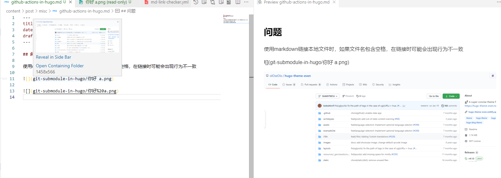

## 问题

使用markdown链接本地文件时，如果文件名包含空格，在链接时可能会出现行为不一致`git-submodule-in-hugo/你好%20a.png`和`git-submodule-in-hugo/你好 a.png`在vscode不同的插件中`kisstkondoros.vscode-gutter-preview`, `shd101wyy.markdown-preview-enhanced`存在有不同的解析结果，所以不能在文件名中出现空格



## 分析

在hugo渲染html时，可能也会出现空格的问题，如当前自定义的`layouts/_default/_markup/render-link.html`，如果没有使用测试转义，可能导致`hasPrefix .Destination $name`不一样的情况。当然，应该不会出现这样的情况，毕竟`$name`与`.Destination`都是经过hugo转义后的。但是本地不一致的行为影响体验，总之，空格禁用

## github action

在github仓库上在hugo build前使用actions检查是否含空格

```yaml
jobs:
  check:
    runs-on: ubuntu-20.04
    steps:
      - uses: actions/checkout@master
      - name: Check file names with spaces
        run: |
        # search spaces in all subfolder names
        if s=$(find content/post | grep ' '); then
          # output to stderr
          >&2 echo "found spaces in $s"
          exit 1
        fi
  deploy:
    runs-on: ubuntu-20.04
    # dependence check
    needs: check
    #...
```

参考：

- [Quickstart for GitHub Actions](https://docs.github.com/en/actions/quickstart)
- [Creating dependent jobs](https://docs.github.com/en/actions/learn-github-actions/managing-complex-workflows#creating-dependent-jobs)
