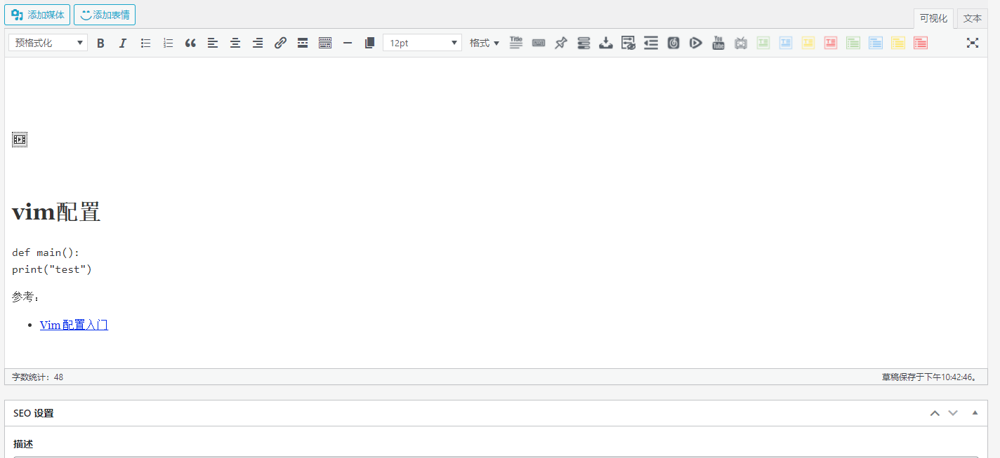

使用markdown写作有一个痛点，如何链接本地文件。如图片、本地md文件链接、其它博文相关文件log等，一般在workspace目录中放置一个`assets/images`目录，md文件会链接到该路径。

```
workspaces/
  - assets/
    - images/
    - files/
  - posts/
    - myblog.md
    - test/a.md
```

<!--more-->

但是这样存在一个问题，大量文件被放在一个不相关的地方，在需要时很难寻找。一旦md文件目录发生迁移，整个md文件中的链接都失效了。

在hugo中目录结构如果md存在多种本地文件链接，则用一个文件夹放入一个index.md与对应文件在同个目录

```
├── archetypes
├── config.toml
├── content
    - posts/
      - blog.md
      - multi-res/
        - index.md
        - a.png
        - b.log
        - c.file
├── data
├── layouts
├── static
└── themes
```

但是这里选择一个`filename.md`文件被build后会生成无后缀的`filename/`目录，里面存放相关的静态资源文件，如果md没有本地文件链接不需要文件夹。将一个md文件相关资源都放在这样的目录中非常方便：

```
workspaces/
  - content/posts/
    - alone.md
    - myblog.md
    - myblog/
      - a.log
      - b.html
      - c.png
  - public/
  - ...
```

在vscode中配合[Markdown Link Updater](https://github.com/mathiassoeholm/markdown-link-updater)重命名文件后对应链接也会被修改

使用[GitHub Action - Markdown link check](https://github.com/gaurav-nelson/github-action-markdown-link-check)可以在github repo中检查link的有效性

参考：

- [Hugo 的文件管理方案](https://www.isyin.cn/post/2018-05-03-hugo-%E7%9A%84%E6%96%87%E4%BB%B6%E7%AE%A1%E7%90%86%E6%96%B9%E6%A1%88/)
- [Directory Structure](https://gohugo.io/getting-started/directory-structure/)
- [CONTENT MANAGEMENT Content Sections](https://gohugo.io/content-management/sections/)
- [Hugo 从入门到会用](https://olowolo.com/post/hugo-quick-start/)

## hugo解决方案

### 预处理markdown link

由于当前目录结构与hugo官方不一致，导致本地相对链接无法正常使用如：

```markdown
<!-- 结构：

myblog.md
myblog/
  - vim_wordpress_esc
  - 2021-08-04-23-17-08.png

-->
[vim_wordpress_esc](my-hugo-blog/vim_wordpress_esc)

```

对于上面的两个本地链接，hugo 构建后

```html
<a href="myblog/vim_wordpress_esc">vim_wordpress_esc</a>
<!-- 配置了 fancybox = true -->
<a class="fancybox" href="http://localhost:1313/post/myblog/myblog/2021-08-04-23-17-08.png" data-fancybox="gallery" data-caption=""></a>
```

很明显，blog.md被hugo后本地路径已经与`myblog/`文件夹一级，而其中的相对路径链接还是没有变化，应该移除对应的filename前缀如：`<a href="vim_wordpress_esc">vim_wordpress_esc</a>`

### template in markdown

有一种简单的方式可以实现，在markdown文件中嵌入hugo template，可以使重写对应的链接如：

```markdown
<base href="{{ .Site.BaseURL }}">
<!-- 访问：https://host.url/img/foo.jpg -->

```

***注意：上面的代码仅用于演示，实际中存在改写`base url`后导致其它相对链接无法正常工作***

下面是简单的处理逻辑：对于`myblog.md`，在当前页面下，如果存在以页面url.path的最后一层即filename开始的href，如：`url=http://localhost:1313/post/myblog, url.path=/post/myblog, filename=myblog, href=myblog/vim_wordpress_esc`，则移除这一级的`href=vim_wordpress_esc`

参考：

- [Cannot link to static files with Hugo](https://stackoverflow.com/a/46180551/8566831)

### js

开始的思路是使用js在页面加载时将对应href重写。但是看到`<a class="fancybox" href="http://localhost:1313/post/myblog/myblog/2021-08-04-23-17-08.png"`就发现使用js无法保证所有对应的href被处理，可能由于加载顺序导致异常。如果link过多可能会影响性能

```js
let list = window.location.pathname.split("/").filter(name => name.length > 0);
console.info("got path list: ", list);
if (list.length != 0) {
    let last = list[list.length - 1];
    console.log("check all ref tag");
    for (let item of document.getElementsByTagName("a")) {
        let href = item.getAttribute("href");
        console.log("href ", href)
        if (href.startsWith(window.location.href)) {
            // console.log("href ", href);
            href = href.substring(window.location.href.length + 1);
        }
        if (href.startsWith(last)) {
            let newRef = href.substring(last.length + 1);
            item.setAttribute("href", newRef);
            console.info("replaced ", href, " with ", newRef);
        }
    }
}
```

### render hooks

在markdown渲染时预处理链接最合适，如果不行，就只能回到hugo标准目录结构了。

Markdown Render Hooks配合hugo template可以在渲染html时处理链接。定义下面的文件可以处理对应的链接类型

```
layouts
└── _default
    └── _markup
        ├── render-image.html
        ├── render-image.rss.xml
        └── render-link.html
```

下面是`render-link.html`代码

```html
<a test=""
{{$name := path.Base .Page.Permalink}}
{{if (hasPrefix .Destination $name) }}
    {{$size := len $name}}
    {{$size = add $size 1}}
    {{$destUrl := substr .Destination $size}}
    href="{{substr .Destination $size}}"
{{else}}
    href="{{.Destination | safeURL}}"
{{end}}
{{ with .Title}}
title="{{ . }}"{{ end }}>{{ .Text | safeHTML }}</a>
```

参考：

- [Configure Markup: Markdown Render Hooks](https://gohugo.io/getting-started/configuration-markup#markdown-render-hooks)
- [Markdown pre-processing?](https://discourse.gohugo.io/t/markdown-pre-processing/27299)
- [How to get the URL of the current page with the rel or relref function?](https://discourse.gohugo.io/t/how-to-get-the-url-of-the-current-page-with-the-rel-or-relref-function/29113/4)
- [Functions Quick Reference](https://gohugo.io/functions/)

## 问题

在完成上面的工作后，未使用permalinks是正常可用的。一旦启用permalinks，所有在md文件同名文件夹下的都无法迁移到新的permalinks目录下

使用同名目录`play-store-failed-to-download-in-clash-proxy.md, play-store-failed-to-download-in-clash-proxy/`部分构建结果:

```
public/post
├── 2021
│   └── 08
│       ├── 09
│           ├── clash-transparent-proxy
│           │   └── index.html
│           └── play-store-failed-to-download-in-clash-proxy
│               └── index.html
├── index.html
├── index.xml
└── tools
    └── play-store-failed-to-download-in-clash-proxy
        ├── 2021-08-09-17-57-48.png
        ├── 2021-08-09-18-06-18.gif
        ├── 2021-08-09-18-09-35.png
        ├── 2021-08-09-18-14-35.png
        ├── 2021-08-09-18-19-06.png
        ├── 2021-08-09-18-34-55.png
        ├── 2021-08-09-18-44-36.png
        ├── 2021-08-09-19-13-51.png
        └── 2021-08-26-01-49-06.png
```

下面是使用标准目录`play-store-failed-to-download-in-clash-proxy/index.md`部分构建结果:

```
public/post
├── 2021
│   └── 08
│       ├── 09
│       │   ├── clash-transparent-proxy
│       │   │   └── index.html
│       │   └── play-store-failed-to-download-in-clash-proxy
│       │       ├── 2021-08-09-17-57-48.png
│       │       ├── 2021-08-09-18-06-18.gif
│       │       ├── 2021-08-09-18-09-35.png
│       │       ├── 2021-08-09-18-14-35.png
│       │       ├── 2021-08-09-18-19-06.png
│       │       ├── 2021-08-09-18-34-55.png
│       │       ├── 2021-08-09-18-44-36.png
│       │       ├── 2021-08-09-19-13-51.png
│       │       ├── 2021-08-26-01-49-06.png
│       │       └── index.html
├── index.html
├── index.xml
└── tools
    └── play-store-failed-to-download-in-clash-proxy
        ├── 2021-08-09-17-57-48.png
        ├── 2021-08-09-18-06-18.gif
        ├── 2021-08-09-18-09-35.png
        ├── 2021-08-09-18-14-35.png
        ├── 2021-08-09-18-19-06.png
        ├── 2021-08-09-18-34-55.png
        ├── 2021-08-09-18-44-36.png
        ├── 2021-08-09-19-13-51.png
        └── 2021-08-26-01-49-06.png
```

暂时还不清楚要在标准目录中hugo如何移动对应的资源文件。但是非标准目录要这样的代价不如使用标准目录，避免一堆问题

参考：

- [调整了下 Hugo 永久链接生成配置](https://ttys3.dev/post/got-my-hugo-permalink-config-adjusted/)
- [CONTENT MANAGEMENT Page Bundles](https://gohugo.io/content-management/page-bundles/)
- [Single Page Templates](https://gohugo.io/templates/single-page-templates/)
