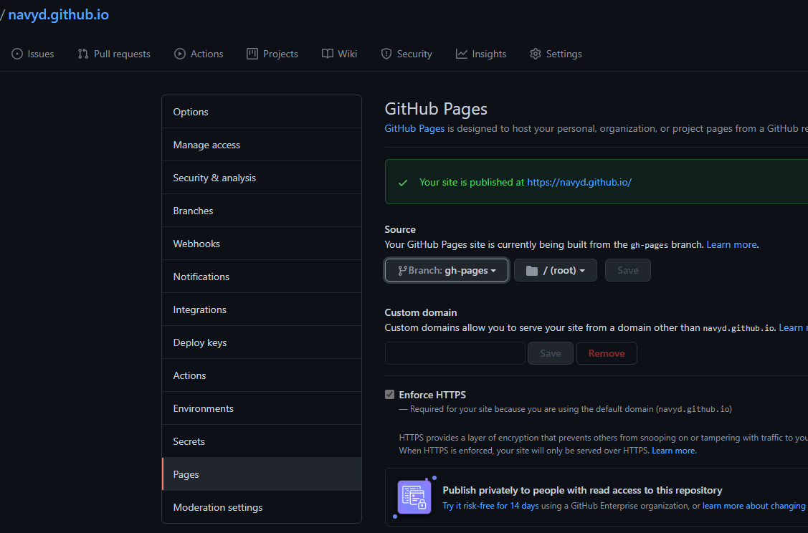
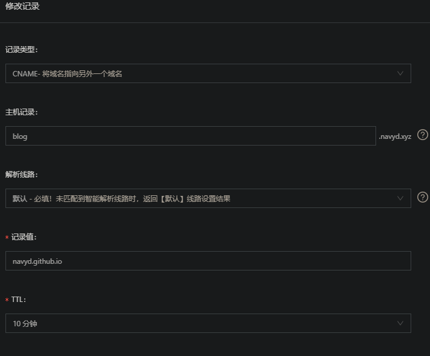
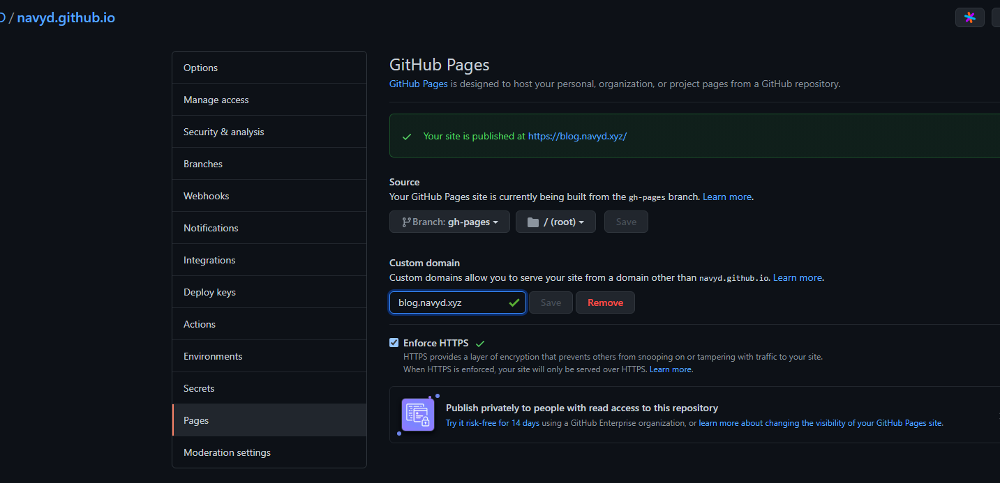
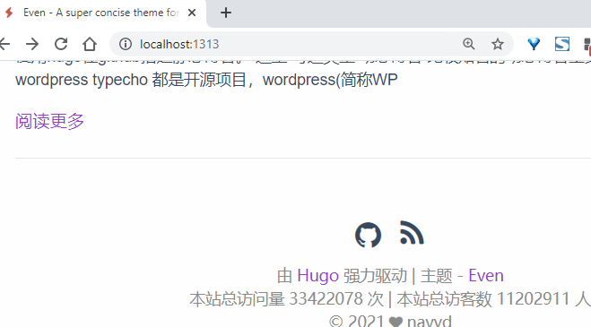
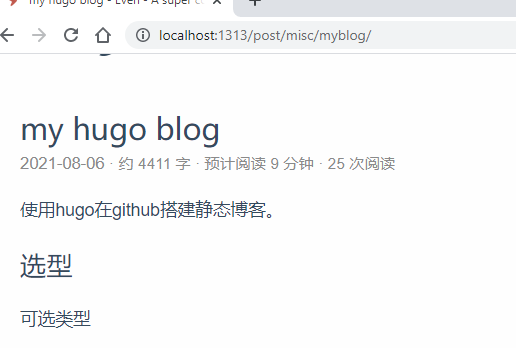
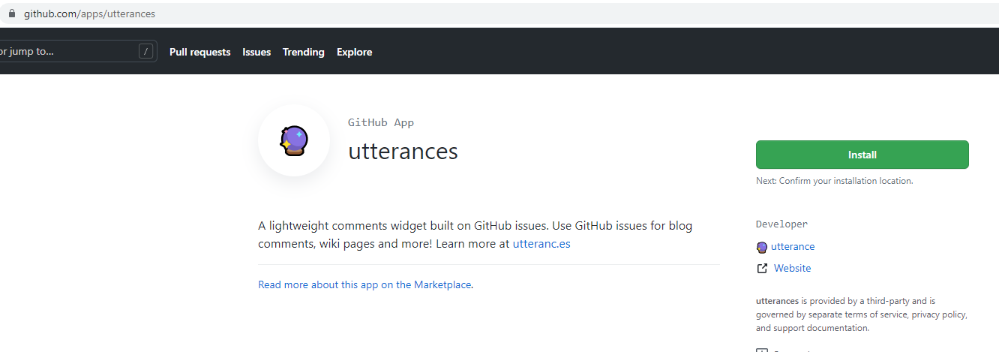
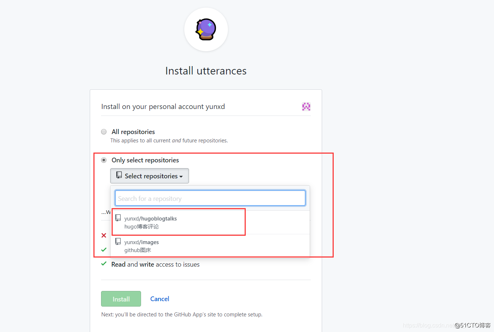
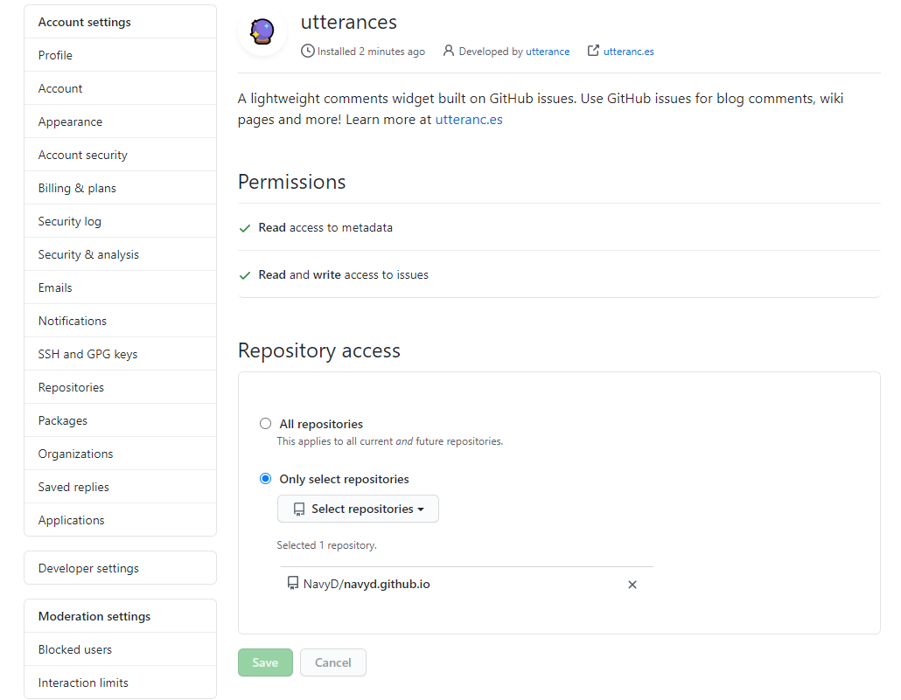
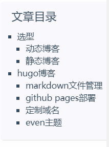
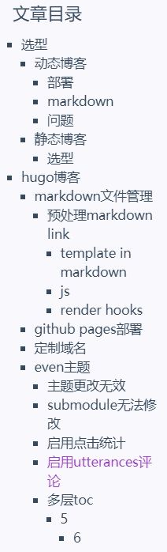

使用hugo在github搭建静态博客。

<!--more-->

## 选型

可选类型

### 动态博客

比较知名的动态博客工具有下面几种：

- [wordpress](https://wordpress.com/)
- [typecho](http://typecho.org/)

都是开源项目，wordpress(简称WP)是使用最广泛的，而typecho开发都不是告别活跃

对于博客项目，稳定是前提

开源项目参考：

- [WordPress/WordPress](https://github.com/WordPress/WordPress)
- [typecho/typecho](https://github.com/typecho/typecho)

#### 部署

在试用WP中，虽然现在可以使用docker方便的部署，我使用raspi4 2GB运行有点不够，运行WP与mysql后仅剩下200M左右，如果再vscode remote连接直接死机，需要开启swap才能正常。

#### markdown

由于之前都是使用markdown写作，存在100多篇md博文，不可能一一复制到WP中，所以想使用工具批量发布到WP中。在初步使用中没有发现在WP中有方法直接渲染markdown，基本都是md在线编辑器，不符合需求。

换个方式，使用已经渲染好的html文件发布到WP更好，避免了md的渲染不一致的问题，同时可以使用wp rest api批量更新。

尝试直接复制使用渲染markdown转换的html不可用，WP的html代码文本编辑器会转义部分代码

1. 原始markdown内容

    ```markdown
    # vim配置

    <!-- 去除空格`` ` -->
    `` `yaml
    vim: true
    `` `

    参考：

    * [Vim 配置入门](http://www.ruanyifeng.com/blog/2018/09/vimrc.html)
    ```

1. 使用markdown-preview-enhanced导出cdn hosted文件[vim_markdown_preview_enhanced.html](vim_markdown_preview_enhanced.html)，下面是部分代码：

    ```html
    <!DOCTYPE html><html><head>
    <title>vim&#x914D;&#x7F6E;</title>
    <meta charset="utf-8">
    <meta name="viewport" content="width=device-width, initial-scale=1.0">

    <link rel="stylesheet" href="https://cdn.jsdelivr.net/npm/katex@0.13.11/dist/katex.min.css">

    <style>
    /**
    * prism.js Github theme based on GitHub's theme.
    * @author Sam Clarke
    */
    code[class*="language-"],
    pre[class*="language-"] {
    color: #333;
    background: none;
    font-family: Consolas, "Liberation Mono", Menlo, Courier, monospace;
    text-align: left;
    white-space: pre;
    word-spacing: normal;
    word-break: normal;
    word-wrap: normal;
    line-height: 1.4;

    -moz-tab-size: 8;
    -o-tab-size: 8;
    tab-size: 8;

    -webkit-hyphens: none;
    -moz-hyphens: none;
    -ms-hyphens: none;
    hyphens: none;
    }
    ```

1. 经过WP转义后[vim_wordpress_esc](vim_wordpress_esc)

     下面是部分代码：

    ```html
    &nbsp;
    
    &nbsp;
    
    <style>
    /**<br />
    * prism.js Github theme based on GitHub's theme.<br />
    * @author Sam Clarke<br />
    */<br />
    code[class*="language-"],<br />
    pre[class*="language-"] {<br />
    color: #333;<br />
    background: none;<br />
    font-family: Consolas, "Liberation Mono", Menlo, Courier, monospace;<br />
    text-align: left;<br />
    white-space: pre;<br />
    word-spacing: normal;<br />
    word-break: normal;<br />
    word-wrap: normal;<br />
    line-height: 1.4;</p>
    <p>-moz-tab-size: 8;<br />
    -o-tab-size: 8;<br />
    tab-size: 8;</p>
    <p>-webkit-hyphens: none;<br />
    -moz-hyphens: none;<br />
    -ms-hyphens: none;<br />
    hyphens: none;<br />
    }</p>
    ```

可以看到`title, link`等tag被移除转义为`&nbsp;`，其中`<link rel="stylesheet" href="https://cdn.jsdelivr.net/npm/katex@0.13.11/dist/katex.min.css">`被移除导致无法正确显示代码高亮；`\n`被转义为`<br />`。下面有可以解决这两个问题：

- minifiy html移除所有`\n`避免转义：有各种插件可以生成一行的html文件
- 在WP中引用全局外部css。有两种方式

  1. 在额外css中插入`@import url("//cdn.jsdelivr.net/npm/katex@0.13.11/dist/katex.min.css");`
      

  2. 在主题style.css中插入`@import url("//cdn.jsdelivr.net/npm/katex@0.13.11/dist/katex.min.css");`
      

参考：

- [在WordPress中使用Markdown进行写作的正确姿势](https://cloud.tencent.com/developer/article/1150073)
- [WordPress+PublishMarkdown快速构建个人博客](https://www.paincker.com/publish-markdown)
- [命令行创建和发布 MarkDown 到 WordPress](https://zhuanlan.zhihu.com/p/65593971)
- [REST API Handbook](https://developer.wordpress.org/rest-api/reference/)
- [rest api: Posts](https://developer.wordpress.org/rest-api/reference/posts/)
- [How to link external css in wordpress? [closed]](https://stackoverflow.com/questions/27045670/how-to-link-external-css-in-wordpress)

#### 问题

到此，markdown渲染的问题解决了，新的问题出现了，如何批量渲染md文件。vscode markdown-preview-enhanced插件只提供了手动的方式渲染出html，front-matter配置自动导出需要打开预览界面才行，不利于自动化

```yaml
---
html:
  embed_local_images: false
  embed_svg: true
  offline: false
  toc: undefined

print_background: false
---
```

另外，对于不常用的图片，可以base64编码嵌入html文件中，缺点是文件过大，不利于缓存加载，链接形式的图片可以懒加载体验更好

于是转而寻找自动化工具，在[typora issues](https://github.com/typora/typora-issues/issues/824#issuecomment-418176112)中找到答案：Static Site Generator

参考：

- [Markdown Preview Enhanced docs](https://shd101wyy.github.io/markdown-preview-enhanced/#/zh-cn/)
- [Support export Multiple Documents #824](https://github.com/typora/typora-issues/issues/824)
- [[Summary] Advanced command line interface support #1999](https://github.com/typora/typora-issues/issues/1999)
- [typora issues](https://github.com/typora/typora-issues)

### 静态博客

知名的静态博客工具有：

- [hexo](https://github.com/hexojs/hexo)
- [hugo. A fast, simple & powerful blog framework, powered by Node.js.](https://github.com/gohugoio/hugo)
- [jekyll. Jekyll is a blog-aware static site generator in Ruby](https://github.com/jekyll/jekyll)

#### 选型

hexo使用nodejs开发，hugo使用golang开发，相对更熟悉golang。速度在这里不是重点，nodejs已经足够

部署方面，由于不是nodejs开发者，需要配置复杂的开发环境，虽然可借助docker在本地使用，但是没有找到可用的docker镜像，能满足需求。hugo部署非常简单，只有一个bin文件，结合git管理与github pages非常方便

在资源方面，hexo更多，但本着可以折腾golang、轻量博客功能不作过多要求的精神，hugo是理想的选择

## hugo博客

[目录管理](../markdown-management-in-hugo.md)

### github pages部署

在github上使用一个仓库`<username>.github.io`保存hugo博文与gh-pages。基本配置在[Host on GitHub](https://gohugo.io/hosting-and-deployment/hosting-on-github/#readout)一致。

但是要注意[First Deployment with GITHUB_TOKEN](https://github.com/peaceiris/actions-gh-pages#%EF%B8%8F-first-deployment-with-github_token)，配置完github ations后需要主动创建`gh-pages`*空的分支*用于保存在hugo public/中的内容，并在repo settings中将其配置为GitHub Pages的source：



参考：

- [GitHub Pages action](https://github.com/marketplace/actions/github-pages-action)
- [hugo: Host on GitHub](https://gohugo.io/hosting-and-deployment/hosting-on-github/#types-of-github-pages)
- [GitHub Action Hugo setup](https://github.com/marketplace/actions/hugo-setup)

### 定制域名

1. 在dns提供商添加cname解析到gh-pages的域名`navyd.github.io`。如[阿里云DNS解析控制台](https://dns.console.aliyun.com)
    
1. 添加域名`blog.navyd.xyz`内容到`static/CNAME`文件
1. 根据[Configuring a subdomain](https://docs.github.com/en/pages/configuring-a-custom-domain-for-your-github-pages-site/managing-a-custom-domain-for-your-github-pages-site#configuring-a-subdomain)指导，在github仓库中添加子域名`blog.navyd.xyz`并启用https
    

注意：如果用浏览器打开新域名时提示不安全的证书，可能是缓存了以前使用过的域名证书，使用chrome无痕模式可以正常打开，等待chrome刷新缓存即可

参考：

- [hugo Use a Custom Domain](https://gohugo.io/hosting-and-deployment/hosting-on-github/#use-a-custom-domain)
- [About custom domains and GitHub Pages](https://docs.github.com/en/pages/configuring-a-custom-domain-for-your-github-pages-site/about-custom-domains-and-github-pages)
- [Q: Custom domain for GitHub project pages](https://stackoverflow.com/a/9123911/8566831)
- [Can github pages CNAME file contain more than one domain?](https://stackoverflow.com/a/16455966/8566831)

### even主题

#### 主题更改无效

在[Theme Color](https://github.com/olOwOlo/hugo-theme-even/blob/master/README-zh.md#theme-color)中提到可以在evne目录中`/assets/sass/_variable.scss`文件修改主题

```scss
// ========== Theme Color ========== //
// Config here to change theme color
// Default | Mint Green | Cobalt Blue | Hot Pink | Dark Violet
$theme-color-config: 'Dark Violet';
```

如果未生效可能是由于hugo不是extend版本，使用`--tags extended`重新编译

```sh
$ hugo version
hugo v0.87.0 linux/amd64 BuildDate=unknown

# 在hugo源码内重编译
$ CGO_ENABLED=1 go install --tags extended

$ hugo version
hugo v0.87.0+extended linux/amd64 BuildDate=unknown
```

- [怎么更该了主题/assets/sass/_variable.scss 颜色值没发生改变是怎么回事](https://github.com/olOwOlo/hugo-theme-even/issues/350#issuecomment-857537169)
- [Build and Install the Binaries from Source (Advanced Install)](https://github.com/gohugoio/hugo#build-and-install-the-binaries-from-source-advanced-install)
- [even Installation](https://github.com/olOwOlo/hugo-theme-even/blob/master/README-zh.md#installation)

#### submodule无法修改

由于使用了`git submodle`将even作为项目的子模块，现在要修改`/assets/sass/_variable.scss`文件，但是无法完成。如果之后无法找到解决方法，只有使用clone而不是作为submodule

<!-- todo -->

#### 启用点击统计

even支持不蒜子统计站点访问量

```toml
[params.busuanzi] # count web traffic by busuanzi                             # 是否使用不蒜子统计站点访问量
enable = true
siteUV = true
sitePV = true
pagePV = true
```

主站统计



文章访问统计



#### 启用utterances评论

utterances 是依托于 github repository 的 issues 建立的评论功能

1. 点击[GitHub App utterances](https://github.com/apps/utterances)为github pages仓库`navyd.github.io`安装
    
2. 选择使用utterances评论的仓库
    
    
3. 在even配置中启用utterances

    ```toml
    [params.utterances] # https://utteranc.es/
    owner = "navyd" # Your GitHub ID
    repo = "navyd.github.io"  # The repo to store comments
    ```

4. 启动`hugo server -D`本地查看效果
    

参考：

- [hugo博客使用 utterances 作为评论系统](https://blog.51cto.com/xdr630/2797532)
- [utterances](https://utteranc.es/)
- [Hugo 主题 Even 的自定义配置](https://blog.dontjudge.cn/post/hugo-%E4%B8%BB%E9%A2%98-even-%E7%9A%84%E8%87%AA%E5%AE%9A%E4%B9%89%E9%85%8D%E7%BD%AE/)

#### 多层toc

```toml
[markup.tableOfContents]
startLevel = 1
endLevel = 6
```

配置前：



配置后：



参考：

- [Hugo 相关部署操作](https://kuang.netlify.app/blog/hugo.html)
- [CONTENT MANAGEMENT Table of Contents](https://gohugo.io/content-management/toc/)
- [Configure Markup](https://gohugo.io/getting-started/configuration-markup#config)

### 配置

#### 忽略渲染部分文件

在输出中发现非hugo配置的md文件被渲染，实际不需要渲染生成这些文件

```sh
$ hugo --debug
Start building sites …
hugo v0.87.0 linux/amd64 BuildDate=unknown
INFO 2021/08/27 19:47:43 syncing static files to /home/navyd/Workspaces/projects/navyd.github.io/public/
DEBUG 2021/08/27 19:47:43 Render page Cargo Doc Open Does Not Work in Wsl to "/post/rust/cargo-doc-open-does-not-work-in-wsl/index.html"
DEBUG 2021/08/27 19:47:43 found menu: "main", in site config
DEBUG 2021/08/27 19:47:43 found menu: "main", in site config
DEBUG 2021/08/27 19:47:43 found menu: "main", in site config
DEBUG 2021/08/27 19:47:43 found menu: "main", in site config
DEBUG 2021/08/27 19:47:43 Render page  to "/res/docker/docker更换国内镜像/index.html"
DEBUG 2021/08/27 19:47:43 Render page  to "/res/docker/docker构建容器/index.html"
# ...
                   | ZH-CN
-------------------+--------
  Pages            |   155
  Paginator pages  |     3
  Non-page files   |   175
  Static files     |    39
  Processed images |     0
  Aliases          |    17
  Sitemaps         |     1
  Cleaned          |     0

Total in 391 ms
```

```toml
# baseURL = "https://blog.navyd.xyz/"
# languageCode = "en"
# ...
ignoreFiles = ['content/res/*']

# [permalinks]
#...
```

参考：

- [Ignore Content and Data Files when Rendering](https://gohugo.io/getting-started/configuration/#ignore-content-and-data-files-when-rendering)

#### 修改首页博文list排序

覆盖主题中提供的list模板如`themes/<your-theme>/layouts/_default/list.html`，放到`layouts/_default/list.html`中，修改其中的关键变量`.Pages`，hugo在这[Lists of Content in Hugo#Order Content](https://gohugo.io/templates/lists/#order-content)提供了多种方式排序，默认为`Weight > Date > LinkTitle > FilePath`

参考：

- [Lists of Content in Hugo#Order Content](https://gohugo.io/templates/lists/#order-content)
- [Sorting paginated pages by date](https://discourse.gohugo.io/t/sorting-paginated-pages-by-date/14472)
- [TEMPLATES Pagination List Paginator Pages](https://gohugo.io/templates/pagination/#list-paginator-pages)
- [VARIABLES AND PARAMS Page Variables The .Pages Variable](https://gohugo.io/variables/page/#pages)

#### Content Summaries

使用`<!--more-->`控制渲染md显示文章简介

参考：

- [CONTENT MANAGEMENT Content Summaries](https://gohugo.io/content-management/summaries/#readout)
