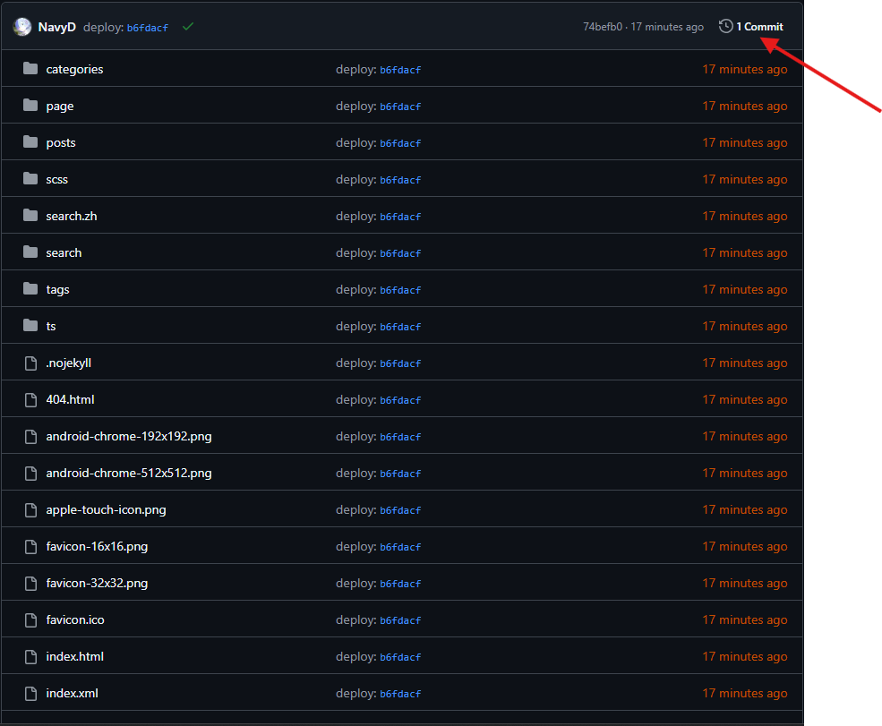
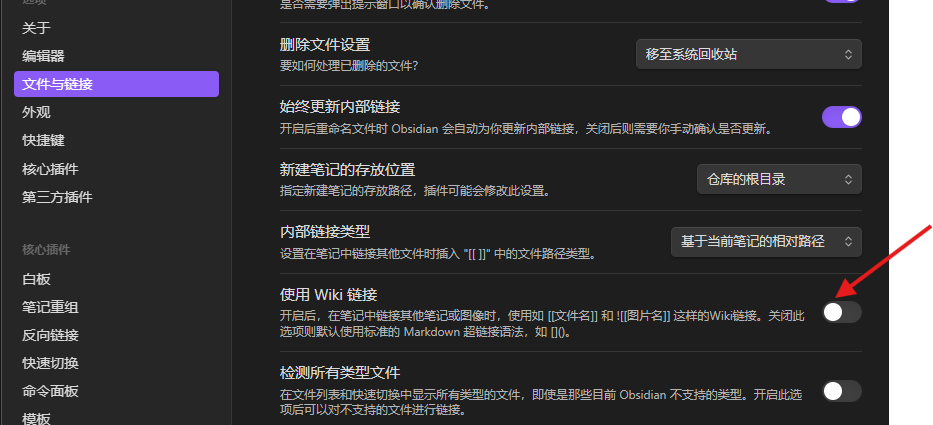
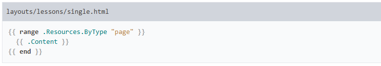

## hugo new content

在使用`hugo new content posts/your-post.md`创建一个 md 文件`content/posts/your-post.md`，但更好的博客目录结构可以使用`posts/2025/01/your-post/index.md`这种

根据[leaf-bundles](https://gohugo.io/content-management/archetypes/#leaf-bundles)自动创建叶子结点目录结构，根据常用的 shell 使用下面的命令运行即可

```bash
hugo new posts/$(date +'%Y/%m')/'your post'
```

```powershell
hugo new "posts/$(Get-Date -Format 'yyyy/MM')/my posts"
```

参考：

- [content-management archetypes](https://gohugo.io/content-management/archetypes/)
- [“Hugo way” to create new content in year/month/subfolders?](https://discourse.gohugo.io/t/hugo-way-to-create-new-content-in-year-month-subfolders/36557)
- [Dates in post filenames](https://discourse.gohugo.io/t/dates-in-post-filenames/26219)
- [搭建好博客之后，纠结怎么组织文章的目录结构](https://linux.do/t/topic/206540)
- [Page resources not working (as expected) with extract date and slug from filename functionality #4558](https://github.com/gohugoio/hugo/issues/4558)
- [Add a date to default filename](https://discourse.gohugo.io/t/add-a-date-to-default-filename/31059)

## 如何兼容多种主题

由于多种主题间的 params 是不兼容的，一旦在 md 的[front matter](https://gohugo.io/content-management/front-matter/)中指定了主题的配置，会导致切换主题后无效。如果允许动态的修改 front matter 中的主题的配置，能轻易的兼容多种主题

### 模板

从模板中通过[Override the base template](https://gohugo.io/templates/base/#define-the-base-template)和[Template lookup order](https://gohugo.io/templates/lookup-order/)重置`.Site.Params`变量是不可行的，这是由于所有全局模板变量基本是只读的，无法更新，如果使用[hugo.Store](https://gohugo.io/functions/hugo/store/)允许更新但无法覆盖 params api

在[Theme components](https://gohugo.io/hugo-modules/theme-components/)中提到允许指定`theme = ['my-shortcodes', 'base-theme']`覆盖主题，尽管也允许使用[Merge configuration from themes](https://gohugo.io/getting-started/configuration/)参考示例[Allow smarter merging of config (esp. params) from themes #8633](https://github.com/gohugoio/hugo/issues/8633)合并主题配置，但有这样一种需求是无法满足的：**当前 post 中如果存在 1 个图片链接则作为文章 cover**

大多数主题都有 cover 图片配置参数，但这样的逻辑处理却需要动态处理，只能修改主题的处理逻辑。但如果可以在 build page 时修改 front matter 动态的设置 cover 就可以避免修改主题也能达成类似的效果

参考：

- [Porting posts between themes?](https://discourse.gohugo.io/t/porting-posts-between-themes/35455)
- [CONTENT MANAGEMENT Content adapters](https://gohugo.io/content-management/content-adapters/)
- [Build pages from data source #5074](https://github.com/gohugoio/hugo/issues/5074)
- [Create pages from _content.gotmpl #12427](https://github.com/gohugoio/hugo/issues/12427)
- [Allow Hugo to parse "plain" Markdown #6098](https://github.com/gohugoio/hugo/issues/6098)
- [Could I add Front Matter auto based on markdown file information #8638](https://github.com/gohugoio/hugo/issues/8638)
- [Setting page params/variables from a template](https://discourse.gohugo.io/t/setting-page-params-variables-from-a-template/9505)

#### hooks 模板问题

##### 如何访问题部分中的 Config.toml 值

有一个简单的想法，在 [Link render hooks](https://gohugo.io/render-hooks/links/) 中检查当前启用的主题设置不同的 link 属性来兼容多种主题。

hugo 可以通过 [Site.Config](https://gohugo.io/methods/site/config/) 获取部分配置信息 [Privacy](https://gohugo.io/about/privacy/) ，如果需要所有配置信息则需要主动读取配置文件 `{{ $config := os.ReadFile "config.toml" | transform.Unmarshal }}` 或在配置文件中添加需要的信息到 `[params]` 中使用 [.Site.Params](https://gohugo.io/methods/site/params/) 获取，读取固定的配置文件由于 hugo 可随时指定配置文件路径导致其稳定性非常脆弱，使用 params 又会导致重复配置的问题

目前来看这不是一个着急的问题，毕竟主题不常换

TODO

参考：

- [Access Config.toml values in theme’s partial](https://discourse.gohugo.io/t/access-config-toml-values-in-themes-partial/35999)
- [.Site.Theme?](https://discourse.gohugo.io/t/site-theme/33200)

### Content adapters

根据[Content adapters](https://gohugo.io/content-management/content-adapters/)通过 go 模板`content/$section/_content.gotmpl`在构建时动态添加 page 生成静态页面

#### 问题

`_content.gotmpl`模板只能在构建时使用，其相对于主题中能使用的众多模板 Methods 相当有限[content-adapters/#methods](https://gohugo.io/content-management/content-adapters/#methods)，只要是与[Page](https://gohugo.io/methods/page/)相关都不可用，如[Site.Config](https://gohugo.io/methods/page/)。

想要动态生成元数据就需要解析 md 文件，但 hugo 目前不提供在构建阶段解析 markdown,html 的方法，如[transform.Markdownify](https://gohugo.io/functions/transform/markdownify/)在这个阶段使用将会出现`this method cannot be called before the site is fully initialized`错误。

另外，如果只用 go 模板，一旦代码规模稍大其可维护性必然很糟糕。

在 github 上发现大部分都是使用解析一个 data.json 文件添加到 page，而不是复杂的解析 md 文件，问题就变成了解析 md 文件到 json 再使用`_content.gotmpl`解析添加到 page

由于 hugo 不支持调用外部命令运行[Configuration option to invoke a command upon build #9460](https://github.com/gohugoio/hugo/issues/9460)，在`hugo server|build`等命令运行前需要处理好 data.json 避免部分数据更新无效的问题

## 部署 gh-pages

### gh-pages 分支

在 gh-pages 分支中保留当前构建的 static 页面，默认情况下会保留 deploy 的提交，可能导致仓库大小激增。



在[actions-gh-pages #Force orphan `force_orphan`](https://github.com/peaceiris/actions-gh-pages#%EF%B8%8F-force-orphan-force_orphan)中提到可以使用`force_orphan: true`仅保留最新提交

```yaml
- name: Deploy
  uses: peaceiris/actions-gh-pages@v4
  with:
    github_token: ${{ secrets.GITHUB_TOKEN }}
    publish_dir: ./public
    force_orphan: true
```

### baseUrl

如果域名根目录指向主页，无需设置 baseUrl

参考：

- [How put the URL base?](https://discourse.gohugo.io/t/how-put-the-url-base/45920)
- [hugo: Host on GitHub Pages](https://gohugo.io/hosting-and-deployment/hosting-on-github/)

## Obsidian

参考 [编辑与格式化/基本格式语法#内部链接](https://publish.obsidian.md/help-zh/%E7%BC%96%E8%BE%91%E4%B8%8E%E6%A0%BC%E5%BC%8F%E5%8C%96/%E5%9F%BA%E6%9C%AC%E6%A0%BC%E5%BC%8F%E8%AF%AD%E6%B3%95#%E5%86%85%E9%83%A8%E9%93%BE%E6%8E%A5) 支持 2 种风格的链接

- Wiki 链接风格：`[[运动三定律]]`
- Markdown 链接风格：`[运动三定律](运动三定律.md)`

### 兼容 wiki 链接

目前未找到兼容`![[img]]`,`[[post.md]]`转换为标准 md 链接的方式，参考 [Support wiki-style internal page links #3606](https://github.com/gohugoio/hugo/issues/3606#issuecomment-1555955974) 只能修改 obsidian 从默认 wiki 方式转为标准的 md 链接避免这个问题



虽然可以尝试使用 [Content adapters](https://gohugo.io/content-management/content-adapters/) 在模板中替换 `[[link]]` 作为标准的 `[text](link)` 链接即可，但由于 markdown 比较复杂，无法用简单的正则表达式正确地做到这一点，有许多边缘情况需要考虑，过于复杂的正则也可能导致文本匹配性能问题。

参考：

- [Regex match markdown link](https://stackoverflow.com/a/67138593/8566831)
- [Which is better- WikiLinks or Markdown links?](https://www.reddit.com/r/ObsidianMD/comments/k0po5z/which_is_better_wikilinks_or_markdown_links/)

### 兼容 md 内部文件链接

对于如 `content/posts/this is post/index.md` 内部文件有链接如 `[xxx](../other post/index.md)` 应该被解析成 hugo page 链接如 `[xxx](/posts/other-post)` ，但由于正则的复杂性，不应该使用正则替换。

#### Link render hooks

在 [Link render hooks](https://gohugo.io/render-hooks/links/) 提到可以使用 `layouts/_default/_markup/render-link.html` 覆盖主题配置和 [embedded link render hook](https://github.com/gohugoio/hugo/blob/master/tpl/tplimpl/embedded/templates/_default/_markup/render-link.html) 。

##### 添加 HTML 文件作为资源

有时需要添加如 `html`, `md`, `txt` 等文件到文章作为链接资源，但 hugo 对于 [Content management Page resources](https://gohugo.io/content-management/page-resources/) 特殊内容资源文件如 `html`, `md` 等视为 page 类型，在 [leaf bundles](https://gohugo.io/quick-reference/glossary/#leaf-bundle) 中的这些文件默认不会加载作为资源文件到 public 目录中。

参考 [Add a way to identify a non-Page HTML etc. resource #12274](https://github.com/gohugoio/hugo/issues/12274) 需要主动将这种类型的文件发布：

```gotmpl
{{ ((.Resources.Get "a.html").Content | resources.FromString "/p1/a.html").RelPermalink }}
{{ ((.Resources.Get "b.html").Content | resources.FromString "/p1/b.html").Permalink }}
{{ ((.Resources.Get "c.html").Content | resources.FromString "/p1/c.html").Publish }}
```

注意：由于 page 类型的链接使用的文件名可能会由于 [logical path](https://gohugo.io/quick-reference/glossary/#logical-path) 的转换与原始的文件名不同，如 `fuck post.md` 作为 page 时的路径名为 `fuck-post.md`，从而导致匹配文件名失败，可以使用 [.Page.Resources.ByType](https://gohugo.io/methods/page/resources/#bytype) 获取当前目录下的所有 page 类型的资源

```gotmpl
{{ $page_res := "" }}
{{ range .Page.Resources.ByType "page" }}
    {{/* NOTE: 仅用于当前leaf bundule中的page资源，无法作用如`../../test.html`的page资源，
        但对于这样的page资源会事先被`.Page.GetPage path`获取，所以无需处理
    */}}
    {{ if hasSuffix . $link_path }}
        {{ $page_res = . }}
        {{ break }}
    {{ end }}
{{ end }}
{{ with $page_res }}
    {{ $publishPath := urls.JoinPath $.Page.RelPermalink .Name }}
    {{ $page_res_permalink := (.Content | resources.FromString $publishPath).Permalink }}
    href="{{$page_res_permalink | safeURL}}"
{{ end }}
```

参考：

- [Link to .html resources](https://discourse.gohugo.io/t/link-to-html-resources/22953)
- [How do I have an HTML file as a page resource?](https://discourse.gohugo.io/t/how-do-i-have-an-html-file-as-a-page-resource/37523)
- [Loading a page resources within a page Markdown page resource](https://discourse.gohugo.io/t/loading-a-page-resources-within-a-page-markdown-page-resource/35195)
- [How to render markdown url with .md to correct link](https://discourse.gohugo.io/t/how-to-render-markdown-url-with-md-to-correct-link/26372)

## 扩展语法

### 转义 hugo shortcode

在 markdown 源码中使用 `<!-- {} -->` 可以让这之中的代码转义为原始代码避免被渲染，同时在 md 文档中隐藏 `{{%/*` 。

参考：

- [Can I escape a shortcode from a Hugo theme from blogdown](https://stackoverflow.com/questions/62432532/can-i-escape-a-shortcode-from-a-hugo-themebb-bbbbblogdownblogdown子子frombb-blogdown)
- [Escape shortcodes while using RenderString #10058](https://github.com/gohugoio/hugo/issues/10058)
- [Escape shortcodes while using RenderString](https://discourse.gohugo.io/t/escape-shortcodes-while-using-renderstring/39331)

### 可折叠内容

[在 GitHub 上写入/使用高级格式/ 使用折叠部分组织信息](https://docs.github.com/zh/get-started/writing-on-github/working-with-advanced-formatting/organizing-information-with-collapsed-sections#creating-a-collapsed-section) 中可以使用 `<details>` 将内容折叠，直到单击展开详细信息，但在 hugo 中默认不会渲染 html，但可以在 [configuration-markup/#rendererunsafe](https://gohugo.io/getting-started/configuration-markup/#rendererunsafe) 使用 `markup.goldmark.renderer.unsafe=true` 渲染。

另外也可以使用 [Shortcodes/Details](https://gohugo.io/shortcodes/details/) 如

<!-- {} -->

参考：

- [How can I fold content in Github markdown?](https://stackoverflow.com/questions/52214187/how-can-i-fold-content-in-github-markdown)
- [Raw HTML getting omitted in 0.60.0](https://discourse.gohugo.io/t/raw-html-getting-omitted-in-0-60-0/22032)

### 在代码块上显示文件名

在 hugo 官网上代码块常常包含了文件名很直观



但目前没有相关 markdown 标准可做到，在 hugo 中提供的 [shortcodes/highlight](https://gohugo.io/shortcodes/highlight/) 中建议可能需要创建 `layouts/shortcodes/hl.html` 定制 shortcode，但在我这里，应该尽量避免使用平台专有特性以增强兼容性。

目前可以需要使用 [Code block render hooks](https://gohugo.io/render-hooks/code-blocks/) 定制主题模板，但是
TODO

参考：

- [Filenames for code blocks](https://discourse.gohugo.io/t/filenames-for-code-blocks/32466)
- [Properly displaying config file names in code blocks](https://forum.obsidian.md/t/properly-displaying-config-file-names-in-code-blocks/92009)
- [In-line code highlight](https://discourse.gohugo.io/t/in-line-code-highlight/43744)
