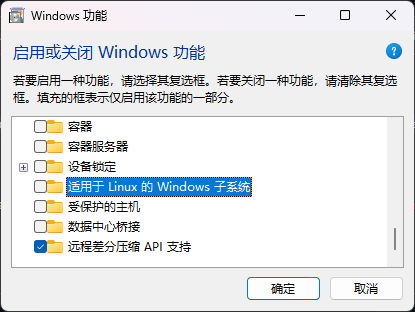
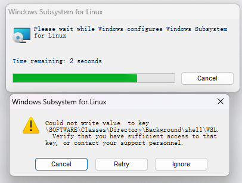

# WSL更新出错：Wsl/CallMsi/Install/REGDB_E_CLASSNOTREG

今天手贱尝试更新`wsl --update`，结果更新失败出错

```console
$ wsl --update # 或 `wsl --help`,`wsl --status`等
# ...
WSL 正在完成升级...
Could not write value to key \SOFTWARE\Classes\Directory\Background\shell\WSL.
Verify that you have sufficient access to that key, or contact your support personnel.wsl:
WSL 安装似乎已损坏 (错误代码： Wsl/CallMsi/Install/ERROR_INSTALL_FAILURE)。
按任意键修复 WSL，或 CTRL-C 取消。
此提示将在 60 秒后超时。

正在将适用于 Linux 的 Windows 子系统更新到版本： 2.3.26。
没有注册类
错误代码: Wsl/CallMsi/Install/REGDB_E_CLASSNOTREG
```

问题参考[# Error code: Wsl/CallMsi/REGDB_E_CLASSNOTREG #10882](https://github.com/microsoft/WSL/issues/10882)，无论运行WSL的任何命令和参数，都会出现上述提示。

## 解决

注意：***一定要事先备份好WSL的磁盘避免数据丢失***，参考[How to locate the .vhdx file and disk path for your Linux distribution](https://learn.microsoft.com/en-us/windows/wsl/disk-space#how-to-locate-the-vhdx-file-and-disk-path-for-your-linux-distribution)找到`.vhdx`文件复制备份好

```powershell
# 获取wsl distro vhdx文件目录
(Get-ChildItem -Path HKCU:\Software\Microsoft\Windows\CurrentVersion\Lxss | Where-Object { $_.GetValue("DistributionName") -eq '<distribution-name>' }).GetValue("BasePath") + "\ext4.vhdx"
```

参考[Error code: Wsl/CallMsi/REGDB_E_CLASSNOTREG #10882](https://github.com/microsoft/WSL/issues/10882#issuecomment-2197198797)，[wsl --install 报错：灾难性故障](https://answers.microsoft.com/zh-hans/windows/forum/all/wsl-install/cd18be19-e2fb-4173-82ad-c5a7600fc18e)

1. 关闭wsl功能并重启
	
2. 关闭powertoys避免在安装wsl时出现[MSI installer "Warning: 1946.Property [...] could not be set."#11276](https://github.com/microsoft/WSL/issues/11276)
3. 下载最新或兼容你更新前的版本[WSL/releases](https://github.com/microsoft/WSL/releases)msi文件并安装
4. 忽略[Could not write value to key \SOFTWARE\Classes\Drive\shell\WSL #11697](https://github.com/microsoft/WSL/issues/11697#issuecomment-2168104220)问题即可
	
5. 检查是否成功
	```console
	$ wsl --version
	WSL 版本： 2.4.10.0
	内核版本： 5.15.167.4-1
	WSLg 版本： 1.0.65
	MSRDC 版本： 1.2.5716
	Direct3D 版本： 1.611.1-81528511
	DXCore 版本： 10.0.26100.1-240331-1435.ge-release
	Windows 版本： 10.0.26100.3037
	$ wsl -l
	适用于 Linux 的 Windows 子系统分发:
	Debian (默认)
	Ubuntu
	```

参考：

- [解决问题：WSL升级后无法运行：错误代码: wsl/callmsi/install/error_install_failure](https://zhuanlan.zhihu.com/p/11217948712)
- [WSL2 升级更新失败(退出代码: 1603，错误代码: Wsl/CallMsi/Install/ERROR_INSTALL_FAILURE）解决办法](https://blog.csdn.net/weixin_44358931/article/details/143952359)
