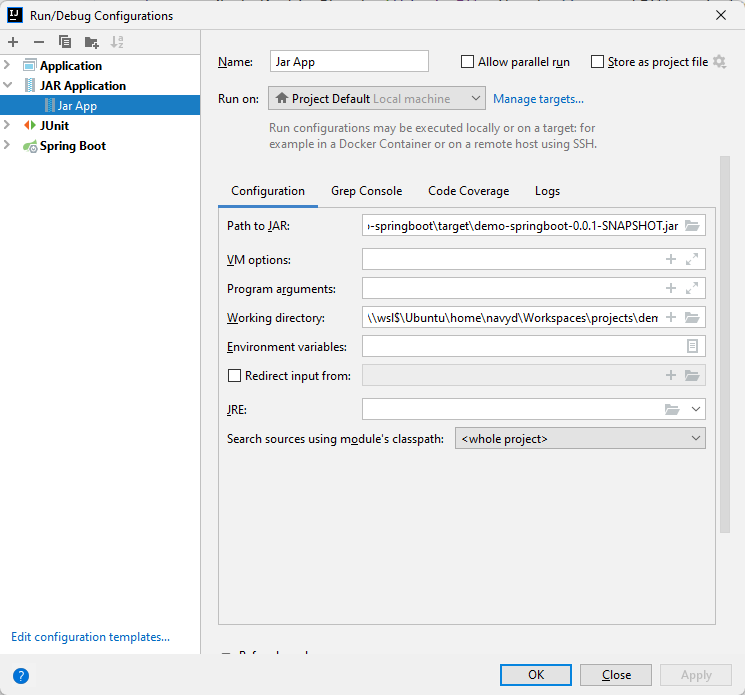
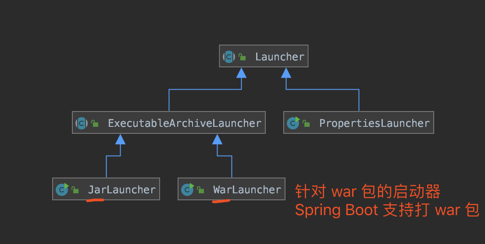
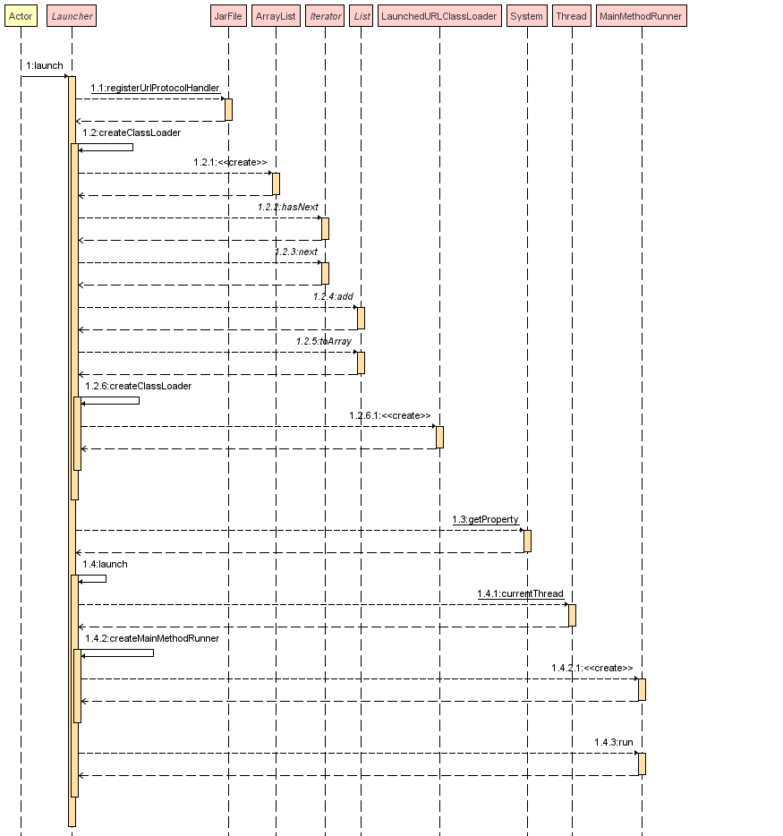
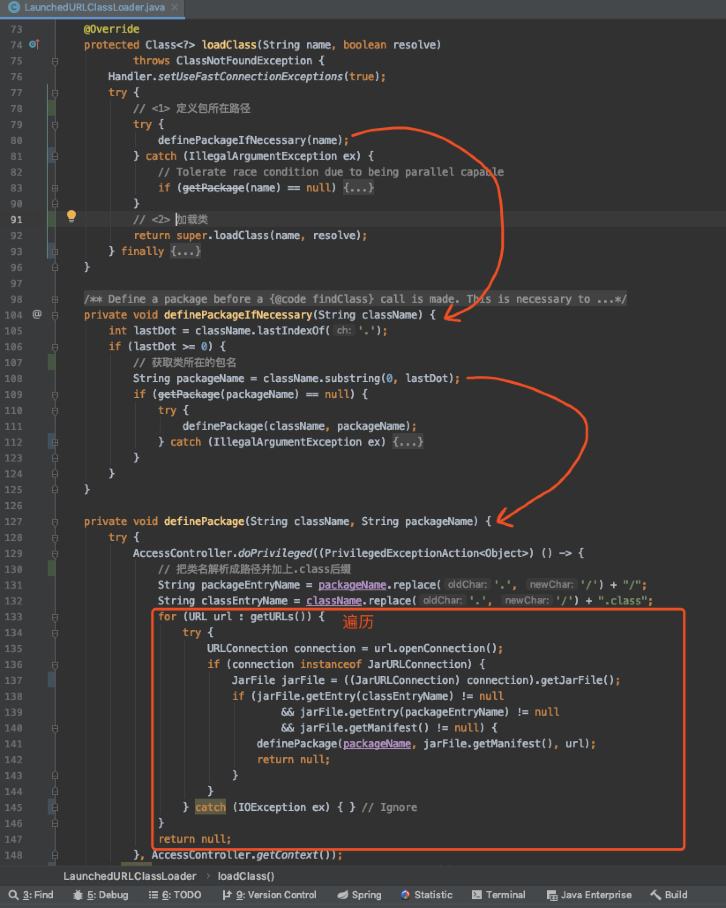
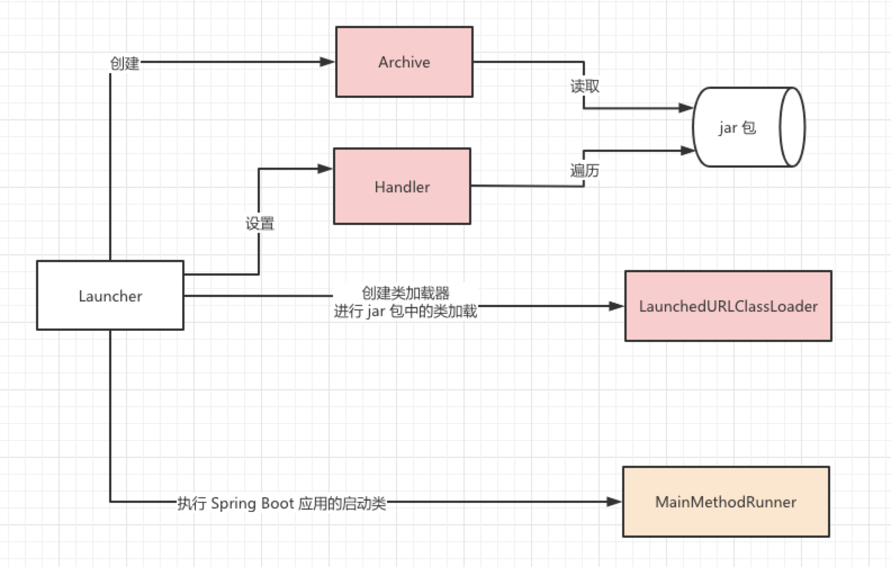

摘要: 原创出处 [http://www.iocoder.cn/Spring-Boot/jar/](http://www.iocoder.cn/Spring-Boot/jar/) 「芋道源码」欢迎转载，保留摘要，谢谢！

Spring Boot 提供了 Maven 插件 [`spring-boot-maven-plugin`](https://docs.spring.io/spring-boot/docs/current/reference/html/build-tool-plugins.html#build-tool-plugins-maven-plugin)，可以方便的将 Spring Boot 项目打成 `jar` 包或者 `war` 包。

考虑到部署的便利性，我们绝大多数 99.99% 的场景下，我们会选择打成 `jar` 包。这样，我们就无需在部署项目的服务器上，配置相应的 Tomcat、Jetty 等 Servlet 容器。

那么，`jar` 包是如何运行，并启动 Spring Boot 项目的呢？这个就是本文的目的，一起弄懂 Spring Boot `jar` 包的**运行原理**。

## 结构

下面，我们来打开一个 Spring Boot `jar` 包，看看其里面的结构。根据[The Executable Jar File Structure](https://docs.spring.io/spring-boot/docs/current/reference/html/executable-jar.html#appendix.executable-jar.nested-jars.jar-structure)一共分成四部分：

```
example.jar
 |
 +-META-INF
 |  +-MANIFEST.MF
 +-org
 |  +-springframework
 |     +-boot
 |        +-loader
 |           +-<spring boot loader classes>
 +-BOOT-INF
    +-classes
    |  +-mycompany
    |     +-project
    |        +-YourClasses.class
    +-lib
       +-dependency1.jar
       +-dependency2.jar
```

* `META-INF` 目录：通过 `MANIFEST.MF` 文件提供 `jar` 包的**元数据**，声明了 `jar` 的启动类。
* `org` 目录：为 Spring Boot 提供的 [`spring-boot-loader`](https://github.com/spring-projects/spring-boot/blob/main/spring-boot-project/spring-boot-tools/spring-boot-loader/) 项目，它是 `java -jar` 启动 Spring Boot 项目的秘密所在，也是稍后我们将深入了解的部分。

    > Spring Boot Loader provides the secret sauce that allows you to build a single jar file that can be launched using `java -jar`. Generally you will not need to use `spring-boot-loader` directly, but instead work with the [Gradle](https://github.com/spring-projects/spring-boot/blob/main/spring-boot-project/spring-boot-tools/spring-boot-gradle-plugin) or [Maven](https://github.com/spring-projects/spring-boot/blob/main/spring-boot-project/spring-boot-tools/spring-boot-maven-plugin) plugin.

* `BOOT-INF/lib` 目录：我们 Spring Boot 项目中引入的**依赖**的 `jar` 包们。`spring-boot-loader` 项目很大的一个作用，就是**解决 `jar` 包里嵌套 `jar` 的情况**，如何加载到其中的类。

* `BOOT-INF/classes` 目录：我们在 Spring Boot 项目中 Java 类所编译的 `.class`、配置文件等等。

先简单剧透下，`spring-boot-loader` 项目需要解决两个问题：

1. 如何引导执行我们创建的 Spring Boot 应用的启动类，例如上述图中的 Application 类。
1. 如何加载 `BOOT-INF/class` 目录下的类，以及 `BOOT-INF/lib` 目录下内嵌的 `jar` 包中的类。

## MANIFEST.MF

下面，尾随艿艿，一起来抽丝剥茧！

我们来查看 `META-INF/MANIFEST.MF` 文件，里面的内容如下：

```Properties
Manifest-Version: 1.0
Implementation-Title: lab-39-demo
Implementation-Version: 2.2.2.RELEASE
Start-Class: cn.iocoder.springboot.lab39.skywalkingdemo.Application
Spring-Boot-Classes: BOOT-INF/classes/
Spring-Boot-Lib: BOOT-INF/lib/
Build-Jdk-Spec: 1.8
Spring-Boot-Version: 2.2.2.RELEASE
Created-By: Maven Archiver 3.4.0
Main-Class: org.springframework.boot.loader.JarLauncher
\n
\n
```

它实际是一个 **Properties** 配置文件，每一行都是一个配置项目。重点来看看两个配置项：

* `Main-Class` 配置项：Java 规定的 `jar` 包的启动类，这里设置为 `spring-boot-loader` 项目的 [JarLauncher](https://github.com/spring-projects/spring-boot/blob/main/spring-boot-project/spring-boot-tools/spring-boot-loader/src/main/java/org/springframework/boot/loader/JarLauncher.java) 类，进行 Spring Boot 应用的启动。
* `Start-Class` 配置项：Spring Boot 规定的**主**启动类，这里设置为我们定义的 Application 类。

*小知识补充：为什么会有 `Main-Class`/`Start-Class` 配置项呢？因为我们是通过 Spring Boot 提供的 Maven 插件 [`spring-boot-maven-plugin`](https://github.com/spring-projects/spring-boot/blob/main/spring-boot-project/spring-boot-tools/spring-boot-maven-plugin/) 进行打包，该插件将该配置项写入到 `MANIFEST.MF` 中，从而能让 `spring-boot-loader` 能够引导启动 Spring Boot 应用。*

可能胖友会有疑惑，`Start-Class` 对应的 Application 类自带了 `#main(String[] args)` 方法，为什么我们不能直接运行会如何呢？我们来简单尝试一下哈，控制台执行如下：

```sh
$ java -classpath lab-39-demo-2.2.2.RELEASE.jar cn.iocoder.springboot.lab39.skywalkingdemo.Application
错误: 找不到或无法加载主类 cn.iocoder.springboot.lab39.skywalkingdemo.Application
```

直接找不到 Application 类，因为它在 `BOOT-INF/classes` 目录下，不符合 Java 默认的 `jar` 包的加载规则。因此，需要通过 JarLauncher 启动加载。

当然实际还有一个更重要的原因，Java 规定可执行器的 `jar` 包禁止嵌套其它 `jar` 包。但是我们可以看到 `BOOT-INF/lib` 目录下，实际有 Spring Boot 应用依赖的所有 `jar` 包。因此，`spring-boot-loader` 项目自定义实现了 ClassLoader 实现类 [LaunchedURLClassLoader](https://github.com/spring-projects/spring-boot/blob/main/spring-boot-project/spring-boot-tools/spring-boot-loader/src/main/java/org/springframework/boot/loader/LaunchedURLClassLoader.java)，支持加载 `BOOT-INF/classes` 目录下的 `.class` 文件，以及 `BOOT-INF/lib` 目录下的 `jar` 包。

## Debug

在看具体实现之前，如何才能直观的 debug 到 Spring Boot Loader 的执行过程呢？下面使用idea与maven配置debug

在典型的Spring boot应用（Spring initializr）的pom.xml中添加spring-boot-loader依赖并打包`mvn package`得到`target/xxx.jar`

```xml
<dependency>
    <groupId>org.springframework.boot</groupId>
    <artifactId>spring-boot-loader</artifactId>
</dependency>
```

然后在Idea的Run/Debug Configurations中配置Jar Application的Path to JAR为打包的`xxx.jar`路径



最后在maven依赖中找到spring-boot-loader jar中的JarLauncher断点debug运行即可

## JarLauncher实现

[JarLauncher](https://github.com/spring-projects/spring-boot/blob/2.6.x/spring-boot-project/spring-boot-tools/spring-boot-loader/src/main/java/org/springframework/boot/loader/JarLauncher.java) 类是针对 Spring Boot `jar` 包的启动类，整体类图如下所示：



> 友情提示：[WarLauncher](https://github.com/spring-projects/spring-boot/blob/2.6.x/spring-boot-project/spring-boot-tools/spring-boot-loader/src/main/java/org/springframework/boot/loader/WarLauncher.java) 类，是针对 Spring Boot `war` 包的启动类，后续胖友可以自己瞅瞅，差别并不大哈~

[JarLauncher 的源码](https://github.com/spring-projects/spring-boot/blob/17b5611ace7916fd581ea1d37636130b41f65e22/spring-boot-project/spring-boot-tools/spring-boot-loader/src/main/java/org/springframework/boot/loader/JarLauncher.java#L64)比较简单

```java
public class JarLauncher extends ExecutableArchiveLauncher {
	static final String BOOT_INF_CLASSES = "BOOT-INF/classes/";
	static final String BOOT_INF_LIB = "BOOT-INF/lib/";
    //...
	@Override
	protected boolean isNestedArchive(Archive.Entry entry) {
		if (entry.isDirectory()) {
			return entry.getName().equals(BOOT_INF_CLASSES);
		}
		return entry.getName().startsWith(BOOT_INF_LIB);
	}
	public static void main(String[] args) throws Exception {
		new JarLauncher().launch(args);
	}
}
```

### createArchive

在 [ExecutableArchiveLauncher#ExecutableArchiveLauncher()](https://github.com/spring-projects/spring-boot/blob/17b5611ace7916fd581ea1d37636130b41f65e22/spring-boot-project/spring-boot-tools/spring-boot-loader/src/main/java/org/springframework/boot/loader/ExecutableArchiveLauncher.java#L51) 的构造方法中调用了父类[Launcher#createArchive()](https://github.com/spring-projects/spring-boot/blob/17b5611ace7916fd581ea1d37636130b41f65e22/spring-boot-project/spring-boot-tools/spring-boot-loader/src/main/java/org/springframework/boot/loader/Launcher.java#L124:26)，代码如下：

```java
protected final Archive createArchive() throws Exception {
	ProtectionDomain protectionDomain = getClass().getProtectionDomain();
	CodeSource codeSource = protectionDomain.getCodeSource();
	URI location = (codeSource != null) ? codeSource.getLocation().toURI() : null;
	String path = (location != null) ? location.getSchemeSpecificPart() : null;
	if (path == null) {
		throw new IllegalStateException("Unable to determine code source archive");
	}
	File root = new File(path);
	if (!root.exists()) {
		throw new IllegalStateException(
				"Unable to determine code source archive from " + root);
	}
	return (root.isDirectory() ? new ExplodedArchive(root)
			: new JarFileArchive(root));
}
```

根据根路径**是否为目录**的情况，创建 ExplodedArchive 或 JarFileArchive 对象。那么问题就来了，这里的 `root` 是什么呢？

通过debug发现`root` 路径为 `jar` 包的绝对地址，也就是说创建 JarFileArchive 对象。原因是，Launcher 所在包为 `org` 下，它的根目录当然是 `jar` 包的绝对路径哈！

### Launcher::launch

通过 `#main(String[] args)` 方法，创建 JarLauncher 对象，并调用其 `#launch(String[] args)` 方法进行启动。整体的启动逻辑，其实是由父类 [Launcher#launch(String[] args)](https://github.com/spring-projects/spring-boot/blob/17b5611ace7916fd581ea1d37636130b41f65e22/spring-boot-project/spring-boot-tools/spring-boot-loader/src/main/java/org/springframework/boot/loader/Launcher.java#L51)提供：

```java
protected void launch(String[] args) throws Exception {
	// 省略部分代码。。。
    // 1
	JarFile.registerUrlProtocolHandler();
	// 2
	ClassLoader classLoader = createClassLoader(getClassPathArchivesIterator());
	// 3
	launch(args, getMainClass(), classLoader);
}
```

1. 调用 JarFile 的 `#registerUrlProtocolHandler()` 方法，注册 Spring Boot 自定义的 [URLStreamHandler](https://github.com/openjdk-mirror/jdk7u-jdk/blob/master/src/share/classes/java/net/URLStreamHandler.java) 实现类，用于 `jar` 包的加载读取。
2. 调用自身的 `#createClassLoader` 方法，创建自定义的 [ClassLoader](https://github.com/openjdk-mirror/jdk7u-jdk/blob/master/src/share/classes/java/lang/ClassLoader.java) 实现类，用于从 `jar` 包中加载类。
3. 执行我们声明的 Spring Boot 启动类，进行 Spring Boot 应用的启动。

简单来说，就是整一个可以读取 `jar` 包中类的加载器，保证 `BOOT-INF/lib` 目录下的类和 `BOOT-classes` 内嵌的 `jar` 中的类能够被正常加载到，之后执行 Spring Boot 应用的启动。

下面是`Launcher::launch`的时序图：



下面，我们逐行代码来看看噢。即将代码多多，保持淡定，嘿嘿~

### registerUrlProtocolHandler

友情提示：对应 `JarFile.registerUrlProtocolHandler();` 代码段，不要迷路。

[JarFile](https://github.com/spring-projects/spring-boot/blob/17b5611ace7916fd581ea1d37636130b41f65e22/spring-boot-project/spring-boot-tools/spring-boot-loader/src/main/java/org/springframework/boot/loader/jar/JarFile.java#L56) 是 [java.util.jar.JarFile](https://github.com/openjdk-mirror/jdk7u-jdk/blob/master/src/share/classes/java/util/jar/JarFile.java) 的子类，JarFile 主要增强支持对内嵌的 `jar` 包的获取。

OK，介绍完之后，让我们回到[JarFile#registerUrlProtocolHandler()](https://github.com/spring-projects/spring-boot/blob/17b5611ace7916fd581ea1d37636130b41f65e22/spring-boot-project/spring-boot-tools/spring-boot-loader/src/main/java/org/springframework/boot/loader/jar/JarFile.java#L430) 方法，注册 Spring Boot 自定义的 URL 协议的处理器。代码如下：

```java
private static final String PROTOCOL_HANDLER = "java.protocol.handler.pkgs";
private static final String HANDLERS_PACKAGE = "org.springframework.boot.loader";
// ...
public static void registerUrlProtocolHandler() {
	// If possible, capture a URL that is configured with the original jar handler so that we can use it as a fallback context later. We can only do this if we know that we can reset the handlers after.
	Handler.captureJarContextUrl();
	String handlers = System.getProperty(PROTOCOL_HANDLER, "");
	System.setProperty(PROTOCOL_HANDLER,
			((handlers == null || handlers.isEmpty()) ? HANDLERS_PACKAGE : handlers + "|" + HANDLERS_PACKAGE));
	resetCachedUrlHandlers();
}
// 。。。
private static void resetCachedUrlHandlers() {
	try {
		URL.setURLStreamHandlerFactory(null);
	} catch (Error ex) {
		// ignore
	}
}
```

目的很明确，通过将 `org.springframework.boot.loader` 包设置到 `"java.protocol.handler.pkgs"` 环境变量，从而使用到自定义的 URLStreamHandler 实现类 [Handler#captureJarContextUrl()](https://github.com/spring-projects/spring-boot/blob/17b5611ace7916fd581ea1d37636130b41f65e22/spring-boot-project/spring-boot-tools/spring-boot-loader/src/main/java/org/springframework/boot/loader/jar/Handler.java#L414:14)，处理 `jar:` 协议的 URL。

> 友情提示：这里我们暂时不深入 Handler 的源码，避免直接走的太深，丢失了主干。后续胖友可结合[《Java URL 协议扩展实现》](https://www.iteye.com/blog/mercyblitz-735529)文章，进行 Handler 的实现理解。
>
> 另外，[HandlerTests](https://github.com/spring-projects/spring-boot/blob/17b5611ace7916fd581ea1d37636130b41f65e22/spring-boot-project/spring-boot-tools/spring-boot-loader/src/test/java/org/springframework/boot/loader/jar/HandlerTests.java) 提供的单元测试，也是非常有帮助的~

### getClassPathArchivesIterator

首先，我们先来看看 [ExecutableArchiveLauncher#getClassPathArchivesIterator()](https://github.com/spring-projects/spring-boot/blob/17b5611ace7916fd581ea1d37636130b41f65e22/spring-boot-project/spring-boot-tools/spring-boot-loader/src/main/java/org/springframework/boot/loader/ExecutableArchiveLauncher.java#L120)，代码如下：

```java
private final Archive archive;

@Override
protected Iterator<Archive> getClassPathArchivesIterator() throws Exception {
	// Determine if the specified entry is a candidate for further searching.
	Archive.EntryFilter searchFilter = this::isSearchCandidate;

	Iterator<Archive> archives = this.archive.getNestedArchives(searchFilter,
			(entry) -> isNestedArchive(entry) && !isEntryIndexed(entry));
	if (isPostProcessingClassPathArchives()) {
		archives = applyClassPathArchivePostProcessing(archives);
	}
	return archives;
}

protected abstract boolean isNestedArchive(Archive.Entry entry);

protected void postProcessClassPathArchives(List<Archive> archives) throws Exception {
}
```

友情提示：这里我们会看到一个接口[Archive](https://github.com/spring-projects/spring-boot/blob/17b5611ace7916fd581ea1d37636130b41f65e22/spring-boot-project/spring-boot-tools/spring-boot-loader/src/main/java/org/springframework/boot/loader/archive/Archive.java#L34) 对象，先可以暂时理解成一个一个的**档案**，稍后会清晰认识的~

```java
public interface Archive extends Iterable<Archive.Entry>, AutoCloseable {
	//。。。

	// Represents a single entry in the archive.
	interface Entry {
		boolean isDirectory();
		String getName();
	}
	// Strategy interface to filter {@link Entry Entries}.
	interface EntryFilter {
		boolean matches(Entry entry);
	}
}
```

#### archive.getNestedArchives

`this::isSearchCandidate` 代码段创建了 EntryFilter 用于过滤 `jar` 包不需要的目录。这里在它的内部，实际调用了其实现类JarLauncher，目的就是过滤获得，`BOOT-INF/` 目录下的类及 `jar` 包

```java
static final EntryFilter NESTED_ARCHIVE_ENTRY_FILTER = (entry) -> {
	if (entry.isDirectory()) {
		return entry.getName().equals("BOOT-INF/classes/");
	}
	return entry.getName().startsWith("BOOT-INF/lib/");
};

@Override
protected boolean isSearchCandidate(Archive.Entry entry) {
	return entry.getName().startsWith("BOOT-INF/");
}

@Override
protected boolean isNestedArchive(Archive.Entry entry) {
	return NESTED_ARCHIVE_ENTRY_FILTER.matches(entry);
}
```

`this.archive.getNestedArchives` 代码段，实际在iterator中通过[JarFileArchive.NestedArchiveIterator#adapt](https://github.com/spring-projects/spring-boot/blob/bce247eafb48c13eadca00f12704e755fc98518b/spring-boot-project/spring-boot-tools/spring-boot-loader/src/main/java/org/springframework/boot/loader/archive/JarFileArchive.java#L272)调用 Archive 的 [JarFileArchive#getNestedArchives(EntryFilter filter)](https://github.com/spring-projects/spring-boot/blob/bce247eafb48c13eadca00f12704e755fc98518b/spring-boot-project/spring-boot-tools/spring-boot-loader/src/main/java/org/springframework/boot/loader/archive/JarFileArchive.java#L110) 方法，获得 `archive` 内嵌的 Archive 集合

```java
private static final String UNPACK_MARKER = "UNPACK:";

protected Archive getNestedArchive(Entry entry) throws IOException {
	JarEntry jarEntry = ((JarFileEntry) entry).getJarEntry();
	if (jarEntry.getComment().startsWith(UNPACK_MARKER)) {
		return getUnpackedNestedArchive(jarEntry);
	}
	try {
		JarFile jarFile = this.jarFile.getNestedJarFile(jarEntry);
		return new JarFileArchive(jarFile);
	}
	catch (Exception ex) {
		throw new IllegalStateException("Failed to get nested archive for entry " + entry.getName(), ex);
	}
}
```

尝试debug打印 JarFileArchive 的 `#getNestedArchives` 方法的执行结果。

```java
// Iterator<Archive> archives = this.archive.getNestedArchives(searchFilter,
// 		(entry) -> isNestedArchive(entry) && !isEntryIndexed(entry));
for (Archive item : archives) {
    System.out.println(item.getUrl());
}

// jar:file:/Users/yunai/Java/SpringBoot-Labs/lab-39/lab-39-demo/target/lab-39-demo-2.2.2.RELEASE.jar!/BOOT-INF/classes!/
// jar:file:/Users/yunai/Java/SpringBoot-Labs/lab-39/lab-39-demo/target/lab-39-demo-2.2.2.RELEASE.jar!/BOOT-INF/lib/spring-boot-starter-web-2.2.2.RELEASE.jar!/
// jar:file:/Users/yunai/Java/SpringBoot-Labs/lab-39/lab-39-demo/target/lab-39-demo-2.2.2.RELEASE.jar!/BOOT-INF/lib/spring-boot-starter-2.2.2.RELEASE.jar!/
// jar:file:/Users/yunai/Java/SpringBoot-Labs/lab-39/lab-39-demo/target/lab-39-demo-2.2.2.RELEASE.jar!/BOOT-INF/lib/spring-boot-2.2.2.RELEASE.jar!/
// ... 省略其他 jar 包
```

从执行结果可以看出，`BOOT-INF/classes/` 目录被归类为**一个** Archive 对象，而 `BOOT-INF/lib/` 目录下的**每个**内嵌 `jar` 包都对应**一个** Archive 对象。

注意，通过debug，一般的spring jar包在`jarEntry.getComment().startsWith(UNPACK_MARKER) == false`，不会执行`getUnpackedNestedArchive`。但在[JarFileArchiveTests#getNestedUnpackedArchive](https://github.com/spring-projects/spring-boot/blob/bce247eafb48c13eadca00f12704e755fc98518b/spring-boot-project/spring-boot-tools/spring-boot-loader/src/test/java/org/springframework/boot/loader/archive/JarFileArchiveTests.java#L108)测试中才能看到jar comment为`UNPACK_MARKER`，几次尝试都找不到如何才能使comment为`UNPACK_MARKER`！！

### createClassLoader

友情提示：对应 `ClassLoader classLoader = createClassLoader(getClassPathArchivesIterator())` 代码段，不要迷路。

然后，我再来看看 [ExecutableArchiveLauncher#createClassLoader(Iterator\<Archive> archives)](https://github.com/spring-projects/spring-boot/blob/17b5611ace7916fd581ea1d37636130b41f65e22/spring-boot-project/spring-boot-tools/spring-boot-loader/src/main/java/org/springframework/boot/loader/ExecutableArchiveLauncher.java#L101)。

```java
protected ClassLoader createClassLoader(Iterator<Archive> archives) throws Exception {
	List<URL> urls = new ArrayList<>(guessClassPathSize());
	while (archives.hasNext()) {
		urls.add(archives.next().getUrl());
	}
	if (this.classPathIndex != null) {
		urls.addAll(this.classPathIndex.getUrls());
	}
	return createClassLoader(urls.toArray(new URL[0]));
}

// [Launcher#createClassLoader](https://github.com/spring-projects/spring-boot/blob/17b5611ace7916fd581ea1d37636130b41f65e22/spring-boot-project/spring-boot-tools/spring-boot-loader/src/main/java/org/springframework/boot/loader/Launcher.java#L82)
protected ClassLoader createClassLoader(URL[] urls) throws Exception {
	return new LaunchedURLClassLoader(urls, getClass().getClassLoader());
}
```

基于获得的 Archive 数组，创建 [java.net.URLClassLoader](https://docs.oracle.com/en/java/javase/11/docs/api/java.base/java/net/URLClassLoader.html) 的自定义实现类 [LaunchedURLClassLoader](https://github.com/spring-projects/spring-boot/blob/17b5611ace7916fd581ea1d37636130b41f65e22/spring-boot-project/spring-boot-tools/spring-boot-loader/src/main/java/org/springframework/boot/loader/LaunchedURLClassLoader.java)，通过它来加载 `BOOT-INF/classes` 目录下的类，以及 `BOOT-INF/lib` 目录下的 `jar` 包中的类。

进一步的解析，我们在[LaunchedURLClassLoader](#LaunchedURLClassLoader)小节中，进行分享哈！

### launch

友情提示：对应 `launch(args, getMainClass(), classLoader)` 代码段，不要迷路。

#### getMainClass

首先，我们先来看看[ExecutableArchiveLauncher#getMainClass()](https://github.com/spring-projects/spring-boot/blob/17b5611ace7916fd581ea1d37636130b41f65e22/spring-boot-project/spring-boot-tools/spring-boot-loader/src/main/java/org/springframework/boot/loader/ExecutableArchiveLauncher.java#L88)代码如下：

```java
private static final String START_CLASS_ATTRIBUTE = "Start-Class";

@Override
protected String getMainClass() throws Exception {
	Manifest manifest = this.archive.getManifest();
	String mainClass = null;
	if (manifest != null) {
		mainClass = manifest.getMainAttributes().getValue(START_CLASS_ATTRIBUTE);
	}
	if (mainClass == null) {
		throw new IllegalStateException("No 'Start-Class' manifest entry specified in " + this);
	}
	return mainClass;
}
```

从 `jar` 包的 `MANIFEST.MF` 文件的 `Start-Class` 配置项，，获得我们设置的 Spring Boot 的**主**启动类。

#### createMainMethodRunner

然后，我们再来看看 [Launcher#launch()](https://github.com/spring-projects/spring-boot/blob/17b5611ace7916fd581ea1d37636130b41f65e22/spring-boot-project/spring-boot-tools/spring-boot-loader/src/main/java/org/springframework/boot/loader/Launcher.java#L51) 代码如下：

```java
protected void launch(String[] args) throws Exception {
	if (!isExploded()) {
		JarFile.registerUrlProtocolHandler();
	}
	ClassLoader classLoader = createClassLoader(getClassPathArchivesIterator());
	String jarMode = System.getProperty("jarmode");
	String launchClass = (jarMode != null && !jarMode.isEmpty()) ? JAR_MODE_LAUNCHER : getMainClass();
	launch(args, launchClass, classLoader);
}

protected void launch(String[] args, String mainClass, ClassLoader classLoader)
		throws Exception {
	Thread.currentThread().setContextClassLoader(classLoader);
	createMainMethodRunner(mainClass, args, classLoader).run();
}

protected MainMethodRunner createMainMethodRunner(String mainClass, String[] args, ClassLoader classLoader) {
	return new MainMethodRunner(mainClass, args);
}
```

该方法负责最终的 Spring Boot 应用真正的**启动**。

1. 设置[createClassLoader](#createclassloader)创建的 [LaunchedURLClassLoader](https://github.com/spring-projects/spring-boot/blob/17b5611ace7916fd581ea1d37636130b41f65e22/spring-boot-project/spring-boot-tools/spring-boot-loader/src/main/java/org/springframework/boot/loader/LaunchedURLClassLoader.java) 作为类加载器，从而保证能够从 `jar` 加载到相应的类。
2. 调用 `Launcher#createMainMethodRunner(String mainClass, String[] args, ClassLoader classLoader)` 方法，创建对象并执行[MainMethodRunner#run()](https://github.com/spring-projects/spring-boot/blob/17b5611ace7916fd581ea1d37636130b41f65e22/spring-boot-project/spring-boot-tools/spring-boot-loader/src/main/java/org/springframework/boot/loader/MainMethodRunner.java#L45)来启动 Spring Boot 应用。

	下面，我们来看看 **MainMethodRunner** 类，负责 Spring Boot 应用的启动。代码如下：

	```java
	public class MainMethodRunner {
		private final String mainClassName;
		private final String[] args;

		public MainMethodRunner(String mainClass, String[] args) {
			this.mainClassName = mainClass;
			this.args = (args != null) ? args.clone() : null;
		}

		public void run() throws Exception {
			Class<?> mainClass = Class.forName(this.mainClassName, false, Thread.currentThread().getContextClassLoader());
			Method mainMethod = mainClass.getDeclaredMethod("main", String[].class);
			mainMethod.setAccessible(true);
			mainMethod.invoke(null, new Object[] { this.args });
		}
	}
	```

	1. 通过 LaunchedURLClassLoader 类加载器，加载到我们设置的 Spring Boot 的主启动类。
	1. 通过**反射**调用主启动类的 `#main(String[] args)` 方法，启动 Spring Boot 应用。这里也告诉了我们答案，为什么我们通过编写一个带有 `#main(String[] args)` 方法的类，就能够启动 Spring Boot 应用。

### LaunchedURLClassLoader

[LaunchedURLClassLoader](https://github.com/spring-projects/spring-boot/blob/17b5611ace7916fd581ea1d37636130b41f65e22/spring-boot-project/spring-boot-tools/spring-boot-loader/src/main/java/org/springframework/boot/loader/LaunchedURLClassLoader.java) 是 `spring-boot-loader` 项目自定义的**类加载器**，实现对 `jar` 包中 `META-INF/classes` 目录下的**类**和 `META-INF/lib` 内嵌的 `jar` 包中的**类**的**加载**。

> FROM [《维基百科 —— Java 类加载器》](https://zh.wikipedia.org/wiki/Java%E7%B1%BB%E5%8A%A0%E8%BD%BD%E5%99%A8)
>
> Java 类加载器是 Java 运行时环境的一个部件，负责动态加载 Java 类到 Java 虚拟机的内存空间中。类通常是按需加载，即第一次使用该类时才加载。
>
> 由于有了类加载器，Java 运行时系统不需要知道文件与文件系统。对学习类加载器而言，掌握 Java 的委派概念是很重要的。每个 Java 类必须由某个类加载器装入到内存。

在[createClassLoader](#createClassLoader)小节中，[LaunchedURLClassLoader#LaunchedURLClassLoader](https://github.com/spring-projects/spring-boot/blob/17b5611ace7916fd581ea1d37636130b41f65e22/spring-boot-project/spring-boot-tools/spring-boot-loader/src/main/java/org/springframework/boot/loader/LaunchedURLClassLoader.java#L63) 构造器代码如下：

```java
public class LaunchedURLClassLoader extends URLClassLoader {

	public LaunchedURLClassLoader(URL[] urls, ClassLoader parent) {
		super(urls, parent);
	}
}
```

1. `urls`，使用的是 Archive 集合对应的 URL 地址们，从而告诉 LaunchedURLClassLoader 读取 `jar` 的**地址**。
1. `parent`，设置 LaunchedURLClassLoader 的**父**加载器。这里后续胖友可以理解下，类加载器的**双亲委派模型**，这里就拓展开了。

我们主要来看看它是如何从 `jar` 包中加载类的[LaunchedURLClassLoader#loadClass](https://github.com/spring-projects/spring-boot/blob/17b5611ace7916fd581ea1d37636130b41f65e22/spring-boot-project/spring-boot-tools/spring-boot-loader/src/main/java/org/springframework/boot/loader/LaunchedURLClassLoader.java#L120)



1. 在通过**父类**的 `#getPackage(String name)` 方法获取不到指定类所在的包时，**会通过遍历 `urls` 数组，从 `jar` 包中加载类所在的包**。当找到包时，会调用 `#definePackage(String name, Manifest man, URL url)` 方法，设置包所在的 **Archive** 对应的 `url`。
2. 调用**父类**的 `#loadClass(String name, boolean resolve)` 方法，加载对应的类。

如此，我们就实现了通过 LaunchedURLClassLoader 加载 `jar` 包中内嵌的类。

## 总结

总体来说，Spring Boot `jar` 启动的原理是非常清晰的，整体如下图所示：



**红色**部分，解决 `jar` 包中的**类加载**问题：

* 通过 [Archive](https://github.com/spring-projects/spring-boot/blob/2.6.x/spring-boot-project/spring-boot-tools/spring-boot-loader/src/main/java/org/springframework/boot/loader/archive/Archive.java)，实现 `jar` 包的**遍历**，将 `META-INF/classes` 目录和 `META-INF/lib` 的每一个内嵌的 `jar` 解析成一个 Archive 对象。
* 通过 [Handler](https://github.com/spring-projects/spring-boot/blob/2.6.x/spring-boot-project/spring-boot-tools/spring-boot-loader/src/main/java/org/springframework/boot/loader/jar/Handler.java)，处理 `jar:` 协议的 URL 的资源**读取**，也就是读取了每个 Archive 里的内容。
* 通过 [LaunchedURLClassLoader](https://github.com/spring-projects/spring-boot/blob/2.6.x/spring-boot-project/spring-boot-tools/spring-boot-loader/src/main/java/org/springframework/boot/loader/LaunchedURLClassLoader.java)，实现 `META-INF/classes` 目录下的类和 `META-INF/classes` 目录下内嵌的 `jar` 包中的类的加载。具体的 URL 来源，是通过 Archive 提供；具体 URL 的读取，是通过 Handler 提供。

**橘色**部分，解决 Spring Boot 应用的**启动**问题：

* 通过 [MainMethodRunner](https://github.com/spring-projects/spring-boot/blob/2.6.x/spring-boot-project/spring-boot-tools/spring-boot-loader/src/main/java/org/springframework/boot/loader/MainMethodRunner.java) ，实现 Spring Boot 应用的启动类的执行。

当然，上述的一切都是通过 [Launcher](https://github.com/spring-projects/spring-boot/blob/2.6.x/spring-boot-project/spring-boot-tools/spring-boot-loader/src/main/java/org/springframework/boot/loader/Launcher.java) 来完成引导和启动，通过 `MANIFEST.MF` 进行具体配置。

😈 生活如此美好，本文就此结束！

另外，本文有两个部分，胖友可以自己再去撸一撸，玩一玩：

* [WarLauncher](https://github.com/spring-projects/spring-boot/blob/2.6.x/spring-boot-project/spring-boot-tools/spring-boot-loader/src/main/java/org/springframework/boot/loader/WarLauncher.java) 类：实现 Spring Boot `war` 包的启动。
* [`org.springframework.boot.loader.jar`](https://github.com/spring-projects/spring-boot/blob/2.6.x/spring-boot-project/spring-boot-tools/spring-boot-loader/src/main/java/org/springframework/boot/loader/jar/) 包：具体读取 `jar` 的逻辑。

参考：

* [springboot The Executable Jar Format](https://docs.spring.io/spring-boot/docs/current/reference/html/executable-jar.html)
* [Package org.springframework.boot.loader description](https://docs.spring.io/spring-boot/docs/current/api/org/springframework/boot/loader/package-summary.html)
* [http://www.iocoder.cn/Spring-Boot/jar/](http://www.iocoder.cn/Spring-Boot/jar/)
