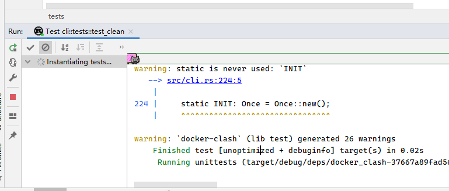
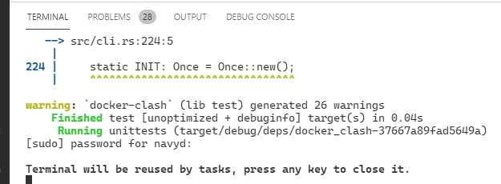

在一些系统应用中需要访问root权限的资源，直接运行可能出现权限错误：

```bash
$ cargo test --package docker-clash --lib -- cli::tests::test_clean --exact --nocapture
[2021-09-15T05:39:57Z INFO  cmd_lib::child] Fatal: can't open lock file /run/xtables.lock: Permission denied
```

rust源码使用[cmd_lib](https://crates.io/crates/cmd_lib)，编译成`std::process`api：

```rust
fn run(table: &str, chain: &str) -> Result<()> {
    run_cmd! (iptables -t "$table" -D OUTPUT -j "$chain")
}
```
<!--more-->
## 分析

直接上sudo提权出现命令无法找到的问题

```bash
$ sudo cargo test --package docker-clash --lib -- cli::tests::test_clean --exact --nocapture
sudo: cargo: command not found
```

要解决可以看我之前的文章：[在sudo时如何保持当前环境变量](../../linux/how-to-keep-environment-variables-when-using-sudo.md)解决了环境权限问题，正常使用iptables，下面的错误并不是iptables权限的问题 忽略

```bash
$ sudo -E PATH=$PATH env cargo test --package docker-clash --lib -- cli::tests::test_clean --exact --nocapture
[2021-09-15T05:45:16Z INFO  cmd_lib::child] iptables v1.8.4 (legacy): Couldn't load target `CLASH':No such file or directory
```

另外，cargo会不会有解决方法呢？

cargo提供了一个配置参数`target.<triple>.runner`

>If a runner is provided, executables for the target \<triple> will be executed by invoking the specified runner with the actual executable passed as an argument. This applies to cargo run, cargo test and cargo bench commands. By default, compiled executables are executed directly.

可以在cargo的配置文件中添加sudo命令去运行cargo test，cargo的可配置的文件在这：[Hierarchical structure](https://doc.rust-lang.org/cargo/reference/config.html#hierarchical-structure)，这里使用`your_project/.cargo/config.toml`添加配置：

```toml
[target.x86_64-unknown-linux-gnu ]
runner = 'sudo -E'
```

注意一下，使用sudo要求在ide命令行输入密码，在clion rust运行时将一直被阻塞`instantiating tests`，也没有提示输入，可能不支持这种方式。而vscode rust-analyzer是可以正常使用提示输入的




如果是shell还可以使用`-S`选项从stdin中密码`sudo -S <<< $YOUR_PASS`，使用了环境变量避免了明文密码，但cargo runner无法解析sh语法运行`echo PASS | sudo -E`。

退一步，如果要是sudo需要输入密码时直接失败不阻塞`-n`选项，但配置了`sudo -nE`了实际在clion rust是一直失败的，可能是在wsl中使用ssh，sudo的认证是关联了session的，无法在clion remote ssh中执行`sudo -v`刷新认证，在clion自带的终端执行也没用，但这个思路应该是没错的。等待后续方案 <!-- TODO -->

这里提一下rust所有内置支持target：[Platform Support](https://doc.rust-lang.org/nightly/rustc/platform-support.html)，可以使用`rustc --print target-list`查看， `rustup target list --installed`查看当前安装的target

## 解决方案

这两种方法都是可行的，由于需求的不同选择，如在ide中运行test选择cargo配置较好，不用手动输入命令，但是不是所有test都要root权限的，而且有时会存在sudo环境问题，使用root用户运行可能出错。

根据最小特权原则，使用sudo单独运行个别测试用例更好

```bash
# alias sudoe='sudo -E PATH=$PATH env';
sudoe cargo test --package $crate --lib -- $module_path --exact --nocapture
```

参考：

- [cargo test with root privilege #963](https://github.com/nix-rust/nix/issues/963)
- [Running tests with elevated privileges #5999](https://github.com/rust-lang/cargo/issues/5999#issuecomment-419972497)
- [The Cargo Book Configuration target.\<triple\>.runner](https://doc.rust-lang.org/cargo/reference/config.html?highlight=runner#targettriplerunner)
- [rust Built-in Targets](https://doc.rust-lang.org/nightly/rustc/targets/built-in.html)
- [sudo with password in one command line?](https://superuser.com/questions/67765/sudo-with-password-in-one-command-line)
