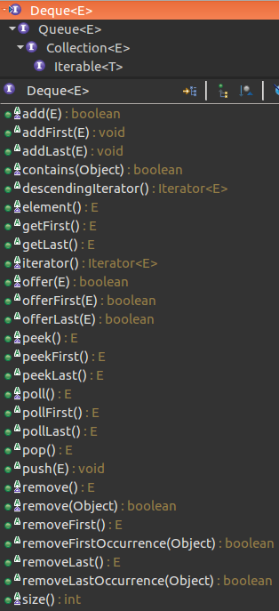

# Deque

一个线性 collection，支持在两端插入和移除元素。名称 deque 是“double ended queue（双端队列）”的缩写，通常读为“deck”。大多数 Deque 实现对于它们能够包含的元素数没有固定限制，但此接口既支持有容量限制的双端队列，也支持没有固定大小限制的双端队列。 

结构：



Deque可以表示双端队列，也可以表示队列，堆栈，和集合

## 堆栈

### 入栈

```java
/**
将一个元素推入此双端队列所表示的堆栈，如果成功，则返回 true，如果当前没有可用空间，则抛出IllegalStateException。 
*/
void push(E e);
```

### 出栈

```java
/**
从此双端队列所表示的堆栈中弹出(即移除)一个元素。 如果堆栈为空将抛出异常NoSuchElementException
*/
E pop();
```

### 检查

```java
/**
获取但不移除此双端队列所表示的堆栈的头部；如果此双端队列为空，则返回 null。 
*/
E peek();
```

### 注意

- Deque所表示的堆栈插入push和删除pop在正常失败时会抛出异常，而获取peek时返回null表示堆栈为空。在实际使用时应该注意对异常的处理

```java
    static void stackPopTest() {
        Deque<String> stack = new ArrayDeque<>();
        stack.push("a");
        stack.push("b");
        String s = null;
        // 抛出异常
//        while ((s = stack.pop()) != null)
//            System.out.println(s);
        while ((s = stack.peek()) != null)
            System.out.println(stack.pop());
    }
```

- Deque中存在与堆栈常用操作的等效方法，但应该使用与堆栈操作一致的方法名

## 队列

- boolean add(E e);
- boolean offer(E e);
- E remove();
- E poll();
- E element();
- E peek();


## 双端队列

### 插入

- void addFirst(E e);


- void addLast(E e);


- boolean offerFirst(E e);
- boolean offerLast(E e);

### 删除

- E removeFirst();
- E removeLast();
- E pollFirst();
- E pollLast();

### 检查

- E getFirst();
- E getLast();
- E peekFirst();
- E peekLast();

### 移除指定元素

- boolean removeFirstOccurrence(Object o);
- boolean removeLastOccurrence(Object o);

### 注意

- 在双端队列的提供的三种操作中，每种的前两个和后两个方法是两种形式，所有的集合操作add、remove、get等方法将在正常失败时抛出异常，而不是队列操作offer、poll、peek返回false或null表示正常失败

正常失败表示 ***当前无可用空间*** 或 ***队列为空***

## 集合

- boolean remove(Object o);
- boolean contains(Object o);
- public int size();

### 迭代器

- Iterator<E> iterator()
- Iterator<E> descendingIterator()

返回以逆向顺序在此双端队列的元素上进行迭代的迭代器。元素将按从最后一个（尾部）到第一个（头部）的顺序返回。


## 总结

- 此接口与Ｑueue同样提供 ***插入、移除、检查元素*** 的方法，每种方法存在两种形式(参见Queue)。但与Queue仅对队列一端操作不同，Deque接口定义在双端队列两端访问元素的方法，因此提供12种方法

|             | *Throws exception*             | *Special value*                |
| ----------- | ------------------------------ | ------------------------------ |
|             | Head/Tail                      | Head/Tail                      |
| **Insert**  | `addFirst(e)`/`addLast(e)`     | `offerFirst(e)`/`offerLast(e)` |
| **Remove**  | `removeFirst()`/`removeLast()` | `pollFirst()`/`pollLast()`     |
| **Examine** | `getFirst()`/`getLast()`       | `peekFirst()`/`peekLast()`     |

- 在将双端队列用 ***作队列*** 时，将得到 FIFO（先进先出）行为。将元素添加到双端队列的末尾，从双端队列的开头移除元素。从 Queue 接口继承的方法完全等效于 Deque 方法，如下表所示：

| **Queue Method** | **Equivalent Deque Method** |
| ---------------- | --------------------------- |
| `add(e)`         | `addLast(e)`                |
| `offer(e)`       | `offerLast(e)`              |
| `remove()`       | `removeFirst()`             |
| `poll()`         | `pollFirst()`               |
| `element()`      | `getFirst()`                |
| `peek()`         | `peekFirst()`               |

- 双端队列也可用作 LIFO（后进先出）***堆栈*** 。在将双端队列用作堆栈时，元素被推入双端队列的开头并从双端队列开头弹出。堆栈方法完全等效于 Deque 方法，如下表所示： 

| **Stack Method** | **Equivalent Deque Method** |
| ---------------- | --------------------------- |
| `push(e)`        | `addFirst(e)`               |
| `pop()`          | `removeFirst()`             |
| `peek()`         | `peekFirst()`               |

- Deque应该不允许插入null元素
- Deque可以用作堆栈Stack和队列Queue两种不同数据结构的接口
- 对于使用**有容量限制的双端队列Deque**时，通常**使用offer系列方法**，这类方法在达到容量限制时返回false而不是抛出异常。
- 常用的java.uti包下的l数据结构都是无界的，自动扩容的，而java.util.concurrent具有有界的数据结构
- Deque没有获取指定元素的能力如没有`get(int index)`，但是具有移除内部元素的能力如：`boolean removeFirstOccurrence(Object o);`