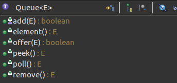

# Queue

在处理元素前用于保存元素的 collection。除了基本的 Collection 操作外，队列还提供其他的插入、提取和检查操作。每个方法都存在两种形式：

- 一种抛出异常（操作失败时）
- 另一种返回一个特殊值（null 或 false，具体取决于操作）

插入操作的后一种形式是用于专门为有容量限制的 Queue 实现设计的；在大多数实现中，插入操作不会失败。 

|             | *Throws exception* | *Returns special value* |
| ----------- | ------------------ | :---------------------- |
| **Insert**  | `add(e)`           | `offer(e)`              |
| **Remove**  | `remove()`         | `poll()`                |
| **Examine** | `element()`        | `peek()`                |

### 类方法



Queue在Collection的基础上新增了６个(其实不包含add和remove只有４个)方法，分别为添加，删除，获取；每种提供两个方法

注意：

- add(即Collection.add)和offer都是插入元素到队列，区别是当前无可用空间时(如达到Queue的容量限制时)前者抛出异常，后者返回false
- remove(即Collection.remove)和poll都是移除并返回队列的头部元素，区别是队列为空时前者抛出异常，后者返回null
- element和peek都是返回但不移除队列的头部元素，区别是前者在队列为空时抛出异常，后者返回null

## 总结

- 队列的元素排序方法由具体实现指定
- Queue通常不允许插入null元素，即使某些具体实现允许插入null，也不应该插入null

由于移除方法poll()和获取方法peek()通过返回null表明队列为空，操作失败。如果在Queue中插入null就会造成混乱。如：

```java
    static void addNullForQueueTest() {
        // LinkedList实现允许插入null元素
        Queue<String> queue = new LinkedList<>();
        queue.add("a");
        queue.add(null);
        queue.add("abc");
        System.out.println(queue);
        String s = null;
        // 插入null使后面的元素'abc'无法被读取
      	// 输出：a
        while ((s = queue.poll()) != null) {
            System.out.println(s);
        }
    }
```

- Queue未定义阻塞队列方法，如果需要可以使用BlockingQueue接口
- Queue的equals和hashCode方法应该使用Object的默认实现