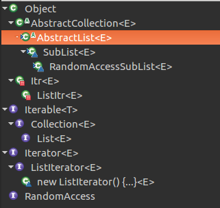
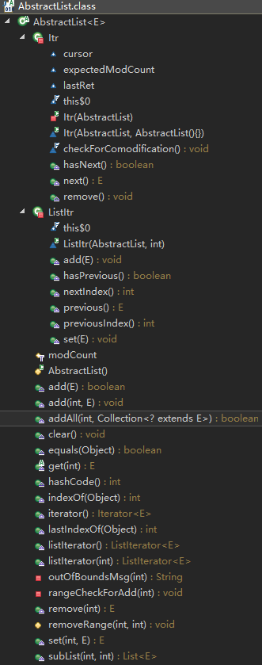

# AbstractList #

此类提供 List 接口的骨干实现，以最大限度地减少实现“随机访问”数据存储（如数组）支持的该接口所需的工作。对于连续的访问数据（如链表），应优先使用 AbstractSequentialList，而不是此类。 

类结构：

```java
public abstract class AbstractList<E> extends AbstractCollection<E> implements List<E>
```



注意：

- AbstractList用于实现随机访问数据的基类，连续访问应该使用AbstractSequentialList抽象类
- 对于子类具体实现结构如数组支持快速随机访问的list应该考虑实现RandomAccess标记接口，而链表，树，图等连续访问结构不应该实现。

对于该接口典型的应用在于使用for循环时`for (int i=0, n=list.size(); i < n; i++)`明显快于iterator实现的循环


类方法概览：



## 抽象方法 ##
```java
    abstract public E get(int index);
```
## 未支持(Unsupported)方法 ##

### 添加 ###

- void add(int index, E element)

```java
    public void add(int index, E element) {
        throw new UnsupportedOperationException();
    }
```
### 删除 ###

- E remove(int index)

```java
    public E remove(int index) {
        throw new UnsupportedOperationException();
    }
```

### 替换 ###

- E set(int index, E element)

```java
    public E set(int index, E element) {
        throw new UnsupportedOperationException();
    }
```

## 未实现方法

- int size():java.util.Collection

## 实现方法 ##


### 添加 ###

- boolean add(E e)

```java
    /**
    将指定的元素添加到此列表的尾部（可选操作）。
    此实现直接调用 add(size(), e)。若没有重写add(int, E)将抛出UnsupportedOperationException
    */
    public boolean add(E e) {
        add(size(), e);
        return true;
    }
```

- boolean addAll(int index, Collection<? extends E> c)

```java
    /**
    将指定 collection 中的所有元素都插入到列表中的指定位置;
    此实现获取指定 collection 上的迭代器并使用 add(int, E) 插入此列表。为了提高效率，多数实现将重写此方法。
    */
    public boolean addAll(int index, Collection<? extends E> c) {
        rangeCheckForAdd(index);
        boolean modified = false;
        for (E e : c) {
            add(index++, e);
            modified = true;
        }
        return modified;
    }
    // 检查添加指定位置index是否合法
    private void rangeCheckForAdd(int index) {
        if (index < 0 || index > size())
            throw new IndexOutOfBoundsException(outOfBoundsMsg(index));
    }

```

### 删除 ###

- void clear()

```java
    // 此实现调用 removeRange(0, size())。 
    public void clear() {
        removeRange(0, size());
    }
```

- protected void removeRange(int fromIndex, int toIndex)

```java 
    /**
    从此列表中移除索引在 fromIndex（包括）和 toIndex（不包括）之间的所有元素。向左移动所有后续元素（减小其索引）。
    此实现获取一个位于 fromIndex 之前的ListIterator删除后续元素
    可以根据具体实现重写此方法改进性能
    */
    protected void removeRange(int fromIndex, int toIndex) {
    	// 返回ListIterator实现的实例， 从指定位置fromIndex开始
        ListIterator<E> it = listIterator(fromIndex);
        for (int i=0, n=toIndex-fromIndex; i<n; i++) {
            it.next();
            it.remove();
        }
    }
```

### 比较和哈希 ###

- boolean equals(Object o)

```java
    /**
    将指定的对象与此列表进行相等性比较。
    当且仅当指定的对象也是一个列表，两个列表具有相同的大小，而且两个列表中所有相应的元素对都相等 时，才返回 true。
    */
    public boolean equals(Object o) {
    	// 先检查指定对象是否为当前list
        if (o == this)
            return true;
        // 检查指定对象是否为List对象
        if (!(o instanceof List))
            return false;
        // 获取迭代器迭代两个list中对象并检查所有对象是否相等
        ListIterator<E> e1 = listIterator();
        ListIterator<?> e2 = ((List<?>) o).listIterator();
        while (e1.hasNext() && e2.hasNext()) {
        	// 两个list的对象的顺序必须一致
            E o1 = e1.next();
            Object o2 = e2.next();
            if (!(o1==null ? o2==null : o1.equals(o2)))
                return false;
        }
        // 检查当前相等的两个list是否某一个存在更多的元素
        return !(e1.hasNext() || e2.hasNext());
    }
```

- int hashCode()

```java
    // 此实现使用在 List.hashCode() 方法的文档中用于定义列表哈希函数的代码
    public int hashCode() {
        int hashCode = 1;
        for (E e : this)
            hashCode = 31*hashCode + (e==null ? 0 : e.hashCode());
        return hashCode;
    }
```

### 搜索 ###

- int indexOf(Object o)

```java
    /**
    返回此列表中第一次出现的指定元素的索引；如果此列表不包含该元素，则返回 -1.
    此实现首先获取一个列表迭代器（使用 listIterator()）。然后它迭代列表，直至找到指定的元素，或者到达列表的末尾。 
    */
    public int indexOf(Object o) {
        ListIterator<E> it = listIterator();
        if (o==null) {
            while (it.hasNext())
                if (it.next()==null)
                    return it.previousIndex();
        } else {
            while (it.hasNext())
                if (o.equals(it.next()))
                    return it.previousIndex();
        }
        return -1;
    }
```

- int lastIndexOf(Object o)

```java
    /**
    返回此列表中最后出现的指定元素的索引；如果列表不包含此元素，则返回 -1。
    此实现首先获取一个指向列表末尾的列表迭代器（使用 listIterator(size())）。然后它逆向迭代列表，直至找到指定的元素，或者到达列表的开头。 
    */
    public int lastIndexOf(Object o) {
        ListIterator<E> it = listIterator(size());
        if (o==null) {
            while (it.hasPrevious())
                if (it.previous()==null)
                    return it.nextIndex();
        } else {
            while (it.hasPrevious())
                if (o.equals(it.previous()))
                    return it.nextIndex();
        }
        return -1;
    }
```

### 迭代器 ###

- Iterator<E> iterator()

```java
    public ListIterator<E> listIterator() {
        return listIterator(0);
    }
```
- ListIterator<E> listIterator()

```java
    public ListIterator<E> listIterator() {
        return listIterator(0);
    }
```

- ListIterator<E> listIterator(final int index)

```java
    public ListIterator<E> listIterator(final int index) {
        rangeCheckForAdd(index);

        return new ListItr(index);
    }
```
Iterator和ListIterator实现：

```java
    // Iterator实现,此实现返回 iterator 接口的一个直接实现，具体取决于底层实现列表的 size()、get(int) 和 remove(int) 方法。 
    private class Itr implements Iterator<E> {
        /**
         * Index of element to be returned by subsequent call to next.
         */
        int cursor = 0;

        /**
         * Index of element returned by most recent call to next or
         * previous.  Reset to -1 if this element is deleted by a call
         * to remove.
         */
        // 表示最近通过next或previous方法调用的元素下标，该元素已经被删除将置为-1
        int lastRet = -1;

        /**
         * The modCount value that the iterator believes that the backing
         * List should have.  If this expectation is violated, the iterator
         * has detected concurrent modification.
         */
        // 该值表示迭代器iterator相信其支持者List应该具有的值modCount。如果这个期望被违反，迭代器就会发现线程的修改
        int expectedModCount = modCount;

        public boolean hasNext() {
            return cursor != size();
        }
        // 通过get下标获取元素，并设置lastRet为当前下标，cursor为下一个元素位置
        public E next() {
            checkForComodification();
            try {
                int i = cursor;
                E next = get(i);
                lastRet = i;
                cursor = i + 1;
                return next;
            } catch (IndexOutOfBoundsException e) {
                checkForComodification();
                throw new NoSuchElementException();
            }
        }
        // 
        public void remove() {
        	// 检查最近调用的元素是否已经被删除
            if (lastRet < 0)
                throw new IllegalStateException();
            checkForComodification();

            try {
            	// 通过最近调用(next设置的下标)的索引删除元素
                AbstractList.this.remove(lastRet);
                // 如果使用next调用就将cursor设置为上一个位置(上一个位置元素已经被后续元素占有，重新访问)
              	//如果使用previous调用表示lastRet==cursor，不用设置
                if (lastRet < cursor)
                    cursor--;
                lastRet = -1;
                // 将iterator.expectedModCount更新为list操作后更改的值
                expectedModCount = modCount;
            } catch (IndexOutOfBoundsException e) {
                throw new ConcurrentModificationException();
            }
        }
        // 如果iterator.expectedModCount和list.modCount不等即在迭代期间发生线程修改，抛出异常
        final void checkForComodification() {
            if (modCount != expectedModCount)
                throw new ConcurrentModificationException();
            
        }
    }

    // ListIterator实现，ListIterator 实现依赖于底层实现列表的 get(int)、set(int, E)、add(int, E) 和 remove(int) 方法。 
    private class ListItr extends Itr implements ListIterator<E> {
        ListItr(int index) {
            cursor = index;
        }

        public boolean hasPrevious() {
            return cursor != 0;
        }
        // 获取当前元素位置-1对应位置的元素
        public E previous() {
            checkForComodification();
            try {
                int i = cursor - 1;
                E previous = get(i);
                lastRet = cursor = i;
                return previous;
            } catch (IndexOutOfBoundsException e) {
                checkForComodification();
                throw new NoSuchElementException();
            }
        }

        public int nextIndex() {
            return cursor;
        }

        public int previousIndex() {
            return cursor-1;
        }
        // 使用指定元素替换当前next或previous返回的元素
        public void set(E e) {
        	// 检查最近调用元素是否存在
            if (lastRet < 0)
                throw new IllegalStateException();
            checkForComodification();

            try {
                AbstractList.this.set(lastRet, e);
                expectedModCount = modCount;
            } catch (IndexOutOfBoundsException ex) {
                throw new ConcurrentModificationException();
            }
        }
        // 将指定元素e插入next()返回元素的后面或previous()返回元素的后面
        public void add(E e) {
            checkForComodification();

            try {
                int i = cursor;
                AbstractList.this.add(i, e);
                lastRet = -1;
                // next会跳过当前元素，previous会返回该元素
                cursor = i + 1;
                expectedModCount = modCount;
            } catch (IndexOutOfBoundsException ex) {
                throw new ConcurrentModificationException();
            }
        }
    }

```

#### 注意

- Iterator.remove()会将lastRet置-1，ListIterator.remove()和ListIterator.add()会将lastRet置-1， set()和remove()(检查)不允许lastRet为负数。
- 迭代器根据光标cursor表示元素位置
- 迭代器对应的操作仍然基于具体的List实现如add,remove,set,get等


**关于"快速失败"线程安全的疑问？**

List.iterator()是new Itr()对象，当前线程在迭代list时，另一个线程list.remove()使modCount++更改了modCount的值，但是由于modCount没有同步和设置volatile，另一个线程的修改不应该能马上看到，虽然快速失败确实不保证一定成功，但是仍然能大概率发生，修改应该看不到才对，这是为何？？？


### subList ###

- List<E> subList(int fromIndex, int toIndex)

```java
    /**
    返回列表中指定的 fromIndex（包括 ）和 toIndex（不包括）之间的部分视图。
    返回列表中的非结构性更改将反映在此列表中，反之亦然
    */
    public List<E> subList(int fromIndex, int toIndex) {
        // 判断具体实现类是否支持快速随机访问如ArrayList，对于支持RandomAccess的实现for(int;size;i++)循环优于iterator实现的循环
        return (this instanceof RandomAccess ?
                new RandomAccessSubList<>(this, fromIndex, toIndex) :
                new SubList<>(this, fromIndex, toIndex));
    }

```

SubList相关实现：

```java
/**
此实现返回一个子类化 AbstractList 的列表。子类在 private 字段中存储底层实现列表中 subList 的偏移量、subList 的大小（随其生存期变化）以及底层实现列表的预期 modCount 值。
子类有两个变体，其中一个实现 RandomAccess。如果此列表实现 RandomAccess，则返回的列表将是实现 RandomAccess 的子类实例。 
*/
class SubList<E> extends AbstractList<E> {
    // 原来的list
    private final AbstractList<E> l;
    // 截取的偏移量
    private final int offset;
    // 可变的subList的长度
    private int size;

    SubList(AbstractList<E> list, int fromIndex, int toIndex) {
        if (fromIndex < 0)
            throw new IndexOutOfBoundsException("fromIndex = " + fromIndex);
        if (toIndex > list.size())
            throw new IndexOutOfBoundsException("toIndex = " + toIndex);
        if (fromIndex > toIndex)
            throw new IllegalArgumentException("fromIndex(" + fromIndex +
                                               ") > toIndex(" + toIndex + ")");
        l = list;
        offset = fromIndex;
        size = toIndex - fromIndex;
        this.modCount = l.modCount;
    }

    public E set(int index, E element) {
        rangeCheck(index);
        checkForComodification();
        return l.set(index+offset, element);
    }

    public E get(int index) {
        rangeCheck(index);
        checkForComodification();
        return l.get(index+offset);
    }

    public int size() {
        checkForComodification();
        return size;
    }

    public void add(int index, E element) {
        rangeCheckForAdd(index);
        checkForComodification();
        l.add(index+offset, element);
        this.modCount = l.modCount;
        size++;
    }

    public E remove(int index) {
        rangeCheck(index);
        checkForComodification();
        // index映射到原来的list中需要加上偏移量
        E result = l.remove(index+offset);
        this.modCount = l.modCount;
        size--;
        return result;
    }

    protected void removeRange(int fromIndex, int toIndex) {
        checkForComodification();
        l.removeRange(fromIndex+offset, toIndex+offset);
        this.modCount = l.modCount;
        size -= (toIndex-fromIndex);
    }

    public boolean addAll(Collection<? extends E> c) {
        return addAll(size, c);
    }

    public boolean addAll(int index, Collection<? extends E> c) {
        rangeCheckForAdd(index);
        int cSize = c.size();
        if (cSize==0)
            return false;

        checkForComodification();
        l.addAll(offset+index, c);
        this.modCount = l.modCount;
        size += cSize;
        return true;
    }
    // 调用原list.listIterator()实现
    public Iterator<E> iterator() {
        return listIterator();
    }

    /**
     * 调用原list.listIterator(index+offset)实现
     */
    public ListIterator<E> listIterator(final int index) {
        checkForComodification();
        rangeCheckForAdd(index);

        return new ListIterator<E>() {
            private final ListIterator<E> i = l.listIterator(index+offset);

            public boolean hasNext() {
                return nextIndex() < size;
            }

            public E next() {
                if (hasNext())
                    return i.next();
                else
                    throw new NoSuchElementException();
            }

            public boolean hasPrevious() {
                return previousIndex() >= 0;
            }

            public E previous() {
                if (hasPrevious())
                    return i.previous();
                else
                    throw new NoSuchElementException();
            }

            public int nextIndex() {
                return i.nextIndex() - offset;
            }

            public int previousIndex() {
                return i.previousIndex() - offset;
            }

            public void remove() {
                i.remove();
                SubList.this.modCount = l.modCount;
                size--;
            }

            public void set(E e) {
                i.set(e);
            }

            public void add(E e) {
                i.add(e);
                SubList.this.modCount = l.modCount;
                size++;
            }
        };
    }

    public List<E> subList(int fromIndex, int toIndex) {
        return new SubList<>(this, fromIndex, toIndex);
    }

    // 截取后的subList新的list，index从0开始size-1结束。所以范围0<=index<size
    private void rangeCheck(int index) {
        if (index < 0 || index >= size)
            throw new IndexOutOfBoundsException(outOfBoundsMsg(index));
    }

    private void rangeCheckForAdd(int index) {
        if (index < 0 || index > size)
            throw new IndexOutOfBoundsException(outOfBoundsMsg(index));
    }

    private String outOfBoundsMsg(int index) {
        return "Index: "+index+", Size: "+size;
    }
    // 检查subList和原list的modCount是否一致
    private void checkForComodification() {
        if (this.modCount != l.modCount)
            throw new ConcurrentModificationException();
    }
}
```
RandomAccessSubList相关实现：
```java
class RandomAccessSubList<E> extends SubList<E> implements RandomAccess {
    RandomAccessSubList(AbstractList<E> list, int fromIndex, int toIndex) {
        super(list, fromIndex, toIndex);
    }

    public List<E> subList(int fromIndex, int toIndex) {
        return new RandomAccessSubList<>(this, fromIndex, toIndex);
    }
}
```

#### 注意

- 返回的subList元素的操作将反映到原List中，**对原List结构(元素个数)的操作将导致subList所有操作方法抛出异常**ConcurrentModificationException，但是对两个list的元素修改替换等将会更新到另一个list

如：
```java
        List<Integer> list = new ArrayList<>();
        list.add(1);
        list.add(2);
        list.add(3);
        list.add(4);
        List<Integer> subList = list.subList(2, list.size());
        System.out.println("subList.size:" + subList.size());
        // 原List的结构被更改
//      list.remove(3);
        list.add(11);
        // 异常
        System.out.println("subList.size:" + subList.size());
```
上面的示例虽然在单线程下运行，但是仍然会抛出异常ConcurrentModificationException，这是由于subList的所有操作均会`checkForComodification()`，当创建了subList对象后，原来的List.remove/add更新了modCount，导致subList.size()发现`this.modCount != l.modCount`抛出异常。

由于创建subList后不允许对原list的结构更改，所以subList.size()实现仅在初始化时将原list.size()读取到SubList.size变量中，就不会产生原list修改无法应用到subList中的错误，因为一旦修改再调用就直接异常

- subList检查修改checkForComodification()的方法为：
  `add(int index, E element)`, `addAll(int index, Collection<? extends E> c)`, `get(int index)`, `remove(int index)`, `removeRange(int fromIndex, int toIndex)`, `set(int index, E element)`, `size()`

由于extends和implements的关系，想要完全弄清每个方法需要费一番功夫，这里仅仅将SubList中显式checkForComodification()的方法罗列出来，没有找到能显式子类所有方法并包含未覆盖父类的方法(eclipse的open type hierarchy会显示所有方法，每个类方法都显示一次 很烦)

- SubList本质是在偏移量offset的基础上通过原List操作，多数操作都是使用subList.index+offset的方式由原List操作
- 注意实现类结构`class SubList<E> extends AbstractList<E>`，不是某一特定List的实现类的子类


