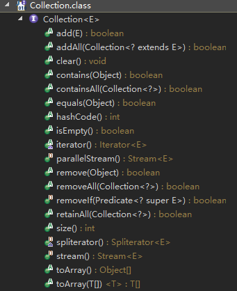
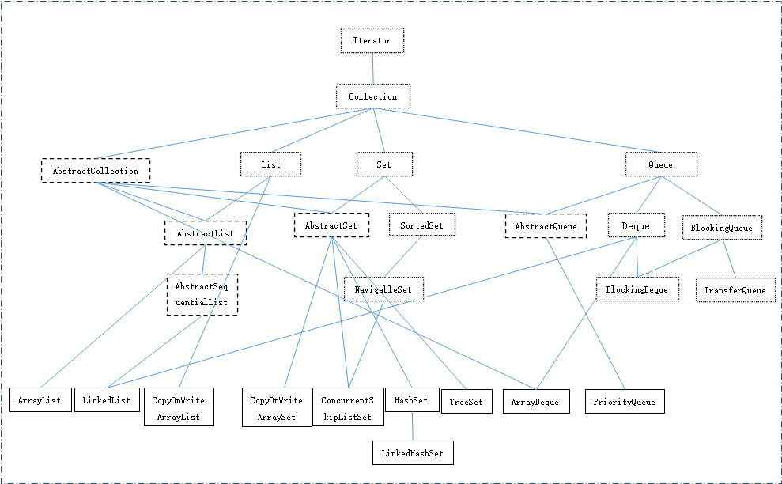

# interface Collection #

```java
public interface Collection<E> extends Iterable<E>
```

Collection 层次结构 中的根接口。Collection 表示一组对象，这些对象也称为 collection 的元素。

注意：

- 包 (bag) 或多集合 (multiset)（可能包含重复元素的无序 collection）应该直接实现此接口。 (可以直接extends AbstractCollection 抽象类)
- 所有实现类应该提供两个“标准”构造方法：

```java
public CollectionXXX() 
// 允许用户复制任何 collection，以生成所需实现类型的一个等效 collection
public CollectionXXX(Collection<E> c)
```
- 未支持的操作可能会抛出UnsupportedOperationException
- collection不保证线程安全
- collection中的对象应该重写equals()和hashCode()
- Colleciton没有定义获取元素的方法

所有方法概览：



常用集合类布局图：



## 添加 ##

2个全为可选操作

```java
/**
确保此 collection 包含指定的元素（可选操作）。
如果此 collection 由于调用而发生更改，则返回 true。
（如果此 collection 不允许有重复元素，并且已经包含了指定的元素，则返回 false。）
*/
boolean add(E e);

/**
将指定 collection 中的所有元素都添加到此 collection 中（可选操作）。
如果在进行此操作的同时修改指定的 collection，那么此操作行为是不确定的。
(this.addAll(this)可能会造成未知错误)
*/
boolean addAll(Collection<? extends E> c);
```
## 删除 ##

5个中有4个为可选操作，1.8添加的方法调用remove()也算是可选操作

```java
/**
移除此 collection 中的所有元素（可选操作）。
*/
void clear();

/**
从此 collection 中移除指定元素的单个实例，如果存在的话（可选操作）。
如果此 collection 包含一个或多个满足 (o==null ? e==null : o.equals(e)) 的元素 e，则移除这样的元素。
如果此 collection 包含指定的元素（或者此 collection 由于调用而发生更改），则返回 true 。 
*/
boolean remove(Object o);

/**
移除此 collection 中那些也包含在指定 collection 中的所有元素（可选操作）。
此调用返回后，collection 中将不包含任何与指定 collection 相同的元素。 
*/
boolean removeAll(Collection<?> c);

/**
移除collection中所有满足指定predicate条件的元素。
在迭代期间或predicate中抛出的错误或运行时异常将传递给调用者。
@since 1.8
*/
default boolean removeIf(Predicate<? super E> filter) {
        // 判断filter是否为空
        Objects.requireNonNull(filter);
        boolean removed = false;
        // 遍历collection
        final Iterator<E> each = iterator();
        while (each.hasNext()) {
            // 判断每一个元素是否满足filter条件
            if (filter.test(each.next())) {
                each.remove();
                removed = true;
            }
        }
        // 只要有一个符合filter条件就返回true
        return removed;
}

/**
仅保留此 collection 中那些也包含在指定 collection 的元素（可选操作）。
即移除此 collection 中未包含在指定 collection 中的所有元素。 
*/
boolean retainAll(Collection<?> c);
```

## 查询 ##

```java
/**
如果此 collection 包含指定的元素，则返回 true。
当且仅当此 collection 至少包含一个满足 (o==null ? e==null : o.equals(e)) 的元素 e 时，返回 true。 
*/
boolean contains(Object o);

/**
如果此 collection 包含指定 collection 中的所有元素，则返回 true。
*/
boolean containsAll(Collection<?> c);

boolean isEmpty();

int size();
```

## 比较和哈希

```java
/**
没有必要重写collection的equals()，应该使用默认的引用比较
*/
boolean equals(Object o);

int hashCode();
```

## 迭代器

```java
/**
返回在此 collection 的元素上进行迭代的迭代器。
关于元素返回的顺序没有任何保证（除非此 collection 是某个能提供保证顺序的类实例）。 
*/
Iterator<E> iterator()

/**
并发用迭代器
没用过
@since 1.8
*/
default Spliterator<E> spliterator();
```

## 转换数组

```java
Object[] toArray();

/**
返回包含此 collection 中所有元素的指定类型的数组；
如果指定的数组能容纳该 collection，则返回包含此 collection 元素的数组。
否则，将分配一个具有指定数组的运行时类型和此 collection 大小的新数组。 
*/
<T> T[] toArray(T[] a);
```


## 流

```java
/**
没用过
@since 1.8
*/
default Stream<E> parallelStream();

/**
没用过
@since 1.8
*/
default Stream<E> stream();
```

