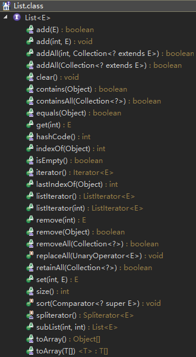

# List #

有序的 collection（也称为序列）。此接口的用户可以对列表中每个元素的插入位置进行精确地控制。用户可以根据元素的整数索引（在列表中的位置）访问元素，并搜索列表中的元素。

注意：

1. List允许重复元素，不应该允许插入重复元素时抛出运行时异常

2. List提供特殊的迭代器ListIterator，允许元素插入和替换，以及双向访问。
3. List对不合法元素操作时抛出异常或返回false由具体子类选择
4. List 接口在 iterator、add、remove、equals 和 hashCode 方法的协定上加了一些其他约定

```java
public interface List<E> extends Collection<E>
```

方法概览：




## 添加 ##

- boolean add(E e);

向列表的尾部添加指定的元素（可选操作）。 

- void add(int index, E element);

在列表的指定位置插入指定元素（可选操作）。将当前处于该位置的元素（如果有的话）和所有后续元素向右移动（在其索引中加 1）。 

- boolean addAll(Collection<? extends E> c);

添加指定 collection 的迭代器的顺序中的所有元素到此列表的结尾（可选操作）。

- boolean addAll(int index, Collection<? extends E> c);

将指定 collection 中的所有元素都插入到列表中的指定位置（可选操作）。

## 移除

- void clear();

从列表中移除所有元素（可选操作）。此调用返回后该列表将是空的。 

- E remove(int index);

移除列表中指定位置的元素（可选操作）。将所有的后续元素向左移动（将其索引减 1）。返回从列表中移除的元素。 

- boolean remove(Object o);
- boolean removeAll(Collection<?> c)
- boolean retainAll(Collection<?> c)

## 获取

- E get(int index);

## 替换

- E set(int index, E element);

用指定元素替换列表中指定位置的元素（可选操作）。

- void replaceAll(UnaryOperator<E> operator)

```java
    default void replaceAll(UnaryOperator<E> operator) {
        Objects.requireNonNull(operator);
        final ListIterator<E> li = this.listIterator();
        while (li.hasNext()) {
            li.set(operator.apply(li.next()));
        }
    }
```

## 比较与哈希 ##

- int hashCode();

返回列表的哈希码值。列表的哈希码定义为以下计算的结果： 

```java
  int hashCode = 1;
  Iterator<E> i = list.iterator();
  while (i.hasNext()) {
      E obj = i.next();
      hashCode = 31*hashCode + (obj==null ? 0 : obj.hashCode());
  }
```

- boolean equals(Object o);

比较指定的对象与列表是否相等。当且仅当 ***指定的对象也是一个列表、两个列表有相同的大小，并且两个列表中的所有相应的元素对相等*** 时才返回 true。即两个列表以相同的顺序包含相同的元素，那么它们是相等的

## 查询 ##

- int size();


- boolean isEmpty();
- boolean contains(Object o);
- boolean containsAll(Collection<?> c)

## 迭代

- Iterator<E> iterator();
- ListIterator<E> listIterator()
- ListIterator<E> listIterator(int index)

### 并行迭代器

- Spliterator<E> spliterator()

```java
    @Override
    default Spliterator<E> spliterator() {
        return Spliterators.spliterator(this, Spliterator.ORDERED);
    }
```

## 视图

- List<E> subList(int fromIndex, int toIndex);

返回列表中指定的 fromIndex（包括 ）和 toIndex（不包括）之间的部分视图。（如果 fromIndex 和 toIndex 相等，则返回的列表为空）。返回的列表由此列表支持，因此**返回列表中的非结构性更改将反映在此列表中**，反之亦然。返回的列表支持此列表支持的所有可选列表操作。

## 转换数组

- <T> T[] toArray(T[] a);
- Object[] toArray();

## 搜索

- int indexOf(Object o);

返回此列表中第一次出现的指定元素的索引；如果此列表不包含该元素，则返回 -1。

- int lastIndexOf(Object o);

返回此列表中最后出现的指定元素的索引；如果列表不包含此元素，则返回 -1。

## 排序 ##

- void sort(Comparator<? super E> c);

```java
    @SuppressWarnings({"unchecked", "rawtypes"})
    default void sort(Comparator<? super E> c) {
        Object[] a = this.toArray();
        Arrays.sort(a, (Comparator) c);
        ListIterator<E> i = this.listIterator();
        for (Object e : a) {
            i.next();
            i.set((E) e);
        }
    }
```

## 其他

- List.remove(int index)和List.remove(Object o)对于int基本类型自动拆装箱时应该使用Integer保存，而不应该使用int保存变量。

下面使用Integer示例：

```java
    static void test() {
        List<Integer> list = new ArrayList<>(5);
        list.add(1);
        list.add(2);
        // 抛出异常：java.lang.IndexOutOfBoundsException: Index: 2, Size: 2
        for (int i : list) {
            System.out.println(i);
            if (i == 2)
                // 调用方法为：List.remove(int index)
                list.remove(i);
        }
    }
```

该方法本意是测试在迭代时使用list.remove时的情况，但是在使用Int作为对象调用list.remove()移除对象时，默认调用的是`list.remove(int)`，这样删除的时int位置的对象，而不是int这一个对象，所以抛出越界异常，没有index=2的下标元素。

应该将变量取出时使用Integer引用类型保存，才能正确调用`List.remove(Object)`。（下面的示例可以正确调用，但这是在测试迭代修改异常）

```java
    static void test() {
        List<Integer> list = new ArrayList<>(5);
        list.add(1);
        list.add(2);
        for (Integer i : list) {
            System.out.println(i);
            if (i == 2)
                // 调用方法为：List.remove(Object o)
                list.remove(i);
        }
    }
```

- 在单线程下迭代调用List.remove会抛出线程修改异常

```java
    static void test() {
        List<Integer> list = new ArrayList<>(5);
        list.add(1);
        list.add(2);
        // 在if (i==1)时仍然抛出异常
//        list.add(3);
        // 抛出异常：java.util.ConcurrentModificationException
        for (Integer i : list) {
            System.out.println(i);
            // 删除正常，但是停止遍历
//            if (i == 1)
            if (i == 2)
                // 调用方法为：List.remove(Object o)
                list.remove(i);
        }
    }
```

由于具体实现为ArrayList，所以结合该实现说明。下面是ArrayList.Itr迭代器内部类Itr.hasNext的实现：

```java
        public boolean hasNext() {
            return cursor != size;
        }
```

当调用List.remove后，更新了size字段，使得cursor>size，hasNext返回true，删除后允许再调用next()，该方法首先`checkForComodification();`发现除了迭代器存在其他的结构修改，即抛出异常`java.util.ConcurrentModificationException`

而当`if (i == 1)`不会抛出异常，但是会停止遍历。这是由于List.remove使得size减少一个即cursor==size，没有进入next()。而当`list.add(3)`时，即使删除一个cursor<size，进入next()被检查线程修改，然后抛出异常