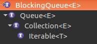
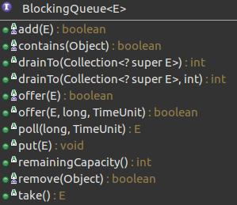

# BlockingQueue

支持两个附加操作的 `Queue`

**结构**



**所有方法**



## 特点

- 该接口是相比与Queue多支持了两个操作：1.获取元素时等待队列变为非空，2.存储元素时等待空间变得可用


- `BlockingQueue` 对于不能立即满足但可能在将来某一时刻可以满足的操作以四种形式出现：1.抛出异常，2.返回特殊值，3.阻塞，4.超时

|             | *Throws exception* | *Special value* | *Blocks*         | *Times out*            |
| ----------- | ------------------ | --------------- | ---------------- | ---------------------- |
| **Insert**  | `add(e)`           | `offer(e)`      | `put(e)`         | `offer(e, time, unit)` |
| **Remove**  | `remove()`         | `poll()`        | `take()`         | `poll(time, unit)`     |
| **Examine** | `element()`        | `peek()`        | *not applicable* | *not applicable*       |

- 不允许插入null元素
- 可以限定容量，使用`remainingCapacity()`报告剩余容量。如果使用的是没有容量限制的实现，则报告Integer.MAX_VALUE的剩余容量
- 支持Collection接口，允许集合的操作，但是这些操作`addAll`, `containsAll`, `retainAll` ,`removeAll`一般都没有自动执行，需要依据具体实现。
- `BlockingQueue` 实质上*不* 支持使用任何一种“close”或“shutdown”操作来指示不再添加任何项。如果需要可以插入特殊的对象，然后根据获取这些对象时执行具体操作
- 线程安全 


## 阻塞队列BlockingQueue

### 插入

#### 阻塞

- `void put(E e) throws InterruptedException;`

```java
    /**
     * Inserts the specified element into this queue, waiting if necessary
     * for space to become available.
     *
     * @param e the element to add
     * @throws InterruptedException if interrupted while waiting
     * @throws ClassCastException if the class of the specified element
     *         prevents it from being added to this queue
     * @throws NullPointerException if the specified element is null
     * @throws IllegalArgumentException if some property of the specified
     *         element prevents it from being added to this queue
     */
    // 将指定元素插入此队列中，将等待可用的空间（如果有必要）。
    void put(E e) throws InterruptedException;
```

#### 超时

- `boolean offer(E e, long timeout, TimeUnit unit) throws InterruptedException;`

```java
    /**
     * Inserts the specified element into this queue, waiting up to the
     * specified wait time if necessary for space to become available.
     *
     * @param e the element to add
     * @param timeout how long to wait before giving up, in units of
     *        {@code unit}
     * @param unit a {@code TimeUnit} determining how to interpret the
     *        {@code timeout} parameter
     * @return {@code true} if successful, or {@code false} if
     *         the specified waiting time elapses before space is available
     * @throws InterruptedException if interrupted while waiting
     * @throws ClassCastException if the class of the specified element
     *         prevents it from being added to this queue
     * @throws NullPointerException if the specified element is null
     * @throws IllegalArgumentException if some property of the specified
     *         element prevents it from being added to this queue
     */
    // 将指定元素插入此队列中，在到达指定的等待时间前等待可用的空间（如果有必要）。
    // 如果插入成功返回true。如果在空间可用前超过了指定的等待时间，则返回 false
    boolean offer(E e, long timeout, TimeUnit unit)
        throws InterruptedException;
```

### 移除

#### 阻塞

- `E take() throws InterruptedException;`

```java
    /**
     * Retrieves and removes the head of this queue, waiting if necessary
     * until an element becomes available.
     *
     * @return the head of this queue
     * @throws InterruptedException if interrupted while waiting
     */
    // 获取并移除此队列的头部，在元素变得可用之前一直等待（如果有必要）
    E take() throws InterruptedException;
```

#### 超时

- `E poll(long timeout, TimeUnit unit) throws InterruptedException;`

```java
    /**
     * Retrieves and removes the head of this queue, waiting up to the
     * specified wait time if necessary for an element to become available.
     *
     * @param timeout how long to wait before giving up, in units of
     *        {@code unit}
     * @param unit a {@code TimeUnit} determining how to interpret the
     *        {@code timeout} parameter
     * @return the head of this queue, or {@code null} if the
     *         specified waiting time elapses before an element is available
     * @throws InterruptedException if interrupted while waiting
     */
    // 获取并移除此队列的头部，在指定的等待时间前等待可用的元素（如果有必要）
    E poll(long timeout, TimeUnit unit)
        throws InterruptedException;
```

### 查询

- `int remainingCapacity();`

```java
    /**
     * Returns the number of additional elements that this queue can ideally
     * (in the absence of memory or resource constraints) accept without
     * blocking, or {@code Integer.MAX_VALUE} if there is no intrinsic
     * limit.
     *
     * <p>Note that you <em>cannot</em> always tell if an attempt to insert
     * an element will succeed by inspecting {@code remainingCapacity}
     * because it may be the case that another thread is about to
     * insert or remove an element.
     *
     * @return the remaining capacity
     */
    // 返回在无阻塞的情况下能接受的附加元素数量；如果没有内部限制，则返回 Integer.MAX_VALUE。
    int remainingCapacity();
```

### 移动到集合

- `int drainTo(Collection<? super E> c);`

```java
    /**
     * Removes all available elements from this queue and adds them
     * to the given collection.  This operation may be more
     * efficient than repeatedly polling this queue.  A failure
     * encountered while attempting to add elements to
     * collection {@code c} may result in elements being in neither,
     * either or both collections when the associated exception is
     * thrown.  Attempts to drain a queue to itself result in
     * {@code IllegalArgumentException}. Further, the behavior of
     * this operation is undefined if the specified collection is
     * modified while the operation is in progress.
     *
     * @param c the collection to transfer elements into
     * @return the number of elements transferred
     * @throws UnsupportedOperationException if addition of elements
     *         is not supported by the specified collection
     * @throws ClassCastException if the class of an element of this queue
     *         prevents it from being added to the specified collection
     * @throws NullPointerException if the specified collection is null
     * @throws IllegalArgumentException if the specified collection is this
     *         queue, or some property of an element of this queue prevents
     *         it from being added to the specified collection
     */
    // 移除此队列中所有可用的元素，并将它们添加到给定 collection 中。
    int drainTo(Collection<? super E> c);
```

- `int drainTo(Collection<? super E> c, int maxElements);`

```java
    /**
     * Removes at most the given number of available elements from
     * this queue and adds them to the given collection.  A failure
     * encountered while attempting to add elements to
     * collection {@code c} may result in elements being in neither,
     * either or both collections when the associated exception is
     * thrown.  Attempts to drain a queue to itself result in
     * {@code IllegalArgumentException}. Further, the behavior of
     * this operation is undefined if the specified collection is
     * modified while the operation is in progress.
     *
     * @param c the collection to transfer elements into
     * @param maxElements the maximum number of elements to transfer
     * @return the number of elements transferred
     * @throws UnsupportedOperationException if addition of elements
     *         is not supported by the specified collection
     * @throws ClassCastException if the class of an element of this queue
     *         prevents it from being added to the specified collection
     * @throws NullPointerException if the specified collection is null
     * @throws IllegalArgumentException if the specified collection is this
     *         queue, or some property of an element of this queue prevents
     *         it from being added to the specified collection
     */
    // 最多从此队列中移除给定数量的可用元素，并将这些元素添加到给定 collection 中。
    int drainTo(Collection<? super E> c, int maxElements);
```

### 注意

- 阻塞操作不同于原queue的接口方法，使用put和take表示插入和移除
- 超时操作在原queue的操作上定义offer和poll表示超时插入或移除
- 阻塞队列没有阻塞获取元素的方法，只能使用take获取，但同时也移除了该元素

## 队列Queue

### 插入

#### 抛出异常

- `boolean add(E e);`

#### 返回特殊值

- `boolean offer(E e);`

### 移除

#### 抛出异常

- `E remove();`

#### 返回特殊值

- `E poll();`

### 检查

#### 抛出异常

- `E element();`

#### 返回特殊值

- `E peek();`

## 集合