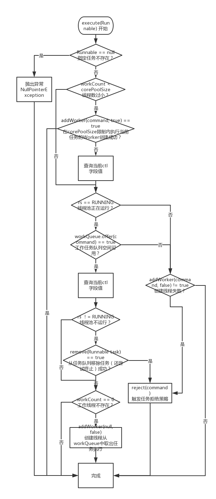
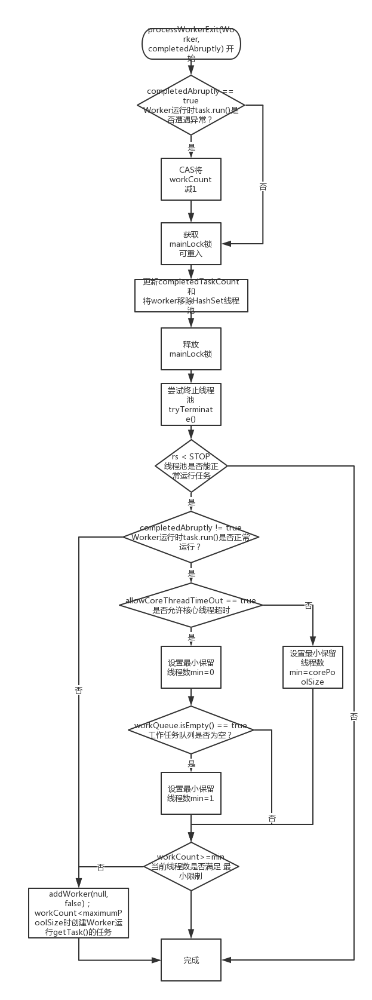
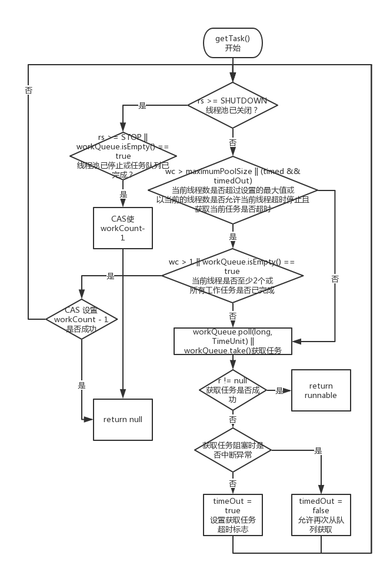

# ThreadPoolExecutor

## 状态变量

所有的字段：


### `ctl`

```java
    private final AtomicInteger ctl = new AtomicInteger(ctlOf(RUNNING, 0));
    private static final int COUNT_BITS = Integer.SIZE - 3;
    // workerCount的最大值
    private static final int CAPACITY   = (1 << COUNT_BITS) - 1;

    // runState is stored in the high-order bits
    private static final int RUNNING    = -1 << COUNT_BITS;
    private static final int SHUTDOWN   =  0 << COUNT_BITS;
    private static final int STOP       =  1 << COUNT_BITS;
    private static final int TIDYING    =  2 << COUNT_BITS;
    private static final int TERMINATED =  3 << COUNT_BITS;

    // Packing and unpacking ctl
    private static int runStateOf(int c)     { 
        // ~CAPACITY = RUNNING:1110 0000 .... 0000 0000(32bit)即仅保留最高3位
        return c & ~CAPACITY; }
    private static int workerCountOf(int c)  { 
        // CAPACITY:0001 1111 .... 1111 1111(32bit)即保留低29位
        return c & CAPACITY; }
    private static int ctlOf(int rs, int wc) { 
        // 位与操作，将runState值的最高3bit和workerCount值的低29bit同时保留在一个int(32bit)中
        return rs | wc; }
```

`AtomicInteger`类型的ctl变量表示两个字段，利用int的低29位表示workerCount即`2^29 - 1，`int的高3位表示运行状态runState：

- workerCount：表示运行的线程数worker的数量
- runState：表示运行的状态如running, shutting down 等

注意：workerCount值可能与实际存活的线程数不同，比如在`ThreadFactory.newThread()`创建线程失败 和 正在退出的线程在终止(terminating)前还在执行记录。

使用`HashSet<Worker>.size()`返回值表示线程池的大小

#### 运行状态

`RUNNING`：接收新task和处理已入队的task

`SHUTDOWN`：不再接收新task，但是处理已入队的task

`STOP`：不再接收新task，不再处理已入队的task，并且中断所有正在执行的task

 `TIDYING`：所有task已经终止，workerCount为0，将运行`terminated()`（默认实现为空，由子类覆盖定义实现）方法

`TERMINATED`：terminated()执行完成

这些值的顺序为由小到大，用于比较。运行状态随着时间单调增加，不会降低，也不需要运行所有状态。

可能的状态转换：

```
     * RUNNING -> SHUTDOWN
     *    On invocation of shutdown(), perhaps implicitly in finalize()
     * (RUNNING or SHUTDOWN) -> STOP
     *    On invocation of shutdownNow()
     * SHUTDOWN -> TIDYING
     *    When both queue and pool are empty
     * STOP -> TIDYING
     *    When pool is empty
     * TIDYING -> TERMINATED
     *    When the terminated() hook method has completed
```


## Worker

主要用于维护线程任务运行的中断状态控制和一些统计记录。

该类是一个non-reentrant mutual exclusion lock即不可重入的互斥锁，当 线程池控制方法如setCorePoolSize将不能在worker运行任务时能够重新请求锁。

另外还能在线程实际开始运行任务前抑制中断（在runWorker()中）

### execute

`execute(Runnable command)`执行步骤：

1. 当前运行的线程数`workCount < corePoolSize`，尝试通过指定的Runnable作为firstTask创建新worker运行该任务(Runnable)。addWorker将自动检查如果不应该创建线程就返回false
2. 成功入队，需要双重检查：是否应该创建新的线程；线程池是否已经关闭，是则触发reject()
3. 入队失败，尝试创建新线程执行任务，失败后reject()


***触发饱和策略***

当线程池不再运行（`runState >= SHUTDOWN`）或任务队列空间已满，此时以最大线程数量限制`maximumPoolSize`提交任务`command`创建线程，前者一定会失败（线程池已关闭），后者可能失败（在线程数达到限制时），触发饱和策略（任务被拒绝策略）

#### 流程图




### addWorker

即`addWorker(Runnable firstTask, boolean core)`

***检查是否应该创建线程。***当线程池能够正常运行任务时（处于`RUNNING`或`SHUTDOWN`时需要处理`workQueue`的任务）并且未超过数量限制时允许创建线程

- 当线程池已停止`runState >= STOP`；
- 线程池在关闭状态`runState = SHUTDOWN`但提交运行任务`firstTask != null`（关闭后不允许提交任务）；
- 线程池在关闭状态`runState = SHUTDOWN`且未提交运行任务`firstTask == null`但工作任务队列为空`workQueue.isEmpty() == true`（关闭后所有任务已完成）；
- 当前工作线程数量`workCount`超过限制

以上几种状态不会创建线程，即直接返回false

- 已经创建了线程`new Worker(runnable)`，但是通过`ThreadFactory.newThread()`创建的这个线程已经启动过（调用过`Thread.start()`但没有死亡），将抛出异常后抛弃该线程返回false

上面这种情况将会创建线程后丢弃该线程

***创建线程***

`Worker`对象创建后将其添加到线程池后，启动该线程`Worker.thread.start()`

#### **流程图**


### runWorker

`runWorker(Worker w)`

获取任务运行，直到所有任务完成后（`worker.firstTask == null` 和`getTask() == null`）退出

***中断***

运行任务前，如果线程池已停止（`runState >= STOP`），保证当前线程以中断状态运行任务；否则将清除当前线程的中断状态

***异常***

如果`task.run()`即`Runnable.run()`在运行中抛出任意的异常，线程将不会继续运行任务，将抛出异常后退出该线程

***退出线程***

当所有任务完成或遭遇异常后，该线程将会退出线程池。正常完成后很可能不需要新的线程执行任务，但是异常后很可能会创建一个线程执行后面未完成的任务（如果不是多个异常发生，将一定会创建一个新线程执行未完成的任务）

获取任务

- 首先运行最初的任务`worker.firstTask`，然后从`getTask()`中获取任务；
- 如果`worker.firstTask`不存在，将直接运行`getTask()`的任务；
- 如果所有任务都已完成`getTask() == null`将退出线程运行任务

#### 流程图


`processWorkerExit(Worker w, boolean completedAbruptly)`

**线程退出**

造成线程退出有两种情况：

- 完成所有任务`workeQueue.isEmpty() == true`
- 运行任务时`task.run()`抛出异常

无论那种情况都会使当前线程退出线程池`HashSet<Worker>.remove(worker)`，关键在于退出后是否需要线程保证线程池的正常运行。

第一种情况，只需要保证当前线程数`workCount >= min`就不需要新线程替换

第二种情况，异常将使得`workCount-1`，在线程池未停止状态下（`rs < STOP`）将会创建新的线程运行剩余的任务，`addWorker(null, false)`使`workCount+1` 保持异常前状态

注意：当正常退出线程池时，并不会直接更新减少`workCount`值。而异常时会减少

流程图：



### getTask

阻塞或定时的等待获取一个任务，下面情况将会返回null

- 由于调用`setMaximumPoolSize(int maximumPoolSize)`减小了最大线程数，使得`workCount > maximumPoolSize`
- 线程池已停止（`runState >= STOP`）
- 线程池已关闭（`runState == SHUTDOWN`）且所有任务已完成（`workQueue.isEmpty() == true`）
- 如果该worker可超时`allowCoreThreadTimeOut || wc > corePoolSize`，且当且任务已超时`timeOut = true`，并且当前worker不是池中最后一个线程`workCount > 1`或所有任务已完成`workQueue.isEmpty()`

返回null之前都会将`workCount-1`

#### 流程图



### tryTerminate

下面几种情况将使线程池状态转变为`TERMINATED`:

- 线程池已关闭`runState = SHUTDOWN`且线程池线程为空`workCount = 0`和任务队列为空`workQueue.isEmpty()`
- 线程池已停止`runState = STOP`且线程池线程为空`workCount = 0`

如果线程池已停止，但线程数不为0，将最多中断一个线程以确保发送关闭信号

该方法在可能终止的操作后调用：

- 减少Worker数量时
- 从队列中移除任务时 

## QA

- 线程如何在线程池中做到线程复用？

Thread本身不支持线程复用，通常一个线程执行一个任务`new Thread(Runnable target)`，线程启动后无法设置新的`Runnable`对象运行。

由于Worker本身是一个Runnable，这个`Runnable.run()`只运行方法`runWorker()`，然后将该Worker作为新线程的任务执行，即这个线程的任务就是不断运行其他的任务。

`ThreadPoolExecutor`通过保持一个任务阻塞队列`BlockingQueue<Runnable>`，在`runWorker()`不断从阻塞队列中取出任务执行，当任务执行完成或异常后worker线程将退出线程池中，由`gc`清理内存。

线程的复用主要是创建后可以不断的从阻塞队列中取出任务执行，而不是线程Thread本身支持复用

- 超过活动时间`keepAliveTime`后终止额外线程是如何实现的

线程超时意味着任务队列为空，当前所有任务都已完成，线程都被阻塞在`workQueue.poll(long, TimeUnit)`或`workQueue.take()`。

当前线程数量超过核心线程数量即`workCount > corePoolSize`或允许核心线程超时将会超时后终止部分线程直到线程数为`corePoolSize`或`1||0`

此时在`runWorker()`方法中线程获取一个任务即`getTask()`中将会检查通过超时版本的`queue.poll()`超时后返回null判断是否超时，返回null表示当前线程的工作任务均已完成，允许退出，即终止线程