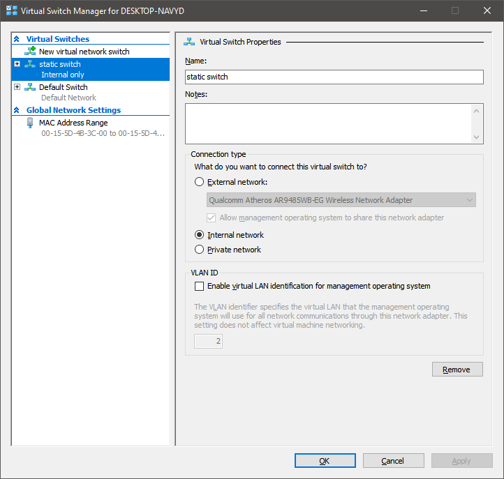
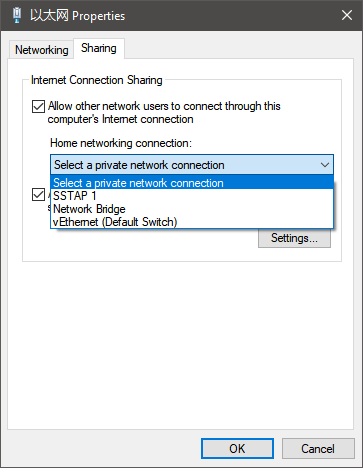
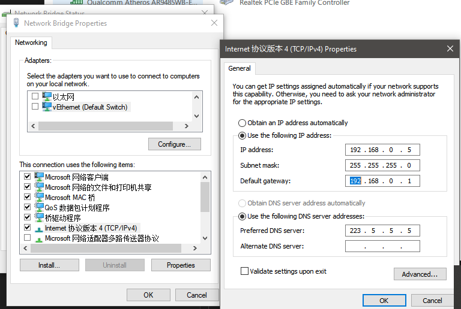

# how to configure static ip

为什么会存在static ip的需求？

经常变化的ip对于开发很不友好

## ubuntu server 18.04

1. 修改ip使用`netplan`

```shell
vim /etc/netplan/50-cloud-init.yaml
```

原文件：

```yaml
network:
    ethernets:
        eth0:
            dhcp4: true
    version: 2
```

2. 改为static ip=192.168.0.10

```yaml
network:
    ethernets:
        eth0:
            dhcp4: no
            # ip
            addresses:
              - 192.168.0.10/24
            # 网关
            gateway4: 192.168.0.1
            # DNS
            nameservers:
              addresses:
                - 223.5.5.5
    version: 2
```

3. `sudo netplan apply`

参考：

[Network Configuration](https://help.ubuntu.com/lts/serverguide/network-configuration.html)


### 如何查看网关

1. `route -n` 或 `netstat -rn`

```shell
~$ route -n
Kernel IP routing table
Destination     Gateway         Genmask         Flags Metric Ref    Use Iface
0.0.0.0         192.168.0.1     0.0.0.0         UG    0      0        0 eth0
192.168.0.0     0.0.0.0         255.255.255.0   U     0      0        0 eth0
```

## hyper-v

配置使主机与vm同一LAN

1. 创建`internal switch`




### 如何共享主机网络

#### sharing

使用正常工作的网卡sharing



缺点：

只能对一个网络

#### bridge

多个网络组成bridge

