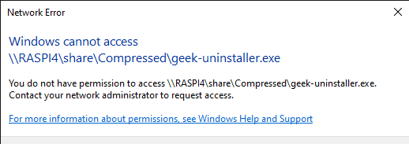
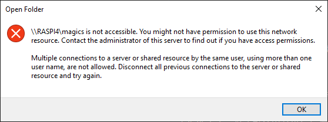

# samba服务

## 安装

```bash
sudo usermod -aG sambashare navyd
sudo chown navyd:sambashare /mnt/share
sudo smbpasswd -a navyd
```

参考：

* [How to Install and Configure Samba on Ubuntu 18.04](https://linuxize.com/post/how-to-install-and-configure-samba-on-ubuntu-18-04/)

## 启用win10自动发现 wsdd

安装wsdd

```bash
sudo sh -c 'echo deb https://pkg.ltec.ch/public/ focal main > /etc/apt/sources.list.d/wsdd.list'
sudo apt-key adv --fetch-keys https://pkg.ltec.ch/public/conf/ltec-ag.gpg.key
sudo apt-get install wsdd
```

参考：

* [解决 Linux samba 主机不能被windows 10 发现的问题](https://zhuanlan.zhihu.com/p/339975385)
* [wsdd](https://github.com/christgau/wsdd)

## win10 samba共享密码无法登陆

在修改win10 登陆当前帐户密码后，不能用新密码登入samba共享，经过重启和注销多次测试，samba还工作在原密码上，可用原密码可正常登入samba中

测试用一个新帐户share，用它做samba分享，测试其它设备可用samba，说明只是帐户密码问题

### 原因

在多次重启和注销中，都使用的是windows hello或PIN登录，没有将新密码同步到系统，可使用新密码登入win10系统

### 解决方案

`选择PIN登录 --> 忘记PIN --> 输入帐户密码 --> 是否确定PIN忘记 --> 否 --> 成功登录`

现在新密码在samba中可用

## win10 samba挂载无法执行exe文件

点击exe文件时无法直接执行，提示没有权限访问文件



### 解决方法

在`/etc/samba/smb.conf`中`[global]`或自定义组下添加`acl allow execute always = True`：

```ini
# ...
[your-share]
    path = /mnt/share
    browseable = yes
    read only = no
    writeable = yes
    force create mode = 0660
    force directory mode = 2770
    valid users = user, @sambashare
    # fix Execute a .exe on a samba share error
    acl allow execute always = True
```

参考：

* [Execute a .exe on a samba share](https://unix.stackexchange.com/questions/188721/execute-a-exe-on-a-samba-share)

## docker启动

在linux上使用host网络docker同时启动samba与wsdd

```yml
version: "3"
services: 
  samba-server:
    image: dperson/samba
    container_name: samba-server
    environment: 
      - TZ=Asia/Shanghai
      - USERID=1000
      - GROUPID=1000
    command: >-
      -p
      -n
      -u "user1;1234;"
      -s "downloads;/share/downloads;yes;no;no;user1;user1;user1"
      -G "downloads;acl allow execute always = True"
      -g "netbios name = RASPI4"
      -g "netbios aliases = RASPI4-D RASPI4-M RASPI4-B"
    network_mode: host
    mem_limit: 128M
    restart: always
    volumes: 
      - type: bind
        source: /mnt/share/Downloads
        target: /share/downloads
  wsdd:
    build:
      context: .
      dockerfile: wsdd.Dockerfile
    container_name: wsdd
    network_mode: host
    restart: always
    depends_on: 
      - samba-server
```

一个简单的docker wsdd镜像：

```dockerfile
FROM python:3-alpine

WORKDIR /

RUN wget https://raw.githubusercontent.com/christgau/wsdd/v0.6.4/src/wsdd.py -O wsdd.py \
    && chmod +x wsdd.py

ENTRYPOINT ["/wsdd.py"]
```

参考：

* [dperson/samba](https://hub.docker.com/r/dperson/samba)

## win10无法连接多个samba用户到一台linux主机

在win10上无法连接多个同一台linux主机上的samba



### 解决方法

#### 断开之前的连接

```powershell
PS C:\Users\navyd> net use
New connections will be remembered.


-------------------------------------------------------------------------------
Disconnected           \\RASPI4\magics            Microsoft Windows Network
The command completed successfully.

PS C:\Users\navyd> net use /delete \\RASPI4\magics
\\RASPI4\magics was deleted successfully.

PS C:\Users\navyd> net use

There are no entries in the list.
```

#### 配置samba服务器多个不同的名称

配置

```
[global]
    netbios name = RASPI4
    netbios aliases = RASPI4-D RASPI4-M RASPI4-B
# ...
```

在win10 中使用不同的名称来访问即可如`\\RASPI4-D\downloads, \\RASPI4-M\magics`

参考：

* [Samba+Windows: Allow multiple connections by different users?](https://superuser.com/a/498219)
* [Windows: Fix ‘Multiple connections to a server or shared resource by the same user’ Error](https://www.technipages.com/fix-multiple-connections-to-a-server-or-shared-resource-by-the-same-user-error)
* [Samba 4, shares, wsdd and Windows 10 – how to list Linux Samba servers in the Win 10 Explorer](https://linux-blog.anracom.com/2020/05/24/samba-4-shares-wsdd-and-windows-10-how-to-list-linux-samba-servers-in-the-win-10-explorer/)
