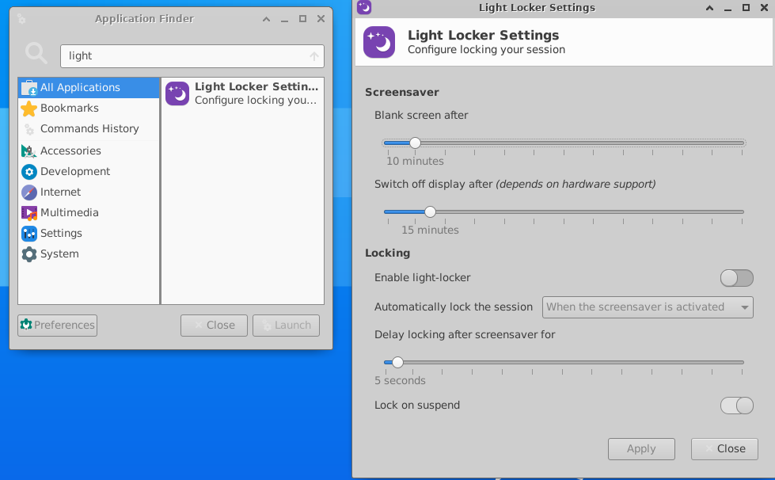

# wsl2安装xfce黑屏

## 描述

在`ctrl+alt+L`按下或10分钟左右后黑屏

## 原因

`light-locker`进程控制锁屏，但是黑屏就不知道怎么回事了

## 解决方法

kill `light-locker`进程

### gui关闭

打开light-locker-settings=>enable light-locker关闭



### cli

`kill light-locker`

```bash
$ ps -aux | grep light-locker
navyd      582  0.0  0.0 263736 21016 pts/0    Sl   14:47   0:00 light-locker

$ killall light-locker
```

参考：

- [How do I disable automatic screen locking in Xubuntu?](https://askubuntu.com/a/544824)
- [Disable Ctrl-Alt-L's behavior of locking the screen](https://askubuntu.com/questions/1005457/disable-ctrl-alt-ls-behavior-of-locking-the-screen)
