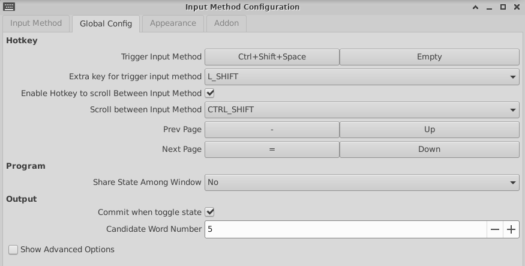

# 1. installation

## 1.1. source list

更新ubuntu ali国内更新源

```bash
sudo sed --in-place=.bak "s/archive.ubuntu.com/mirrors.aliyun.com/g" /etc/apt/sources.list
```

## 1.2. desktop environment

详细的安装步骤：[wsl2-tutorial](https://github.com/QMonkey/wsl-tutorial/blob/master/README.wsl2.md)

也可参考：

- [WSL](https://wiki.ubuntu.com/WSL#Running_Graphical_Applications)
- [WSL使用笔记](https://blog.faymek.com/2018/11/2018-11-03-wsl%E4%BD%BF%E7%94%A8%E7%AC%94%E8%AE%B0/)

### 1.2.1. Install xfce desktop

```bash
$ sudo apt-get install xfce4 xfce4-terminal
```

如果出现`Unable to fetch some archives`可修复后再install

```bash
# 可能出现的问题：
# Get:598 http://mirrors.aliyun.com/ubuntu focal/main amd64 usb-modeswitch-data all 20191128-3 [32.3 kB]
# Get:599 http://mirrors.aliyun.com/ubuntu focal/main amd64 usb-modeswitch amd64 2.5.2+repack0-2ubuntu3 [53.1 kB]
# Fetched 189 MB in 1min 26s (2180 kB/s)
# E: Failed to fetch http://mirrors.aliyun.com/ubuntu/pool/main/i/isl/libisl22_0.22.1-1_amd64.deb  Undetermined Error [IP: 112.67.242.118 80]
# E: Failed to fetch http://mirrors.aliyun.com/ubuntu/pool/main/g/gnome-keyring/gnome-keyring_3.36.0-1ubuntu1_amd64.deb  Undetermined Error [IP: 112.67.242.118 80]
# E: Failed to fetch http://mirrors.aliyun.com/ubuntu/pool/main/g/gst-plugins-base1.0/gstreamer1.0-gl_1.16.2-4_amd64.deb  Undetermined Error [IP: 112.67.242.118 80]
# E: Unable to fetch some archives, maybe run apt-get update or try with --fix-missing?
$ sudo apt-get update --fix-missing
$ sudo apt-get install xfce4 xfce4-terminal
```

Configuring lightdm选择`lightdm`

```bash
Package configuration


 ┌──────────────────────────────────────────────┤ Configuring lightdm ├──────────────────────────────────────────────┐
 │ A display manager is a program that provides graphical login capabilities for the X Window System.                │
 │                                                                                                                   │
 │ Only one display manager can manage a given X server, but multiple display manager packages are installed.        │
 │ Please select which display manager should run by default.                                                        │
 │                                                                                                                   │
 │ Multiple display managers can run simultaneously if they are configured to manage different servers; to achieve   │
 │ this, configure the display managers accordingly, edit each of their init scripts in /etc/init.d, and disable     │
 │ the check for a default display manager.                                                                          │
 │                                                                                                                   │
 │ Default display manager:                                                                                          │
 │                                                                                                                   │
 │                                                     gdm3                                                          │
 │                                                     lightdm                                                       │
 │                                                                                                                   │
 │                                                                                                                   │
 │                                                      <Ok>                                                         │
 │                                                                                                                   │
 └───────────────────────────────────────────────────────────────────────────────────────────────────────────────────┘
```

### 1.2.2. configuration

写入shell环境中`$HOME/.bashrc`

```bash
# wsl2
export DISPLAY=$(awk '/nameserver / {print $2; exit}' /etc/resolv.conf 2>/dev/null):0 # in WSL 2
export LIBGL_ALWAYS_INDIRECT=1

# fcitx
export XMODIFIERS=@im=fcitx
export GTK_IM_MODULE=fcitx
export QT_IM_MODULE=fcitx
if pidof fcitx > /dev/null; then
    echo 'starting up fcitx'
    fcitx -d
fi
```

### 启动xfce

```bash
startxfce4
```

后台运行：[[在Shell后台运行任务.md]]

## 1.3. softwares

### 1.3.1. fcitx中文输入法

```bash
sudo apt-get install fcitx fcitx-pinyin
```

注意：

- 如果输入法没有响应，可检查下列配置是否在shell环境中

```bash
export XMODIFIERS=@im=fcitx
export GTK_IM_MODULE=fcitx
export QT_IM_MODULE=fcitx
```

- 如果切换快捷键没有反应，可以看下是不是设置与windows一样了，最好是不一样就好打开fcitx配置
`input method configuration -> global config`:

```
trigger input method: CTRL+SHIFT+SPACE,
extra key for trigger input method: L_SHIFT,
enable hotkey to scroll between input method: checked
```



### 1.3.2. Idea

移动idea文件夹到`/usr/local/bin/idea/`中，安装idea桌面快捷方式到`/usr/share/applications/intellij-idea.desktop`：

```toml
[Desktop Entry]
Version=1.0
Type=Application
Terminal=false
Icon=/usr/local/bin/idea/idea-IU-201.7846.76//bin/idea.png
Exec="/usr/local/bin/idea/idea-IU-201.7846.76//bin/idea.sh %f"
Name=IntelliJ Idea
Categories=Development;IDE;
```

### 1.3.3. Chrome

```bash
wget https://dl.google.com/linux/direct/google-chrome-stable_current_amd64.deb
sudo dpkg -i ./google-chrome-stable_current_amd64.deb
```

### 1.3.4. zsh配置

[[zsh configuration.md]]

#### 1.3.4.1. 变量`DISPLAY`无效问题

##### 1.3.4.1.1. 描述

当从bash先启动startxfce4，退出后加载的是zsh，则可能导致先前的变量`DISPLAY`无效：

```bash
$ startxfce4
/usr/lib/xorg/Xorg.wrap: Only console users are allowed to run the X server
```

修改文件`/etc/X11/Xwrapper.config`：

```bash
allowed_users = anybody
```

启动后依然出现error，这是由于`DISPLAY`无效导致

##### 1.3.4.1.2. 解决方法

在`$HOME/.zshrc`中重设即可

```zsh
DISPLAY=$(awk '/nameserver / {print $2; exit}' /etc/resolv.conf 2>/dev/null):0.0 # in WSL 2
export DISPLAY
```

参考：[Error when trying to use Xorg: Only console users are allowed to run the X server?
](https://unix.stackexchange.com/a/529945)

### 1.3.5. Docker安装

[[docker installation.md]]
