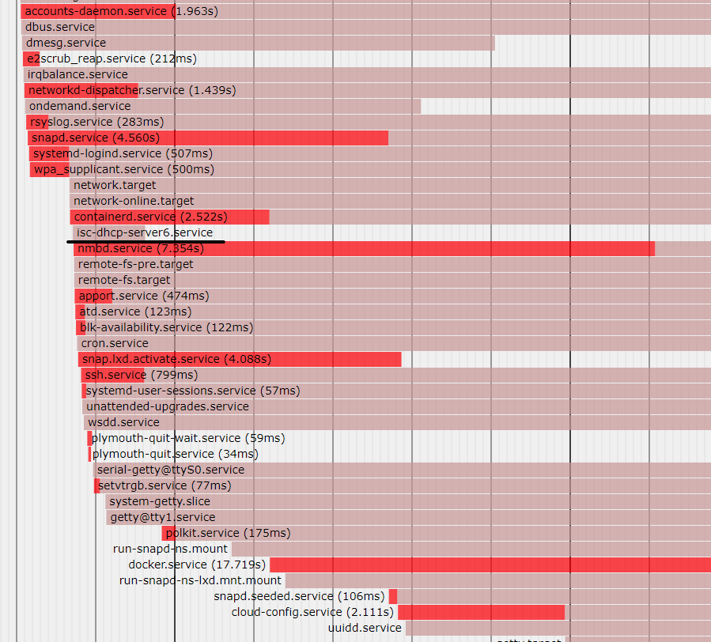

# 树莓派开机自启dhcp server问题

在rasp4 ubuntu 20.04上配置的isc-dhcp-server可以正常工作，但是无法在重启后启动，需要手动restart

`/etc/default/isc-dhcp-server`配置：`INTERFACESv4="eth0"`，下面是`/etc/dhcp/dhcpd.conf`配置：

```
default-lease-time 600;
max-lease-time 7200;
authoritative;

subnet 192.168.93.0 netmask 255.255.255.0 {
    range 192.168.93.150 192.168.93.200;
    option routers 192.168.93.2;
    option domain-name-servers 192.168.93.2;
    # option domain-name "mydomain.example";
}
```

## 分析

使用`journalctl --catalog --unit=isc-dhcp-server.service`查看启动日志：

```
Apr 27 00:24:16 raspi4 dhcpd[1718]: All rights reserved.
Apr 27 00:24:16 raspi4 dhcpd[1718]: For info, please visit https://www.isc.org/software/dhcp/
Apr 27 00:24:16 raspi4 sh[1718]: Config file: /etc/dhcp/dhcpd.conf
Apr 27 00:24:16 raspi4 sh[1718]: Database file: /var/lib/dhcp/dhcpd.leases
Apr 27 00:24:16 raspi4 sh[1718]: PID file: /run/dhcp-server/dhcpd.pid
Apr 27 00:24:16 raspi4 dhcpd[1718]: Config file: /etc/dhcp/dhcpd.conf
Apr 27 00:24:16 raspi4 dhcpd[1718]: Database file: /var/lib/dhcp/dhcpd.leases
Apr 27 00:24:16 raspi4 dhcpd[1718]: PID file: /run/dhcp-server/dhcpd.pid
Apr 27 00:24:16 raspi4 dhcpd[1718]: Wrote 3 leases to leases file.
Apr 27 00:24:16 raspi4 sh[1718]: Wrote 3 leases to leases file.
Apr 27 00:24:17 raspi4 dhcpd[1718]:
Apr 27 00:24:17 raspi4 sh[1718]: No subnet declaration for eth0 (no IPv4 addresses).
Apr 27 00:24:17 raspi4 sh[1718]: ** Ignoring requests on eth0.  If this is not what
Apr 27 00:24:17 raspi4 sh[1718]:    you want, please write a subnet declaration
Apr 27 00:24:17 raspi4 sh[1718]:    in your dhcpd.conf file for the network segment
Apr 27 00:24:17 raspi4 sh[1718]:    to which interface eth0 is attached. **
Apr 27 00:24:17 raspi4 sh[1718]: Not configured to listen on any interfaces!
Apr 27 00:24:17 raspi4 sh[1718]: If you think you have received this message due to a bug rather
Apr 27 00:24:17 raspi4 sh[1718]: than a configuration issue please read the section on submitting
Apr 27 00:24:17 raspi4 sh[1718]: bugs on either our web page at www.isc.org or in the README file
Apr 27 00:24:17 raspi4 sh[1718]: before submitting a bug.  These pages explain the proper
Apr 27 00:24:17 raspi4 sh[1718]: process and the information we find helpful for debugging.
Apr 27 00:24:17 raspi4 sh[1718]: exiting.
Apr 27 00:24:17 raspi4 dhcpd[1718]: No subnet declaration for eth0 (no IPv4 addresses).
Apr 27 00:24:17 raspi4 dhcpd[1718]: ** Ignoring requests on eth0.  If this is not what
Apr 27 00:24:17 raspi4 dhcpd[1718]:    you want, please write a subnet declaration
Apr 27 00:24:17 raspi4 dhcpd[1718]:    in your dhcpd.conf file for the network segment
Apr 27 00:24:17 raspi4 dhcpd[1718]:    to which interface eth0 is attached. **
Apr 27 00:24:17 raspi4 dhcpd[1718]:
Apr 27 00:24:17 raspi4 dhcpd[1718]:
Apr 27 00:24:17 raspi4 dhcpd[1718]: Not configured to listen on any interfaces!
Apr 27 00:24:17 raspi4 dhcpd[1718]:
Apr 27 00:24:17 raspi4 dhcpd[1718]: If you think you have received this message due to a bug rather
Apr 27 00:24:17 raspi4 dhcpd[1718]: than a configuration issue please read the section on submitting
Apr 27 00:24:17 raspi4 dhcpd[1718]: bugs on either our web page at www.isc.org or in the README file
Apr 27 00:24:17 raspi4 dhcpd[1718]: before submitting a bug.  These pages explain the proper
Apr 27 00:24:17 raspi4 dhcpd[1718]: process and the information we find helpful for debugging.
Apr 27 00:24:17 raspi4 dhcpd[1718]:
Apr 27 00:24:17 raspi4 dhcpd[1718]: exiting.
Apr 27 00:24:17 raspi4 systemd[1]: isc-dhcp-server.service: Main process exited, code=exited, status=1/FAILURE
-- Subject: Unit process exited
-- Defined-By: systemd
-- Support: http://www.ubuntu.com/support
--
-- An ExecStart= process belonging to unit isc-dhcp-server.service has exited.
--
-- The process' exit code is 'exited' and its exit status is 1.
Apr 27 00:24:17 raspi4 systemd[1]: isc-dhcp-server.service: Failed with result 'exit-code'.
-- Subject: Unit failed
```

查看systemd中的启动顺序与耗时：`systemd-analyze plot > boot.svg`在浏览器打开



发现docker.service启动耗时长达17s，如果在docker启动后再次重启dhcp应该可以避免eth0没有`No subnet declaration for eth0 (no IPv4 addresses).`的问题

其实也尝试过在`/lib/systemd/system/isc-dhcp-server.service`中直接修改`After=cloud-init.target`启动失败

```
Apr 27 00:17:28 raspi4 dhcpd[3856]: Server starting service.
Apr 27 00:18:33 raspi4 systemd[1]: multi-user.target: Found ordering cycle on cloud-init.target/stop
Apr 27 00:18:33 raspi4 systemd[1]: multi-user.target: Found dependency on isc-dhcp-server.service/stop
Apr 27 00:18:33 raspi4 systemd[1]: multi-user.target: Found dependency on multi-user.target/stop
Apr 27 00:18:33 raspi4 systemd[1]: multi-user.target: Job cloud-init.target/stop deleted to break ordering cycle starting with multi-user.target/stop
Apr 27 00:18:33 raspi4 systemd[1]: Stopping ISC DHCP IPv4 server...
```

## 解决

创建启动服务在docker.service启动后重启dhcp server

```
# /etc/systemd/system/restart-isc-dhcp.service
[Unit]
Description=Restart isc On Startup
# 解决dhcpserver在启动时出现问题，但系统完成启动后可以手动重启
After=docker.service

[Service]
ExecStart=sh -c 'systemctl restart isc-dhcp-server.service'

[Install]
WantedBy=multi-user.target
```

参考：

* [Linux systemd启动守护进程，service启动顺序分析及调整service启动顺序](https://blog.csdn.net/xing_huo95/article/details/90246050)
