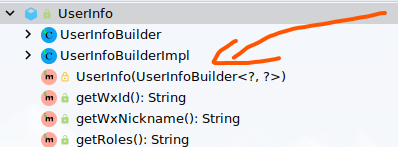

# Mybatis 与lombok `@Builder` `@SuperBuilder`冲突

## 描述

在测试mybatis generator生成代码时出现异常:`org.apache.ibatis.exceptions.PersistenceException: `

```log
org.apache.ibatis.exceptions.PersistenceException: 
### Error querying database.  Cause: org.apache.ibatis.reflection.ReflectionException: Error instantiating class test.model.UserInfo with invalid types (UserInfoBuilder) or values (1). Cause: java.lang.IllegalArgumentException: argument type mismatch
### The error may exist in mapper/UserInfoMapper.xml
### The error may involve test.dao.UserInfoMapper.selectByPrimaryKey
### The error occurred while handling results
### SQL: select                 id, wx_id, wx_nickname, roles, avatar_url, bonus, gmt_create, gmt_modified         from user_info     where id = ?
### Cause: org.apache.ibatis.reflection.ReflectionException: Error instantiating class test.model.UserInfo with invalid types (UserInfoBuilder) or values (1). Cause: java.lang.IllegalArgumentException: argument type mismatch

	at org.apache.ibatis.exceptions.ExceptionFactory.wrapException(ExceptionFactory.java:30)
	at org.apache.ibatis.session.defaults.DefaultSqlSession.selectList(DefaultSqlSession.java:149)
	at org.apache.ibatis.session.defaults.DefaultSqlSession.selectList(DefaultSqlSession.java:140)
	at org.apache.ibatis.session.defaults.DefaultSqlSession.selectOne(DefaultSqlSession.java:76)
	at org.apache.ibatis.binding.MapperMethod.execute(MapperMethod.java:87)
	at org.apache.ibatis.binding.MapperProxy$PlainMethodInvoker.invoke(MapperProxy.java:152)
	at org.apache.ibatis.binding.MapperProxy.invoke(MapperProxy.java:85)
	at com.sun.proxy.$Proxy9.selectByPrimaryKey(Unknown Source)
	at xyz.navyd.mbg.GeneratorTest.test(GeneratorTest.java:54)
#...
```

```java
@Data
@SuperBuilder
@EqualsAndHashCode(callSuper = true)
@ToString(callSuper = true)
public class UserInfo extends BaseEntity implements Serializable {
    private String wxId;
    private String wxNickname;
    private String roles;
    private String avatarUrl;
    private Integer bonus;
    private static final long serialVersionUID = 1L;
}
@Data
@SuperBuilder
@NoArgsConstructor
public class BaseEntity {
    private Long id;
    private LocalDateTime gmtCreate;
    private LocalDateTime gmtModified;
}
```

## 原因

`@SuperBuilder`没有创建默认的无参构造器:`Lombok also generates a static method named builder(), and a protected constructor that takes 1 argument of the builderclass type.`，只有一个protected构造器

```java
protected UserInfo(UserInfoBuilder<?, ?> builder)
```



在mybatis `org.apache.ibatis.executor.resultset.DefaultResultSetHandler`进行对jdbc resultset mapping时，其`createUsingConstructor`方法将调用`org.apache.ibatis.reflection.factory.ObjectFactory`接口生成一个entity对象，`DefaultObjectFactory`实现在`instantiateClass`时无法创建该entity对象`UserInfo`

```java
try {
    // ...
    constructor = type.getDeclaredConstructor(constructorArgTypes.toArray(new Class[0])); 
    // protected test.model.UserInfo(test.model.UserInfo$UserInfoBuilder)
    try {
        return constructor.newInstance(constructorArgs.toArray(new Object[0]));
    } catch (IllegalAccessException e) {// java.lang.IllegalAccessException: class org.apache.ibatis.reflection.factory.DefaultObjectFactory cannot access a member of class test.model.UserInfo with modifiers "protected"
        if (Reflector.canControlMemberAccessible()) {
            constructor.setAccessible(true);
            // protected test.model.UserInfo(test.model.UserInfo$UserInfoBuilder)
            return constructor.newInstance(constructorArgs.toArray(new Object[0]));
        } else {
            throw e;
        }
    }
} catch (Exception e) { // java.lang.IllegalArgumentException: argument type mismatch
    // ...
    throw new ReflectionException("Error instantiating " + type + " with invalid types (" + argTypes + ") or values (" + argValues + "). Cause: " + e, e);
    // org.apache.ibatis.reflection.ReflectionException: Error instantiating class test.model.UserInfo with invalid types (UserInfoBuilder) or values (1). Cause: java.lang.IllegalArgumentException: argument type mismatch
}
```

## 解决方案

配置lombok中保证一个存在默认public无参构造器`@NoArgsConstructor`

```java
@Data
@SuperBuilder
@@NoArgsConstructor
@EqualsAndHashCode(callSuper = true)
@ToString(callSuper = true)
public class UserInfo extends BaseEntity implements Serializable {
    private String wxId;
    private String wxNickname;
    private String roles;
    private String avatarUrl;
    private Integer bonus;
    private static final long serialVersionUID = 1L;
}
@Data
@SuperBuilder
@NoArgsConstructor
public class BaseEntity {
    private Long id;
    private LocalDateTime gmtCreate;
    private LocalDateTime gmtModified;
}
```

参考：

- [踩坑笔记：Lombok的Builder注解和Data注解撞上MyBatis](https://juejin.im/entry/6844904114694946824)
