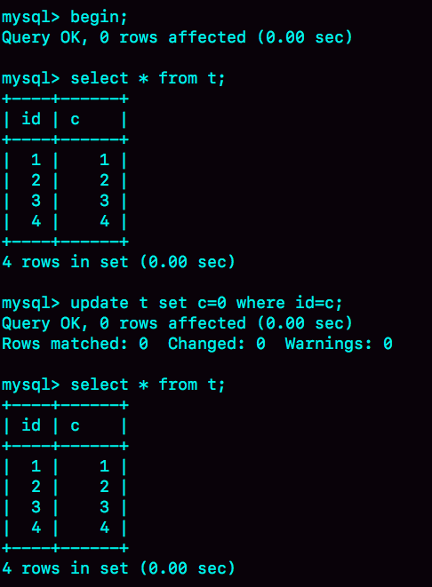

# 乐观锁问题

下面的表结构和初始化语句作为试验环境，事务隔离级别是可重复读。现在，我要把所有“字段 c 和 id 值相等的行”的 c 值清零，但是却发现了一个“诡异”的、改不掉的情况。请你构造出这种情况，并说明其原理。

```sql
CREATE TABLE `t` (
  `id` int(11) NOT NULL,
  `c` int(11) DEFAULT NULL,
  PRIMARY KEY (`id`)
) ENGINE=InnoDB;
insert into t(id, c) values(1,1),(2,2),(3,3),(4,4);
```



复现出来以后，请你再思考一下，在实际的业务开发中有没有可能碰到这种情况？你的应用代码会不会掉进这个“坑”里，你又是怎么解决的呢？

## 原因

RR下，用另外一个事务在update执行之前，先把所有c值修改，应该就可以。比如update t set c = id + 1。

这个实际场景还挺常见——所谓的“乐观锁”。时常我们会基于version字段对row进行cas式的更新，类似update ...set ... where id = xxx and version = xxx。

如果version被其他事务抢先更新，则在自己事务中更新失败，trx_id没有变成自身事务的id，同一个事务中再次select还是旧值，就会出现“明明值没变可就是更新不了”的“异象”（anomaly）。

解决方案就是每次cas更新不管成功失败，结束当前事务。如果失败则重新起一个事务进行查询更新（判断是否成功的标准是 affected_rows 是不是等于预期值）

记得某期给老师留言提到了，似乎只有MySQL是在一致性视图下采用这种宽松的update机制。也许是考虑易用性吧。其他数据库大多在内部实现cas，只是失败后下一步动作有区别。

参考：

- [MySQL实战45讲](https://time.geekbang.org/column/article/70562)
