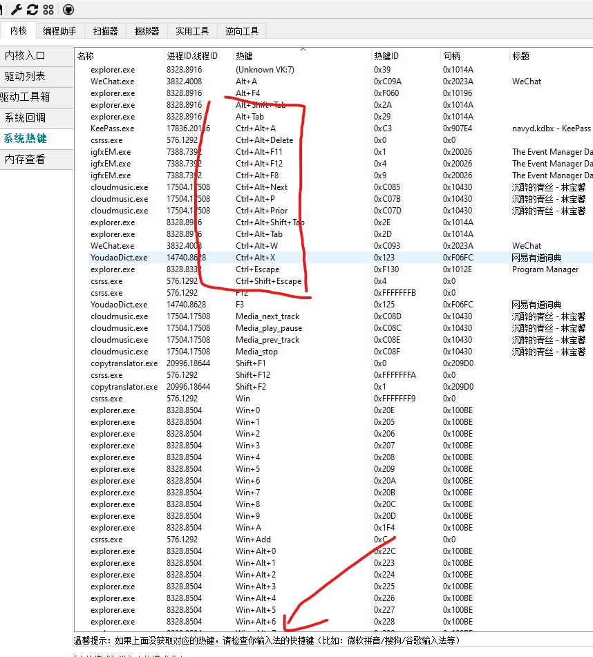

# rust-analyzer ctrl+.在win10无效

在win10 vscode中使用 remote wsl时发现quick fix快捷键`ctrl+.`无效，无法自动导包。

在vscode keyboard shortcuts也无法使用`ctrl+.`搜索。但是在wsl2 xfce中使用xserver的idea可以输入`ctrl+.`

网上搜索后发现没有相关资料，在使用`openark64`查找快捷键也没找到

可能是自带win10输入法的问题，***在切换到`us keyboard`英文输入法时，可以正常使用`ctrl+.`***

这个可能是win10内部bug，占用`ctrl+.`，也没看到哪里有关闭这个的入口
