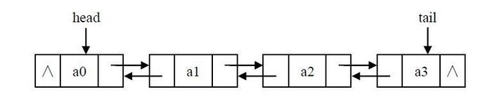

# LinkedList

List 和Deque接口的双链接列表(Doubly-linked list)实现。该类实现了所有可选的List操作和允许所有元素(包括null)。

所有的操作执行情况都能因为双链接列表而被预知，索引进入列表的操作将通过遍历列表的方法来接近指定的索引．

类结构：

```java
public class LinkedList<E> extends AbstractSequentialList<E> implements List<E>, Deque<E>, Cloneable, java.io.Serializable
```


注意：

- LinkedList实现了List接口，作为list时其顺序是由插入元素的顺序保证，由于链表结构插入容易，查找较难，一般没有容量限制．
- LinkedList实现了Deque接口，可以作为堆栈stack，队列queue，双端队列．但是由于这些结构都不允许出现null元素，而linkedList允许null，在使用时应该特别注意．而且，在作为stack,queue的实现应该使用性能更佳的ArrayDeque
- LinkedList不是线程安全的，可以通过 Collections.synchronizedList包装为线程安全类
- LinkedList没有容量限制，链表没有长度限制，只有标准的collection两个构造器，所以在作为Deque, Queue时要注意

所有公共方法：


## 双链接列表

```java
// 双向链表    
private static class Node<E> {
  		E item;
        Node<E> next;
        Node<E> prev;

        Node(Node<E> prev, E element, Node<E> next) {
            this.item = element;
            this.next = next;
            this.prev = prev;
        }
    } 
```

双向链表的结构图：



### 应用

LinkedList通过链表头指针`first`字段和链表尾指针`last`字段对相应链表元素的引用来维护链表．

### 链表操作

#### 节点链接

```java
    /**
     * Links e as first element.
     */
    private void linkFirst(E e) {
        final Node<E> f = first;
        final Node<E> newNode = new Node<>(null, e, f);
        // 成为新的首节点
        first = newNode;
        // 如果首节点f为空即链表为空就添加到尾节点last中
        if (f == null)
            last = newNode;
        // 链表不为空时链接到上一个首节点前面prev
        else
            f.prev = newNode;
        size++;
        modCount++;
    }

    /**
     * Links e as last element.
     */
    void linkLast(E e) {
        final Node<E> l = last;
        final Node<E> newNode = new Node<>(l, e, null);
        // 新的尾节点
        last = newNode;
        // 如果尾节点l为空即链表为空就添加为首节点first
        if (l == null)
            first = newNode;
        // 链表存在就链接到尾节点l
        else
            l.next = newNode;
        size++;
        modCount++;
    }

    /**
     * Inserts element e before non-null Node succ.
     */
    void linkBefore(E e, Node<E> succ) {
        // assert succ != null;
        final Node<E> pred = succ.prev;
        // 新节点在pred后面，在succ前面
        final Node<E> newNode = new Node<>(pred, e, succ);
        // 插入到succ前面
        succ.prev = newNode;
        // 如果pred为空表示succ为首节点，新节点插入前面变为新的首节点
        if (pred == null)
            first = newNode;
        // succ不是首节点，链接到pred的后面
        else
            pred.next = newNode;
        size++;
        modCount++;
    }
```

#### 链接移除

```java
    /**
     * Unlinks non-null first node f.
     */
    private E unlinkFirst(Node<E> f) {
        // assert f == first && f != null;
        // 保证f != null
        final E element = f.item;
        // 将首节点f的下一个节点next作为新的首节点
        final Node<E> next = f.next;
        f.item = null;
        f.next = null; // help GC
        first = next;
        // 如果链表只有一个元素f即next为空时将last=null
        if (next == null)
            last = null;
        // next非空成为首节点删除链接前一个节点f
        else
            next.prev = null;
        size--;
        modCount++;
        return element;
    }

	/**
     * Unlinks non-null last node l.
     */
    private E unlinkLast(Node<E> l) {
        // assert l == last && l != null;
        // 保证l　!= null
        final E element = l.item;
        // 将尾节点l的上一个节点prev作为新的尾节点
        final Node<E> prev = l.prev;
        l.item = null;
        l.prev = null; // help GC
        last = prev;
        // 如果上一个为节点prev为空即链表只有一个元素l就删除将first置为空
        if (prev == null)
            first = null;
        // prev存在即删除l的链接
        else
            prev.next = null;
        size--;
        modCount++;
        return element;
    }

    /**
     * Unlinks non-null node x.
     */
    E unlink(Node<E> x) {
        // assert x != null;
        // 保证 x != null
        final E element = x.item;
        // 将x的前后节点链接，删除x节点
        final Node<E> next = x.next;
        final Node<E> prev = x.prev;
        
        // 链接next节点　考虑prev是否为空
        // 如果prev为空即x为首节点就将next作为新的首节点
        if (prev == null) {
            first = next;
        } 
        // 将next链接到prev后面
        else {
            prev.next = next;
            x.prev = null;
        }

        // 链接prev节点　考虑next是否为空
        // 如果next为空即x为尾节点就将prev作为新的尾节点
        if (next == null) {
            last = prev;
        } 
        // 将prev链接到next前面
        else {
            next.prev = prev;
            x.next = null;
        }
        // gc回收
        x.item = null;
        size--;
        modCount++;
        return element;
    }
```

## 双端队列Deque

### 插入

详细的链表操作在上面...

- void addFirst(E e)

```java
    /**
     * Inserts the specified element at the beginning of this list.
     */
    public void addFirst(E e) {
        linkFirst(e);
    }
```

- void addLast(E e)

```java
    /**
     * Appends the specified element to the end of this list.
     *
     * <p>This method is equivalent to {@link #add}.
     *
     * @param e the element to add
     */
	public void addLast(E e) {
        linkLast(e);
    }
```

- boolean offerFirst(E e)

```java
    /**
     * Inserts the specified element at the front of this list.
     *
     * @param e the element to insert
     * @return {@code true} (as specified by {@link Deque#offerFirst})
     * @since 1.6
     */
    public boolean offerFirst(E e) {
        addFirst(e);
        return true;
    }
```

- boolean offerLast(E e)

```java
    /**
     * Inserts the specified element at the end of this list.
     *
     * @param e the element to insert
     * @return {@code true} (as specified by {@link Deque#offerLast})
     * @since 1.6
     */
    public boolean offerLast(E e) {
        addLast(e);
        return true;
    }
```

#### 注意

- offerXxx方法的实现等效(调用)addXxx方法

### 删除

- E removeFirst()

```java
    /**
     * Removes and returns the first element from this list.
     *
     * @return the first element from this list
     * @throws NoSuchElementException if this list is empty
     */
    public E removeFirst() {
        final Node<E> f = first;
        if (f == null)
            throw new NoSuchElementException();
        // 移除并更新当前首节点
        return unlinkFirst(f);
    }
```

- E removeLast()

```java
    /**
     * Removes and returns the last element from this list.
     *
     * @return the last element from this list
     * @throws NoSuchElementException if this list is empty
     */
    public E removeLast() {
        final Node<E> l = last;
        if (l == null)
            throw new NoSuchElementException();
        return unlinkLast(l);
    }
```

- E pollFirst()

```java
    /**
     * Retrieves and removes the first element of this list,
     * or returns {@code null} if this list is empty.
     *
     * @return the first element of this list, or {@code null} if
     *     this list is empty
     * @since 1.6
     */
    public E pollFirst() {
        final Node<E> f = first;
        return (f == null) ? null : unlinkFirst(f);
    }
```

- E pollLast()

```java
    /**
     * Retrieves and removes the last element of this list,
     * or returns {@code null} if this list is empty.
     *
     * @return the last element of this list, or {@code null} if
     *     this list is empty
     * @since 1.6
     */
    public E pollLast() {
        final Node<E> l = last;
        return (l == null) ? null : unlinkLast(l);
    }
```

#### 注意

- 当链表为空时，removeXxx将抛出异常，而pollXxx将返回null

### 检查

- E getFirst()

```java
    /**
     * Returns the first element in this list.
     *
     * @return the first element in this list
     * @throws NoSuchElementException if this list is empty
     */
    public E getFirst() {
        final Node<E> f = first;
        if (f == null)
            throw new NoSuchElementException();
        return f.item;
    }
```

- E getLast()

```java
    /**
     * Returns the last element in this list.
     *
     * @return the last element in this list
     * @throws NoSuchElementException if this list is empty
     */
    public E getLast() {
        final Node<E> l = last;
        if (l == null)
            throw new NoSuchElementException();
        return l.item;
    }
```

- E peekFirst()

```java
    /**
     * Retrieves, but does not remove, the first element of this list,
     * or returns {@code null} if this list is empty.
     *
     * @return the first element of this list, or {@code null}
     *         if this list is empty
     * @since 1.6
     */
    public E peekFirst() {
        final Node<E> f = first;
        return (f == null) ? null : f.item;
     }
```

- E peekLast() 

```java
    /**
     * Retrieves, but does not remove, the last element of this list,
     * or returns {@code null} if this list is empty.
     *
     * @return the last element of this list, or {@code null}
     *         if this list is empty
     * @since 1.6
     */
    public E peekLast() {
        final Node<E> l = last;
        return (l == null) ? null : l.item;
    }
```

#### 注意

- 当链表为空时，getXxx方法将抛出异常，peekXxx将返回null

### 迭代

#### 正序迭代

- Iterator<E> iterator()：集合的迭代实现

#### 逆序迭代

```java
    /**
     * @since 1.6
     */
    public Iterator<E> descendingIterator() {
        return new DescendingIterator();
    }
```

实现

```java
    /**
     * Adapter to provide descending iterators via ListItr.previous
     */
    private class DescendingIterator implements Iterator<E> {
        private final ListItr itr = new ListItr(size());
        public boolean hasNext() {
            return itr.hasPrevious();
        }
        public E next() {
            return itr.previous();
        }
        public void remove() {
            itr.remove();
        }
    }
```

#### 注意

- 逆序迭代器就是通过正序迭代器ListIterator实现的

### 移除指定元素

- boolean removeFirstOccurrence(Object o)

```java
    /**
     * Removes the first occurrence of the specified element in this
     * list (when traversing the list from head to tail).  If the list
     * does not contain the element, it is unchanged.
     *
     * @param o element to be removed from this list, if present
     * @return {@code true} if the list contained the specified element
     * @since 1.6
     */
    public boolean removeFirstOccurrence(Object o) {
      	// 集合操作collection.remove(Object)。实现为从前往后遍历寻找指定元素
        return remove(o);
    }
```

- boolean removeLastOccurrence(Object o)

```java
    /**
     * Removes the last occurrence of the specified element in this
     * list (when traversing the list from head to tail).  If the list
     * does not contain the element, it is unchanged.
     *
     * @param o element to be removed from this list, if present
     * @return {@code true} if the list contained the specified element
     * @since 1.6
     */
    public boolean removeLastOccurrence(Object o) {
        // 如果指定元素为null
        if (o == null) {
            // 从链表尾节点last往前遍历 寻找item=null的节点
            for (Node<E> x = last; x != null; x = x.prev) {
                if (x.item == null) {
                    // 移除该节点
                    unlink(x);
                    return true;
                }
            }
        } 
        // 如果指定元素不为null
        else {
            // 往前遍历  
            for (Node<E> x = last; x != null; x = x.prev) {
                if (o.equals(x.item)) {
                    // 移除节点
                    unlink(x);
                    return true;
                }
            }
        }
        // 链表中不存在指定元素
        return false;
    }
```

### 注意

- LinkedList实现了双端队列Deque接口标准为操作元素方法定义两种形式：抛出异常和返回特殊值。


对于插入系列方法，offerXxx直接调用addXxx并在后面`return true` ，由于LinkedList没有显式的容量限制，即**不会存在空间问题而插入失败**，offerXxx就不会返回false，addXxx不会因此抛出异常，因此将offerXxx实现为调用addXxx并在后面`return true`

删除和检查系列方法都是在链表为空时一种抛出异常，另一种返回特殊值

## 队列Queue

### 插入

- boolean add(E e);

```java
    /**
     * Appends the specified element to the end of this list.
     *
     * <p>This method is equivalent to {@link #addLast}.
     *
     * @param e element to be appended to this list
     * @return {@code true} (as specified by {@link Collection#add})
     */
    public boolean add(E e) {
        linkLast(e);
        return true;
    }
```

- boolean offer(E e);

```java
    /**
     * Adds the specified element as the tail (last element) of this list.
     *
     * @param e the element to add
     * @return {@code true} (as specified by {@link Queue#offer})
     * @since 1.5
     */
    public boolean offer(E e) {
        return add(e);
    }
```

#### 注意

- Queue接口要求add在没有空间可用添加失败后应该抛出异常，但是LinkedList是无界队列，不会出现这种异常，offer和add实现一致

### 删除

- E remove()

```java
    /**
     * Retrieves and removes the head (first element) of this list.
     *
     * @return the head of this list
     * @throws NoSuchElementException if this list is empty
     * @since 1.5
     */
    public E remove() {
      	// Deque.removeFirst()
        return removeFirst();
    }
```

- E poll()

```java
    /**
     * Retrieves and removes the head (first element) of this list.
     *
     * @return the head of this list, or {@code null} if this list is empty
     * @since 1.5
     */
    public E poll() {
        final Node<E> f = first;
        return (f == null) ? null : unlinkFirst(f);
    }
```

### 检查

- E element()

```java
    /**
     * Retrieves, but does not remove, the head (first element) of this list.
     *
     * @return the head of this list
     * @throws NoSuchElementException if this list is empty
     * @since 1.5
     */
    public E element() {
        // Deque.getFirst()
        return getFirst();
    }
```

- E peek()

```java
    /**
     * Retrieves, but does not remove, the head (first element) of this list.
     *
     * @return the head of this list, or {@code null} if this list is empty
     * @since 1.5
     */
    public E peek() {
        final Node<E> f = first;
        return (f == null) ? null : f.item;
    }
```

## 堆栈stack

### 入栈

```java
    /**
     * Pushes an element onto the stack represented by this list.  In other
     * words, inserts the element at the front of this list.
     *
     * <p>This method is equivalent to {@link #addFirst}.
     *
     * @param e the element to push
     * @since 1.6
     */
    public void push(E e) {
        addFirst(e);
    }
```

### 出栈

```java
    /**
     * Pops an element from the stack represented by this list.  In other
     * words, removes and returns the first element of this list.
     *
     * <p>This method is equivalent to {@link #removeFirst()}.
     *
     * @return the element at the front of this list (which is the top
     *         of the stack represented by this list)
     * @throws NoSuchElementException if this list is empty
     * @since 1.6
     */
    public E pop() {
        return removeFirst();
    }
```

### 检查

- E peek()

与Queue.peek()相同。在上面...

### 注意

- 虽然没有Stack的接口，但主要的操作已经实现

## 列表List

### 添加

- boolean add(E e):见 队列Queue 插入
- void add(int index, E element)

```java
    /**
     * Inserts the specified element at the specified position in this list.
     * Shifts the element currently at that position (if any) and any
     * subsequent elements to the right (adds one to their indices).
     *
     * @param index index at which the specified element is to be inserted
     * @param element element to be inserted
     * @throws IndexOutOfBoundsException {@inheritDoc}
     */
    public void add(int index, E element) {
        // 检查指定索引是否允许add操作 不允许则抛出异常
        checkPositionIndex(index);
        // 如果添加到链表最后
        if (index == size)
            linkLast(element);
        // 添加到链表中
        else
            // 通过索引找到对应节点再将指定元素插入其之前
            linkBefore(element, node(index));
    }
```

- boolean addAll(Collection<? extends E> c)

```java
    /**
     * Appends all of the elements in the specified collection to the end of
     * this list, in the order that they are returned by the specified
     * collection's iterator.  The behavior of this operation is undefined if
     * the specified collection is modified while the operation is in
     * progress.  (Note that this will occur if the specified collection is
     * this list, and it's nonempty.)
     *
     * @param c collection containing elements to be added to this list
     * @return {@code true} if this list changed as a result of the call
     * @throws NullPointerException if the specified collection is null
     */
    public boolean addAll(Collection<? extends E> c) {
        return addAll(size, c);
    }
```

- boolean addAll(int index, Collection<? extends E> c)

```java
    /**
     * Inserts all of the elements in the specified collection into this
     * list, starting at the specified position.  Shifts the element
     * currently at that position (if any) and any subsequent elements to
     * the right (increases their indices).  The new elements will appear
     * in the list in the order that they are returned by the
     * specified collection's iterator.
     *
     * @param index index at which to insert the first element
     *              from the specified collection
     * @param c collection containing elements to be added to this list
     * @return {@code true} if this list changed as a result of the call
     * @throws IndexOutOfBoundsException {@inheritDoc}
     * @throws NullPointerException if the specified collection is null
     */
    public boolean addAll(int index, Collection<? extends E> c) {
        // 检查指定索引是否允许add操作 不允许则抛出异常 
        checkPositionIndex(index);

        Object[] a = c.toArray();
        int numNew = a.length;
        // 如果指定colletion没有元素
        if (numNew == 0)
            return false;
        
        // 找到插入位置前的节点pred和插入位置节点succ
        Node<E> pred, succ;
        // 如果指定索引插入位置在链表最后
        if (index == size) {
            succ = null;
            pred = last;
        } 
        // 插入位置在链表中
        else {
            // 找到插入位置的节点
            succ = node(index);
            pred = succ.prev;
        }
// 优化部分 begin
        for (Object o : a) {
            @SuppressWarnings("unchecked") E e = (E) o;
            Node<E> newNode = new Node<>(pred, e, null);
            // 判断第一次循环时插入时链表为空不存在前一个节点
          	// 当第二次循环时必定 pred != null 不必要的判断
            if (pred == null)
                first = newNode;
            // 存在前一个节点
            else
                pred.next = newNode;
            pred = newNode;
        }
// end
        
/*     // 下面时优化代替部分 
		
		// 将pred判断提前，第一次pred为空
        if (pred == null) 
            first = pred = new Node<>(pred, (E) a[0], null);
        else // pred不为空
            pred = pred.next = new Node<>(pred, (E) a[0], null);
       	// 从1开始循环  去除了不必要的判断pred == null
        for (int i = 1; i < a.length; i++) {
            Object o = a[i];
            @SuppressWarnings("unchecked") E e = (E) o;
            Node<E> newNode = new Node<>(pred, e, null);
            pred.next = newNode;
            pred = newNode;
        }
*/
        // 如果插入到链表最后时不需要链接原位置节点succ而将last更新为pred
        if (succ == null) {
            last = pred;
        } 
        // 插入链表中间需要链接最后插入节点pred和原位置节点succ
        else {
            pred.next = succ;
            succ.prev = pred;
        }

        size += numNew;
        modCount++;
        return true;
    }
```

#### 注意

- 插入指定位置index需要遍历链表找到对应的节点这一额外操作，再通过该节点和前节点pred链接指定元素节点

遍历操作`Node<E> node(int index)`方法已经优化只需要在一半链表中找到对应节点

- `addAll(int index, Collection<? extends E> c)`存在极小的优化空间，已经在代码中指出

### 移除

- void clear()

```java
    /**
     * Removes all of the elements from this list.
     * The list will be empty after this call returns.
     */
    public void clear() {
        // Clearing all of the links between nodes is "unnecessary", but:
        // - helps a generational GC if the discarded nodes inhabit
        //   more than one generation
        // - is sure to free memory even if there is a reachable Iterator
        // 将链表所有节点保持的引用置为null  除了让gc回收，对已经获取链表引用的迭代器仍然可以释放内存
        for (Node<E> x = first; x != null; ) {
            Node<E> next = x.next;
            x.item = null;
            x.next = null;
            x.prev = null;
            x = next;
        }
        first = last = null;
        size = 0;
        modCount++;
    }
```

- E remove(int index);

```java
    /**
     * Removes the element at the specified position in this list.  Shifts any
     * subsequent elements to the left (subtracts one from their indices).
     * Returns the element that was removed from the list.
     *
     * @param index the index of the element to be removed
     * @return the element previously at the specified position
     * @throws IndexOutOfBoundsException {@inheritDoc}
     */
    public E remove(int index) {
        checkElementIndex(index);
        // 先找到指定索引对应节点后移除链接
        return unlink(node(index));
    }
```

- boolean remove(Object o)

```java
    /**
     * Removes the first occurrence of the specified element from this list,
     * if it is present.  If this list does not contain the element, it is
     * unchanged.  More formally, removes the element with the lowest index
     * {@code i} such that
     * <tt>(o==null&nbsp;?&nbsp;get(i)==null&nbsp;:&nbsp;o.equals(get(i)))</tt>
     * (if such an element exists).  Returns {@code true} if this list
     * contained the specified element (or equivalently, if this list
     * changed as a result of the call).
     *
     * @param o element to be removed from this list, if present
     * @return {@code true} if this list contained the specified element
     */
    public boolean remove(Object o) {
        if (o == null) {
            // 从前往后遍历寻找item=null的节点
            for (Node<E> x = first; x != null; x = x.next) {
                if (x.item == null) {
                    unlink(x);
                    return true;
                }
            }
        } else {
            // 从前往后遍历寻找item=o的节点
            for (Node<E> x = first; x != null; x = x.next) {
                if (o.equals(x.item)) {
                    unlink(x);
                    return true;
                }
            }
        }
        return false;
    }
```

- boolean removeAll(Collection<?> c):由超类AbstractList.removeAll实现
- boolean retainAll(Collection<?> c):由超类AbstractList.retainAll实现

#### 注意

- clear()将所有链表节点引用置为null，需要一定时间执行但获得会更好的gc管理
- 由抽象类AbstractList实现的removeAll和retainAll操作都是借助Iterator并调用iterator.remove完成批量删除

### 获取

```java
    /**
     * Returns the element at the specified position in this list.
     *
     * @param index index of the element to return
     * @return the element at the specified position in this list
     * @throws IndexOutOfBoundsException {@inheritDoc}
     */
    public E get(int index) {
        checkElementIndex(index);
        return node(index).item;
    }
```

#### 注意

- 链表不支持随机访问，所以通过指定索引获取的方式只能遍历链表，效率较差。所以不能用遍历数组的方式用get获取

### 替换

- E set(int index, E element)

```java
    /**
     * Replaces the element at the specified position in this list with the
     * specified element.
     *
     * @param index index of the element to replace
     * @param element element to be stored at the specified position
     * @return the element previously at the specified position
     * @throws IndexOutOfBoundsException {@inheritDoc}
     */
    public E set(int index, E element) {
        checkElementIndex(index);
        // 获取指定索引对应的节点
        Node<E> x = node(index);
        E oldVal = x.item;
        x.item = element;
        return oldVal;
    }
```

- void replaceAll(UnaryOperator<E> operator)

该方法为List接口的defalut方法，通过迭代器Iterator将每个元素替换为指定操作operator返回的结果。下面给出简单的示例：

```java
    static void replaceAllTest() {
        List<String> list = new LinkedList<>(Arrays.asList("a", "ab", "abc"));
        list.replaceAll(s -> {
            System.out.println("replace before:" + s);
            final String temp = s.toUpperCase();
            System.out.println("replace after :" + temp);
            return temp;
        });
        System.out.println(list);
/*输出：
replace before:a
replace after :A
replace before:ab
replace after :AB
replace before:abc
replace after :ABC
[A, AB, ABC]

*/
    }
```

### 比较与哈希

- boolean equals(Object o)

LinkedList没有覆盖AbstractList.equals的实现，遵从List.equals的定义，大致实现为判断为List对象后比较相同位置的对象是否相等

- int hashCode()

LinkedList没有覆盖AbstractList.hashCode的实现，遵从List.hashCode的定义，大致实现为需要调用List中所有对象的hashCode

### 查询

- int size()

```java
    /**
     * Returns the number of elements in this list.
     *
     * @return the number of elements in this list
     */
    public int size() {
        return size;
    }
```

- boolean isEmpty()：AbstractCollection的实现
- boolean contains(Object o)

```java
    /**
     * Returns {@code true} if this list contains the specified element.
     * More formally, returns {@code true} if and only if this list contains
     * at least one element {@code e} such that
     * <tt>(o==null&nbsp;?&nbsp;e==null&nbsp;:&nbsp;o.equals(e))</tt>.
     *
     * @param o element whose presence in this list is to be tested
     * @return {@code true} if this list contains the specified element
     */
    public boolean contains(Object o) {
        // 从前往后搜索指定元素节点是否存在
        return indexOf(o) != -1;
    }
```

- boolean containsAll(Collection<?> c)

由抽象类AbstractCollection实现，通过遍历集合c调用contains比较

### 迭代器

- Iterator<E> iterator()

由抽象类AbstractSequential实现，调用listIterator()实现

- ListIterator<E> listIterator(int index)

```java
    /**
     * Returns a list-iterator of the elements in this list (in proper
     * sequence), starting at the specified position in the list.
     * Obeys the general contract of {@code List.listIterator(int)}.<p>
     *
     * The list-iterator is <i>fail-fast</i>: if the list is structurally
     * modified at any time after the Iterator is created, in any way except
     * through the list-iterator's own {@code remove} or {@code add}
     * methods, the list-iterator will throw a
     * {@code ConcurrentModificationException}.  Thus, in the face of
     * concurrent modification, the iterator fails quickly and cleanly, rather
     * than risking arbitrary, non-deterministic behavior at an undetermined
     * time in the future.
     *
     * @param index index of the first element to be returned from the
     *              list-iterator (by a call to {@code next})
     * @return a ListIterator of the elements in this list (in proper
     *         sequence), starting at the specified position in the list
     * @throws IndexOutOfBoundsException {@inheritDoc}
     * @see List#listIterator(int)
     */
    public ListIterator<E> listIterator(int index) {
        checkPositionIndex(index);
        return new ListItr(index);
    }
```

#### 并行迭代器

不熟悉

#### 迭代器实现

```java
    private class ListItr implements ListIterator<E> {
        // 最近访问的节点
        private Node<E> lastReturned;
        // 下一个访问节点
        private Node<E> next;
        // 下一个节点对应的索引
        private int nextIndex;
        private int expectedModCount = modCount;

        ListItr(int index) {
            // assert isPositionIndex(index);
            // 如果指定index在链表最后  则设置next=null，否则设置为对应节点
            next = (index == size) ? null : node(index);
            nextIndex = index;
        }

        public boolean hasNext() {
            return nextIndex < size;
        }

        public E next() {
            checkForComodification();
            if (!hasNext())
                throw new NoSuchElementException();
            // next不用考虑为null，因为hasNext保证next不会null
            lastReturned = next;
            next = next.next;
            nextIndex++;
            return lastReturned.item;
        }

        public boolean hasPrevious() {
            return nextIndex > 0;
        }

        public E previous() {
            checkForComodification();
            if (!hasPrevious())
                throw new NoSuchElementException();
            // 如果next为null表示上一个节点就为last，否则调用next.prev上一个节点
            lastReturned = next = (next == null) ? last : next.prev;
            nextIndex--;
            return lastReturned.item;
        }

        public int nextIndex() {
            return nextIndex;
        }

        public int previousIndex() {
            return nextIndex - 1;
        }

        public void remove() {
            checkForComodification();
            if (lastReturned == null)
                throw new IllegalStateException();
            // 被删除节点的下一个节点lastNext
            Node<E> lastNext = lastReturned.next;
            // 移除删除节点
            unlink(lastReturned);
            // 如果删除节点为next 即最近访问的是next()，下一个节点next置为lastNext
            if (next == lastReturned)
                next = lastNext;
            // 删除节点为next.prev节点 即最近访问的是previous()，next不变，索引位置向前移动一位 将所有节点前移一位
            else
                nextIndex--;
            lastReturned = null;
            expectedModCount++;
        }

        public void set(E e) {
            if (lastReturned == null)
                throw new IllegalStateException();
            checkForComodification();
            lastReturned.item = e;
        }

        public void add(E e) {
            checkForComodification();
            lastReturned = null;
            if (next == null)
                linkLast(e);
            else
                linkBefore(e, next);
            nextIndex++;
            expectedModCount++;
        }

        public void forEachRemaining(Consumer<? super E> action) {
            Objects.requireNonNull(action);
            while (modCount == expectedModCount && nextIndex < size) {
                action.accept(next.item);
                lastReturned = next;
                next = next.next;
                nextIndex++;
            }
            checkForComodification();
        }

        final void checkForComodification() {
            if (modCount != expectedModCount)
                throw new ConcurrentModificationException();
        }
    }
```

#### 注意

- LinkedList只实现了ListIterator，而iterator()直接调用该对象
- ListIterator的实现由于链表与数组ArrayList有些差异

nextIndex实际上为数组迭代器上的cursor，虽然next本身也可充当(自己在写链表迭代器时做过，没有考虑用index模拟光标)，但需要额外的判断，下面时用next判断，没有经过详细验证。

```java
public boolean hasNext() {
  	return next != null;
}
public boolean hasPrevious() {
  	// 如果next为空即到了链表最后，链表为空则返回false    如果next不为空则验证next.next
	return (next != null && next.next != null) || (next == null && last != null);
}
```

事实表明增加一个字段nextIndex模拟cursor是很方便直接的，减少了许多频繁的判断

### 视图

- List<E> subList(int fromIndex, int toIndex)

由抽象类AbstractList实现。大致为通过保存偏移量offset=fromIndex，subList的所有方法通过偏移量offset在原List上调用方法完成。具体参看源码

### 转换数组

- ​

```java
    /**
     * Returns an array containing all of the elements in this list
     * in proper sequence (from first to last element).
     *
     * <p>The returned array will be "safe" in that no references to it are
     * maintained by this list.  (In other words, this method must allocate
     * a new array).  The caller is thus free to modify the returned array.
     *
     * <p>This method acts as bridge between array-based and collection-based
     * APIs.
     *
     * @return an array containing all of the elements in this list
     *         in proper sequence
     */
    public Object[] toArray() {
        Object[] result = new Object[size];
        int i = 0;
        // 遍历链表并将节点元素插入数组中
        for (Node<E> x = first; x != null; x = x.next)
            result[i++] = x.item;
        return result;
    }
```

- ​

```java
    /**
     * Returns an array containing all of the elements in this list in
     * proper sequence (from first to last element); the runtime type of
     * the returned array is that of the specified array.  If the list fits
     * in the specified array, it is returned therein.  Otherwise, a new
     * array is allocated with the runtime type of the specified array and
     * the size of this list.
     *
     * <p>If the list fits in the specified array with room to spare (i.e.,
     * the array has more elements than the list), the element in the array
     * immediately following the end of the list is set to {@code null}.
     * (This is useful in determining the length of the list <i>only</i> if
     * the caller knows that the list does not contain any null elements.)
     *
     * <p>Like the {@link #toArray()} method, this method acts as bridge between
     * array-based and collection-based APIs.  Further, this method allows
     * precise control over the runtime type of the output array, and may,
     * under certain circumstances, be used to save allocation costs.
     *
     * <p>Suppose {@code x} is a list known to contain only strings.
     * The following code can be used to dump the list into a newly
     * allocated array of {@code String}:
     *
     * <pre>
     *     String[] y = x.toArray(new String[0]);</pre>
     *
     * Note that {@code toArray(new Object[0])} is identical in function to
     * {@code toArray()}.
     *
     * @param a the array into which the elements of the list are to
     *          be stored, if it is big enough; otherwise, a new array of the
     *          same runtime type is allocated for this purpose.
     * @return an array containing the elements of the list
     * @throws ArrayStoreException if the runtime type of the specified array
     *         is not a supertype of the runtime type of every element in
     *         this list
     * @throws NullPointerException if the specified array is null
     */
    @SuppressWarnings("unchecked")
    public <T> T[] toArray(T[] a) {
        // 如果指定数组长度不够，创建一个刚好长度的同类型的数组
        if (a.length < size)
            a = (T[])java.lang.reflect.Array.newInstance(
                                a.getClass().getComponentType(), size);
        int i = 0;
        Object[] result = a;
        for (Node<E> x = first; x != null; x = x.next)
            result[i++] = x.item;
        // 将a[size()]位置置为null
        if (a.length > size)
            a[size] = null;

        return a;
    }
```

#### 注意

- 由于toArray()该无参方法底层数组为Object[]，无法向下转型(会抛出异常)，应该使用toArray(T[])带参方法，数组长度应该至少设为list.size()

### 搜索

- int indexOf(Object o)

```java
    /**
     * Returns the index of the first occurrence of the specified element
     * in this list, or -1 if this list does not contain the element.
     * More formally, returns the lowest index {@code i} such that
     * <tt>(o==null&nbsp;?&nbsp;get(i)==null&nbsp;:&nbsp;o.equals(get(i)))</tt>,
     * or -1 if there is no such index.
     *
     * @param o element to search for
     * @return the index of the first occurrence of the specified element in
     *         this list, or -1 if this list does not contain the element
     */
    public int indexOf(Object o) {
        int index = 0;
        if (o == null) {
            for (Node<E> x = first; x != null; x = x.next) {
                if (x.item == null)
                    return index;
                index++;
            }
        } else {
            for (Node<E> x = first; x != null; x = x.next) {
                if (o.equals(x.item))
                    return index;
                index++;
            }
        }
        return -1;
    }
```

- int lastIndexOf(Object o)

```java
    /**
     * Returns the index of the last occurrence of the specified element
     * in this list, or -1 if this list does not contain the element.
     * More formally, returns the highest index {@code i} such that
     * <tt>(o==null&nbsp;?&nbsp;get(i)==null&nbsp;:&nbsp;o.equals(get(i)))</tt>,
     * or -1 if there is no such index.
     *
     * @param o element to search for
     * @return the index of the last occurrence of the specified element in
     *         this list, or -1 if this list does not contain the element
     */
    public int lastIndexOf(Object o) {
        int index = size;
        if (o == null) {
            for (Node<E> x = last; x != null; x = x.prev) {
                index--;
                if (x.item == null)
                    return index;
            }
        } else {
            for (Node<E> x = last; x != null; x = x.prev) {
                index--;
                if (o.equals(x.item))
                    return index;
            }
        }
        return -1;
    }
```

#### 注意

- 链表的搜索只有遍历一条路

### 位置访问操作

- Node<E> node(int index)

```java
    /**
     * Returns the (non-null) Node at the specified element index.
     */
    Node<E> node(int index) {
        // assert isElementIndex(index);
        // 如果指定索引在链表左边就从前往后遍历找到指定节点
        if (index < (size >> 1)) {
            Node<E> x = first;
            for (int i = 0; i < index; i++)
                x = x.next;
            return x;
        } 
        // 如果指定索引在链表右边就从后往前遍历找到指定节点
        else {
            Node<E> x = last;
            for (int i = size - 1; i > index; i--)
                x = x.prev;
            return x;
        }
    }
```

