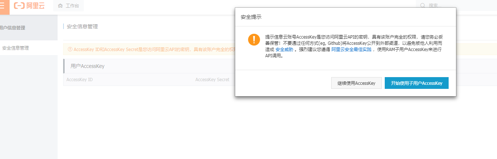

# letsencrypt证书申请

<!-- todo -->

在使用ali dns验证时，注意使用子账号的key与sercet时存在无法创建的问题，可以使用主账号创建key与sercet

## docker部署

```sh
$ docker exec acme.sh --issue --dns dns_ali -d '*.navyd.xyz'
[Sat Jul 17 11:30:37 UTC 2021] Using CA: https://acme.zerossl.com/v2/DV90
[Sat Jul 17 11:30:37 UTC 2021] Create account key ok.
[Sat Jul 17 11:30:37 UTC 2021] No EAB credentials found for ZeroSSL, let's get one
[Sat Jul 17 11:30:37 UTC 2021] acme.sh is using ZeroSSL as default CA now.
[Sat Jul 17 11:30:37 UTC 2021] Please update your account with an email address first.
[Sat Jul 17 11:30:37 UTC 2021] acme.sh --register-account -m my@example.com
[Sat Jul 17 11:30:37 UTC 2021] See: https://github.com/acmesh-official/acme.sh/wiki/ZeroSSL.com-CA
[Sat Jul 17 11:30:37 UTC 2021] Please add '--debug' or '--log' to check more details.
[Sat Jul 17 11:30:37 UTC 2021] See: https://github.com/acmesh-official/acme.sh/wiki/How-to-debug-acme.sh

# 如果提示注册zerossl
$ docker exec acme.sh --register-account -m dhjnavyd@gmail.com --server zerossl
[Sat Jul 17 11:39:35 UTC 2021] No EAB credentials found for ZeroSSL, let's get one
[Sat Jul 17 11:39:36 UTC 2021] Registering account: https://acme.zerossl.com/v2/DV90
[Sat Jul 17 11:39:39 UTC 2021] Registered
[Sat Jul 17 11:39:39 UTC 2021] ACCOUNT_THUMBPRINT='HrxyOm4LPXQgLrhsTObh2GJoCLtcN09qclO3xndmNDg'

# 使用ali dns 获取证书
$ docker exec acme.sh --issue --dns dns_ali -d '*.navyd.xyz'
# ...
pJnYcdwi5sY=
-----END CERTIFICATE-----
[Sat Jul 17 12:35:08 UTC 2021] Your cert is in  /acme.sh/*.navyd.xyz/*.navyd.xyz.cer
[Sat Jul 17 12:35:08 UTC 2021] Your cert key is in  /acme.sh/*.navyd.xyz/*.navyd.xyz.key
[Sat Jul 17 12:35:08 UTC 2021] The intermediate CA cert is in  /acme.sh/*.navyd.xyz/ca.cer
[Sat Jul 17 12:35:08 UTC 2021] And the full chain certs is there:  /acme.sh/*.navyd.xyz/fullchain.cer
[Sat Jul 17 12:35:08 UTC 2021] _on_issue_success
[Sat Jul 17 12:35:08 UTC 2021] '' does not contain 'dns'

# 部署到nginx容器
$ docker exec acme.sh --deploy -d '*.navyd.xyz' --deploy-hook docker
[Sat Jul 17 12:45:18 UTC 2021] Container id: 987317fdd05604d0214f8b370230b4efd2445677d31fc54664251daa8126078a
[Sat Jul 17 12:45:18 UTC 2021] Copying file from /acme.sh/*.navyd.xyz/*.navyd.xyz.key to /etc/nginx/ssl/*.navyd.xyz/key.pem
[Sat Jul 17 12:45:19 UTC 2021] Copying file from /acme.sh/*.navyd.xyz/*.navyd.xyz.cer to /etc/nginx/ssl/*.navyd.xyz/cert.pem
[Sat Jul 17 12:45:20 UTC 2021] Copying file from /acme.sh/*.navyd.xyz/ca.cer to /etc/nginx/ssl/*.navyd.xyz/ca.pem
[Sat Jul 17 12:45:20 UTC 2021] Copying file from /acme.sh/*.navyd.xyz/fullchain.cer to /etc/nginx/ssl/*.navyd.xyz/full.pem
[Sat Jul 17 12:45:21 UTC 2021] Reloading: service nginx force-reload
[Sat Jul 17 12:45:21 UTC 2021] Success

# 查看acme.sh crontab 任务
$ docker exec -it acme.sh crontab -l
10 0 * * * "/root/.acme.sh"/acme.sh --cron --home "/root/.acme.sh" --config-home "/acme.sh"
```

如果需要为多个域名签发证书，在部署的时候无法使用`DEPLOY_DOCKER_CONTAINER_`变量对多个域名部署，可以使用--deploy运行多次

```sh
docker  exec \
    -e DEPLOY_DOCKER_CONTAINER_LABEL=sh.acme.autoload.domain=example.com \
    -e DEPLOY_DOCKER_CONTAINER_KEY_FILE=/etc/nginx/ssl/example.com/key.pem \
    -e DEPLOY_DOCKER_CONTAINER_CERT_FILE="/etc/nginx/ssl/example.com/cert.pem" \
    -e DEPLOY_DOCKER_CONTAINER_CA_FILE="/etc/nginx/ssl/example.com/ca.pem" \
    -e DEPLOY_DOCKER_CONTAINER_FULLCHAIN_FILE="/etc/nginx/ssl/example.com/full.pem" \
    -e DEPLOY_DOCKER_CONTAINER_RELOAD_CMD="service nginx force-reload" \
    acme.sh --deploy -d example.com  --deploy-hook docker
```

docker-compose.yml

```yml
version: '3.4'
services:
  web:
    image: nginx
    container_name: nginx
    labels:
      - sh.acme.autoload.domain=example.com

  acme.sh:
    image: neilpang/acme.sh
    container_name: acme.sh    
    command: daemon
    volumes:
      - ./acmeout:/acme.sh
      - /var/run/docker.sock:/var/run/docker.sock 
    environment:
      - DEPLOY_DOCKER_CONTAINER_LABEL=sh.acme.autoload.domain=example.com
      - DEPLOY_DOCKER_CONTAINER_KEY_FILE=/etc/nginx/ssl/example.com/key.pem
      - DEPLOY_DOCKER_CONTAINER_CERT_FILE="/etc/nginx/ssl/example.com/cert.pem"
      - DEPLOY_DOCKER_CONTAINER_CA_FILE="/etc/nginx/ssl/example.com/ca.pem"
      - DEPLOY_DOCKER_CONTAINER_FULLCHAIN_FILE="/etc/nginx/ssl/example.com/full.pem"
      - DEPLOY_DOCKER_CONTAINER_RELOAD_CMD="service nginx force-reload"
  
```

### ali dns: InvalidAccessKeyId

在使用ali dns注册`*.xxx`时失败`Error add txt for domain:_acme-challenge.navyd.xyz`

```sh
$ docker exec acme.sh --issue --dns dns_ali -d '*.navyd.xyz'
[Sat Jul 17 11:39:48 UTC 2021] Using CA: https://acme.zerossl.com/v2/DV90
[Sat Jul 17 11:39:48 UTC 2021] Creating domain key
[Sat Jul 17 11:39:49 UTC 2021] The domain key is here: /acme.sh/*.navyd.xyz/*.navyd.xyz.key
[Sat Jul 17 11:39:49 UTC 2021] Single domain='*.navyd.xyz'
[Sat Jul 17 11:39:49 UTC 2021] Getting domain auth token for each domain
[Sat Jul 17 11:39:53 UTC 2021] Getting webroot for domain='*.navyd.xyz'
[Sat Jul 17 11:39:53 UTC 2021] Adding txt value: A36LeLO16XvRaJRWgL81sge5vcSJxBln5V7mpiz5nIQ for domain:  _acme-challenge.navyd.xyz
[Sat Jul 17 11:39:56 UTC 2021] Error add txt for domain:_acme-challenge.navyd.xyz
[Sat Jul 17 11:39:56 UTC 2021] Please add '--debug' or '--log' to check more details.
[Sat Jul 17 11:39:56 UTC 2021] See: https://github.com/acmesh-official/acme.sh/wiki/How-to-debug-acme.sh
```

使用`--debug 2`重新运行查看原因：ali dns出现`code: InvalidAccessKeyId`

```sh
$ docker exec acme.sh --issue --dns dns_ali -d '*.navyd.xyz' --debug 2
# ...
[Sat Jul 17 12:17:44 UTC 2021] Adding txt value: iav8uptGBR1yz4E0okSDvsIIqyNSszYpvlB6wS1y_hw for domain:  _acme-challenge.navyd.xyz
[Sat Jul 17 12:17:44 UTC 2021] First detect the root zone
[Sat Jul 17 12:17:46 UTC 2021] GET
[Sat Jul 17 12:17:46 UTC 2021] url='https://alidns.aliyuncs.com/?AccessKeyId="LTAI5tS1eJSg1AeXo1uGTWq5"&Action=DescribeDomainRecords&DomainName=navyd.xyz&Format=json&SignatureMethod=HMAC-SHA1&SignatureNonce=1626524264907657673&SignatureVersion=1.0&Timestamp=2021-07-17T12%3A17%3A44Z&Version=2015-01-09&Signature=YTzU4GXGSJjiqQ3PPiIvJr%2FfteE%3D'
[Sat Jul 17 12:17:46 UTC 2021] timeout=
[Sat Jul 17 12:17:46 UTC 2021] Http already initialized.
[Sat Jul 17 12:17:46 UTC 2021] _CURL='curl --silent --dump-header /acme.sh/http.header  -L  --trace-ascii /tmp/tmp.nlM15sEwYp '
[Sat Jul 17 12:17:46 UTC 2021] ret='0'
[Sat Jul 17 12:17:46 UTC 2021] response='{"RequestId":"887141F2-5E35-4086-A684-37C9C0C2345F","Message":"Specified access key is not found or invalid.","Recommend":"https://error-center.aliyun.com/status/search?Keyword=InvalidAccessKeyId&source=PopGw","HostId":"alidns.aliyuncs.com","Code":"InvalidAccessKeyId"}'
[Sat Jul 17 12:17:47 UTC 2021] GET
[Sat Jul 17 12:17:47 UTC 2021] url='https://alidns.aliyuncs.com/?AccessKeyId="LTAI5tS1eJSg1AeXo1uGTWq5"&Action=DescribeDomainRecords&DomainName=xyz&Format=json&SignatureMethod=HMAC-SHA1&SignatureNonce=1626524266842536109&SignatureVersion=1.0&Timestamp=2021-07-17T12%3A17%3A46Z&Version=2015-01-09&Signature=fASHrOjwsI4bsuII7Bqi9mrM%2Fvs%3D'
[Sat Jul 17 12:17:47 UTC 2021] timeout=
[Sat Jul 17 12:17:47 UTC 2021] Http already initialized.
[Sat Jul 17 12:17:47 UTC 2021] _CURL='curl --silent --dump-header /acme.sh/http.header  -L  --trace-ascii /tmp/tmp.nlM15sEwYp '
[Sat Jul 17 12:17:48 UTC 2021] ret='0'
[Sat Jul 17 12:17:48 UTC 2021] response='{"RequestId":"8BA571D2-F3AB-4081-9E42-8511597D661C","Message":"Specified access key is not found or invalid.","Recommend":"https://error-center.aliyun.com/status/search?Keyword=InvalidAccessKeyId&source=PopGw","HostId":"alidns.aliyuncs.com","Code":"InvalidAccessKeyId"}'
[Sat Jul 17 12:17:48 UTC 2021] Error add txt for domain:_acme-challenge.navyd.xyz
# ...
```

问题出现在使用了非法的AccessKey ID和AccessKey Secret，我这个是使用了主账户的ak，可能因为安全问题不能使用。



尝试使用子账户的ak，并给予在整个云账号范围内：`AliyunHTTPDNSFullAccess,AliyunDNSFullAccess,AliyunPubDNSFullAccess`权限（这里是不清楚要多大权限，只能将dns管理权限都给上）。在这里可以管理[RAM 访问控制/用户](https://ram.console.aliyun.com/users/)


参考：

* [验证方式](https://letsencrypt.org/zh-cn/docs/challenge-types/)
* [How to use DNS API](https://github.com/acmesh-official/acme.sh/wiki/dnsapi)
* [Let's Encrypt 证书申请及配置](https://www.jianshu.com/p/1a792f87b6fe)
* [acme.sh使用某云dns申请Let'sEncrypt证书时遇到的大坑 关闭域名DNSSEC](https://www.vpslala.com/t/514)
* [DNS安全 DNSSEC](https://dns.console.aliyun.com/#/dns/dnssec/navyd.xyz)
* [deploy to docker containers](https://github.com/acmesh-official/acme.sh/wiki/deploy-to-docker-containers)
* [Run acme.sh in docker](https://github.com/acmesh-official/acme.sh/wiki/Run-acme.sh-in-docker)
